# **SwiftUI in 100 Days**

------

Video URL:

https://www.bilibili.com/video/BV1hZ42127Qu/?spm_id_from=333.788&vd_source=dec0df5946c5a4e7864de4bc96371c49

Project Source Files URL:

https://github.com/twostraws/HackingWithSwift

------

## Swift语法

### Day1：变量、常量、字符串、数字

- 给变量/常量起名要使用驼峰法
- 开发过程中尽量用let创建字符串、常量等，var会不经意间被修改。
- 字符串的长度不限
- 多行字符串需要使用三个双引号"""...."""
- 因为计算机架构是2进制的，所以算0.1+0.2不是等于0.3，而是3.0000000004。这是不可避免的。

```swift
import Cocoa

//1️⃣ 变量 常量
var greeting = "Hello, playground👨🏻‍💻"

var numberOfPeople = 10
var nameOfMan = "Smith"
let nameOfBook = "《SwiftUi Programme》"
print(nameOfBook)

let quote = "He tapped a sign \"Hello!\" and go ahead."

let wordsToYou = """
Welcome to study
SwiftUi language!
It is nice to meet
you here!🧑🏻‍💻
"""

//1.打印字符串有几个字符，这里一个emoji就是一个byte
print(greeting.count)

//2.小写字符转换为大写
print(greeting.uppercased())

//3.判断字符串开头是不是以“Welcome开头”
print(wordsToYou.hasPrefix("Welcome"))

//4.判断字符串结尾是不是以“here!”结尾
print(wordsToYou.hasSuffix("here!🧑🏻‍💻"))

//2️⃣ 运算符
let normalNumber = 10
//_会被swift忽略 _一般用于分割数 让多位的大数字更易读
let bigNumber = 10_000_000

//判断120是不是3的倍数
print(bigNumber.isMultiple(of: 10))
print(120.isMultiple(of: 10))

//3️⃣ 浮点数
let number = 0.1 + 0.2
//swift自动判定所有小数为double类型，所以结果并不是0.3
print(number)

let a = 0.1
let b = 1.2
let c = Double(a) + b
print(c)
```

### Day2：布尔值、字符串插值、CheckPoint1

- 字符串之间用+拼接时，+两边的类型必须相等

```swift
import Cocoa

//1️⃣ bool的两种取反方式
var isVerified = true
//1. !
print(!isVerified)
//2. .toggle()
print(isVerified.toggle())

//2️⃣ 字符串插值的两种方式
//1. + （两边类型必须相同）
let people = "Haters"
let action = "hate"
let lyric = people + " gonna " + action
//2. \() 类型随意
let name = "Taylor"
let age = 21
let message = "Hello, my name is \(name). I'm \(age) years old."
print(message)

//📋CheckPoint1:摄氏度华氏度的转换
let celsius = 26.0
let fahrenheit = celsius * 9 / 5 + 32
print(celsius)
print(fahrenheit)
```

### Day3：数组、字典、集合、枚举

- 不能将不同类型的数据放进同一个数组内
- 常量数组sorted不会改变原数组，反而会生成下面一行的新数组。


- 常量数组reversed不会改变原数组，swift会记住原来的顺序，并生成一个倒序的新collection。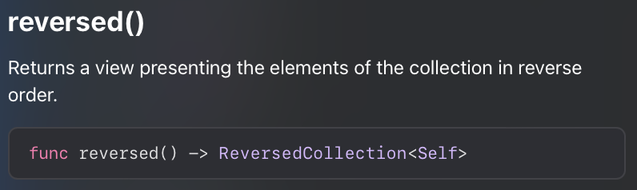

- 集合（set）和数组的区别：1.无序的 2.无重复元素
- 所以集合不是append 而是用insert
- 数组中找值是按照序号一个个找下去的，非常慢。而集合里找值非常快。
- 枚举既能提高写代码的效率，也能提高swift的编译效率

```swift
import Cocoa

//1️⃣初始化数组
//1.完整的初始化空数组
var numbers = Array<Int>()
var singers = Array<String>()

//2.简短的初始化空数组
var ints = [Int]()
var doubles = [Double]()
var albums = [String]()

//3.swift自行隐式判断出什么类型
let temperatures = [26.2, 28.1, 22.9]
let names = ["Steve", "Tim", "Jovi"]
let warroirs = ["Steph", "Klay", "Draymond"]

//数组的常用方法
//1.在数组末尾增加元素
numbers.append(10)
numbers.append(11)
numbers.append(12)
print(numbers)

//2.查看数组元素个数
print(numbers.count)

//3.删除指定下标的元素、删除所有元素
numbers.remove(at: 0)
print(numbers)
numbers.removeAll()
print(numbers)

//4.检查数组是否包含值为“Steve”的元素
print(names.contains("Steve"))

//5.排序元素
//Tips:常量数组只能用sorted，sorted不会改变原数组，反而会生成下面一行的新数组。
print(temperatures)
print(temperatures.sorted())

//6.反转数组
//Tips:常量数组只能用reversed，reversed不会改变原数组，swift会记住原来的顺序，并生成一个倒序的新collection。
print(warroirs.reversed())

//2️⃣字典
//1.初始化字典
var players = [Int: String]()
let company = [
    "Steve Jobs": "Apple",
    "Elon Musk": "Tesla",
    "Zach": "Meta"
]

//2.查看字典固定键值
//Tips：这是一个可选值，必须指定未匹配到键时的常规值
print(company["Steve Jobs", default: "Undefined"])

//3.往空字典里加元素键值对
players[30] = "Curry"
players[11] = "Tompson"
print(players[30, default: "Nobody"])
print(players[11, default: "Nobody"])
print(players[81, default: "Nobody"])

//4.修改字典里的元素键值对
players[11] = "player"
print(players[11, default: "Nobody"])

//3️⃣集合
//1.初始化集合
var books = Set<String>()
var people = Set([1, 2, 3, 4, 5, 6, 7, 8, 8])
//set是无序 不重复的
print(people)

//2.往空数组中新增元素
books.insert("C语言教程")
books.insert("C++秘籍")
books.insert("Swift0基础教学")
print(books)

//3.查元素数量
books.count
print(books)

//4.排序
print(books.sorted())

//5.删除
books.remove("Swift0基础教学")
print(books)

//4️⃣枚举
//1.初始化枚举
enum Weekday{
    case Monday
    case Tuesday
    case Wednesday
    case Thursday
    case Friday
}
//简写
enum Weekend{
    case Saturday, Sunday
}

var day = Weekday.Monday
day = Weekday.Tuesday
//简写
day = .Tuesday
day = .Wednesday
print(day)
```

### Day4：类型注释、CheckPoint2

- 寻找到适合自己的声明方式

```swift
import Cocoa

var arrayDemo1: [String] = ["apple", "microsoft"]
var setDemo1: Set<String> = ([
    "One",
    "Two",
    "Three",
])
var dictionaryDemo1: [String: Int] = [
    "one": 1,
    "two": 2,
    "three": 3
]

enum systemUI{
    case light
    case dark
    case system
}
var usingUI = systemUI.light
print(usingUI)

let names = ["John", "Terry", "Tom", "Steve", "Elon", "Steve"]
var uniqeNames = Set(names)
print("Name.count = \(names.count) uniqeNames.count = \(uniqeNames.count)")
print(uniqeNames.insert("Steve"))

//空数组、集合、字典
var eArray1 = Array<Int>()
var eArray2 = [String]()
var eArray3: [String] = []

var eSet1 = Set<Int>()
var eSet2: Set<Int> = ([])

var eDictionary:[Int: String] = [:]
```

### Day5：If、switch、三元运算符

- 寻找到适合自己的声明方式
- swift的switch语句不像c那样（即使匹配到对应的case也会跑下去）swift只会跑最终匹配到的case
- 如果希望swift执行下面没匹配到的case，就用fallthrough
- swiftUI中如果频繁使用if else，代码就会一团糟，使用三元运算符就能很好地解决这个问题
- print()里不能使用if else进行选择性打印，但用三元运算符就可以

```swift
import Cocoa

var numbers = [1, 2, 3]
numbers.append(4)
if numbers.count > 3 {
    numbers.removeFirst()
}
print(numbers)

var username = ""
if username.isEmpty {
    username = "Unknown User"
}
print(username)

enum TransportOptions{
    case bike
    case car
    case airplane
    case scooter
}

let transport = TransportOptions.scooter

print("Your transport is:")
if transport == .scooter {
    print("Scooter")
} else if transport == .airplane{
    print("Airplane")
} else if transport == .car {
    print("car")
} else if transport == .bike {
    print("bike")
} else {
    print("Null")
}

enum NatrulNum {
    case one
    case two
    case three
}
let number1 = NatrulNum.one
switch number1 {
case .one:
    print("1")
    fallthrough
case .two:
    print("2")
    fallthrough
default:
    print("Null")
}

let timeNow = 14
print(timeNow <= 18 ? "Light Mode on!" : "Dark Mode on!")
```

### Day6：循环、CheckPoint3

- checkpoint3中的逻辑写起来简单 但是重在优化 需要设计出足够优化的代码逻辑

```swift
import Cocoa

//for循环
let platforms = ["macOS", "iOS", "tvOS", "watchOS", "VisionOS"]
for os in platforms {
    print("Swift can run in \(os)")
}

for i in 0...9 {
    for j in 0..<10{
//        print("\(i)\(j)")
    }
}

var lyric = "Haters gonna hate "
for _ in 1..<5 {
    lyric += "hate "
}
print(lyric)

//while循环
var loopNumber = 5
while loopNumber >= 0 {
    if loopNumber != 0 {
        print(loopNumber)
        loopNumber -= 1
    } else {
        print("Time out!")
        break
    }
}

var dices = 0
while dices != 12 {
    print("I rolled \(dices)")
    dices = Int.random(in: 1...12)
}
print("I rolled the max!")

//continue break
var demoArray1 = [Int]()

for i in 1...100_00 {
    if i.isMultiple(of: 1) && i.isMultiple(of: 2) {
        demoArray1.append(i)
        if demoArray1.count == 10 {
            break
        }
    }
}

print(demoArray1)

//Checkpoint3📋
//FizzBuzz案例：从1到100，3的倍数打印Fizz，5的倍数打印Buzz，3和5的倍数打印FizzBuzz，其他的打印真实数字。
for i in 1...100 {
    if i.isMultiple(of: 3) {
        print("Fizz")
        if i.isMultiple(of: 5) {
            print("FizzBuzz")
        }
    } else if i.isMultiple(of: 5) {
        print("Buzz")
    } else {
        print(i)
    }
}
```

### Day7：函数、参数、元组、返回值

- 函数如果只有一行return语句，可以直接省略return关键字
- 元组和字典的区别：读取字典键值对里的值时，值是不确定的，需要有个default值。元祖不需要，并且可以同时容纳多个值。更像是json键值对。元组常用于函数返回多个值。
- 函数名称相同，但函数参数不同，那依旧是不同的函数。类似于重载。
- 函数参数可以起两个名字，一个给外部调用时使用，一个给内部使用。

```swift
import Cocoa

//比较两个字符串内容是否相等
func compareTwoStrings(String1: String, String2: String) -> Bool {
//    let first = String1.sorted()
//    let second = String2.sorted()
//    if first == second {
//        return true
//    } else {
//        return false
//    }
//    以上代码可以简写成以下方式
//    return String1.sorted() == String2.sorted()
//    只有一行返回值代码时 可以把return省略
    String1.sorted() == String2.sorted()
}

compareTwoStrings(String1: "abcd", String2: "adcb")

func Pythagorean(a: Double,b: Double) -> Double {
//    var input = a * a + b * b
//    return sqrt(input)
    sqrt(a * a + b * b)
}

Pythagorean(a: 3, b: 4)

//元组
//元组全写形式
func tuplePrint1() -> (firstname: String, secondname: String) {
//    (firstname:"Steve", secondname:"Jobs")
//    可以不写元组键
    ("Steve","Jobs")
}
let ceo1 = tuplePrint1()
print("\(ceo1.firstname) \(ceo1.secondname)")
//元组数组模式
func tuplePrint2() -> (String, String) {
    ("Steve","Jobs")
}
let ceo2 = tuplePrint2()
print("\(ceo2.0) \(ceo2.1)")
//元组分裂赋值
func tuplePrint3() -> (firstname:String, secondname:String){
    (firstname:"Steve", secondname:"Jobs")
}
let (firstname1, secondname) = tuplePrint3()
let (firstname2, _) = tuplePrint3()
print("\(firstname1) \(secondname)")
print("I just want firstname:\(firstname1)")

func rollDices(sides: Int, count: Int) -> [Int] {
    var dicePoints = [Int]()
    for _ in 1...count {
        dicePoints.append(Int.random(in: 1...sides))
    }
    return dicePoints
}
print(rollDices(sides: 6, count: 4))

//参数标签和参数名称：函数参数可以起两个名字，一个给外部调用时使用，一个给内部使用。
func isUppercase(_ string: String) -> Bool {
    string == string.uppercased()
}
let string1 = "HELLO,WOLRD!"
print(isUppercase(string1))
```

### Day8：默认值、throw截取错误、CheckPoint4

- 函数参数能给默认值
- 函数能报错抓错：do{}catch{}

```swift
import Cocoa

//函数能给默认值
func rollDices(sides: Int, count: Int = 5) -> [Int] {
    var dicePoints = [Int]()
    for _ in 1...count {
        dicePoints.append(Int.random(in: 1...sides))
    }
    return dicePoints
}
print(rollDices(sides: 6, count: 4))

var demoArray1 = ["1", "2", "3", "4"]
print(demoArray1.count)
//keepingCapacity:清空数组后，是否保存数组原内存空间的开关，默认是关着的。
demoArray1.removeAll(keepingCapacity: true)
print(demoArray1.count)

//对可能发生错误的代码段抓错：do{...}catch{...}
//1.创建出一个error类型的枚举
enum ErrorCodes:Error {
    case short
    case obvious
}
//2.设置抛错条件
func checkPassword(_ password: String) throws -> String {
    if password.count < 5 {throw ErrorCodes.short}
    if password == "12345" {throw ErrorCodes.obvious}
    
    if password.count > 5 {
        return "Password length: Normal"
    } else if password.count < 12 {
        return "Password length: Good"
    } else {
        return "Password length: Great"
    }
}

//3.do{}catch{} try是设置抓错的关键词
do {
    let password = "123"
    let result = try checkPassword(password)//try在这里可以写成try!（同时也不用写do了）：用来表示完全确认不会抛错，很少用！
    print(result)
} catch {
    print("Error happend")
}

//4.自定义抛错处理
do {
    let password = "12345"
    let result = try checkPassword(password)
    print(result)
} catch ErrorCodes.short {
    print("Password too short!")
} catch ErrorCodes.obvious {
    print("Password too obvious!")
} catch {
    print(error.localizedDescription)//苹果自带的报错信息
}

//CheckPoint4📋：自己写一个1～10000求平方根的函数
enum ErrorCodeForSqrt:Error {
    case tooLow
    case tooHigh
    case noFound
}

func squareRoot(_ numberToBeSquared:Int) throws -> Int {
    if numberToBeSquared < 1 { throw ErrorCodeForSqrt.tooLow }
    if numberToBeSquared > 10_000 { throw ErrorCodeForSqrt.tooHigh }
    for i in 1...100 {
        if i * i == numberToBeSquared {
            return i
        }
    }
    throw ErrorCodeForSqrt.noFound
}

let number = 10000
do {
    let result = try squareRoot(number)
    print("The root of \(number) is \(result)")
} catch ErrorCodeForSqrt.tooLow {
    print("\(number) is too low.")
} catch ErrorCodeForSqrt.tooHigh {
    print("\(number) is too high.")
} catch ErrorCodeForSqrt.noFound {
    print("Root no found")
} catch {
    print("A problem happend")
}
```

### Day9：闭包、传递函数到函数、CheckPoint5

- 将一个函数复制给另一个函数时，不能加（）
- 简写闭包步骤：
  1. 因为swift已经知道sorted by：会传入两个数组对应的数据类型并丢出一个bool，所以(a: String, b: String) -> Bool in...可以简写成a, b in...
  2. 当调用sorted等函数时，可以用尾随闭包法：删掉(by：...)
  3. swift其实并不关心变量名叫什么，只关心数据类型是什么，有几个，所以变量可以写成$0、$1，同时去掉in关键词。
- 一般三种情况不考虑使用$0 $1的变量简写形式：
  1. 参数在两个以上 $0 $1 $2 $3
  2. 参数使用不止一次
  3. 闭包函数主体很长
- swift中常用isMultiple(of: Int)来判断是不是一个数的倍数或者是否是奇偶数
- for item in result {...} 通常用来循环打印数组 

```swift
import Cocoa

//1️⃣学习闭包
//把一个函数拷贝到另一个函数
func greeting() {
    print("Hello!")
}
greeting()
var greetingCopy1 = greeting
greetingCopy1()

//以上code可以简写为闭包的形式
let greetingCopy2 = {
    print("Hello!")
}
greetingCopy2()

//写一个完整的闭包
let greetingCopy3 = { (name: String) -> String in
    "Hello! \(name)"
}
greetingCopy3("World!")

//将函数拷贝写成类型注释型的闭包
let greetingCopy4: () -> Void = greeting //() -> Void指明函数内的数据类型传递：什么参数传进来，什么数据传出去

//集合以上语法的一个例子
func yearPrint(for year: Int) -> String {
    if year == 1989 {
        return "Taylor Swift"
    } else {
        return "Nil"
    }
}

let year: (Int) -> String = yearPrint
print(year(1989))

//sorted(by:)：by后面可以放一个闭包，该闭包接受两个元素，返回一个Bool。
let someHero = ["Spiderman", "IronMan", "Batman", "Wolfman", "CatWoman"]
print(someHero.sorted())
//普通函数放到sorted(by:)
func pickUpCaptionHero(name1: String, name2: String) -> Bool {
    if name1 == "IronMan" {
        return true
    } else if name2 == "IronMan" {
        return false
    }
    return name1 < name2
}
print(someHero.sorted(by: pickUpCaptionHero))
//闭包放到sorted(by:)
print(someHero.sorted(by: {(a: String, b: String) -> Bool in
    if a == "IronMan" {
        return true
    } else if b == "IronMan" {
        return false
    }
    return a < b
}))

//2️⃣简写闭包
print(someHero.sorted {
    if $0 == "IronMan" {
        return true
    } else if $1 == "IronMan" {
        return false
    }
    return $0 < $1
})

//常用的尾随闭包法
print(someHero.sorted{ $0 > $1 })
print(someHero.filter{ $0.hasPrefix("S") })
print(someHero.map{ $0.uppercased() })

//3️⃣将函数作为函数参数传入函数中
//1.写法一：相对完整
func generator() -> Int {
    Int.random(in: 1...10)
}
func makeArray(size: Int, using generator: () -> Int) -> [Int] {
    var newArray = [Int]()
    
    for _ in 1...size {
        newArray.append(generator())
    }
    
    return newArray;
}
print(makeArray(size: 5, using: generator))

//2.写法二：相对简单
print(makeArray(size: 6) {
    Int.random(in: 1...6)
})

//投骰子🎲案例
func makeRandomArray(length: Int, using randomNum: () -> Int) -> [Int] {
    var newArray = [Int]()
    for _ in 1...length {
        newArray.append(randomNum())
    }
    return newArray
}

let rollDices = makeRandomArray(length: 6) {
    Int.random(in: 1...6)
}

print(rollDices)

//4️⃣将 空参空返回值的函数 作为 参数 的 函数
func doSomethingImportant(first: () -> Void, second: () -> Void, third: () -> Void) {
    print("About to start first work")
    first()
    print("About to start first work")
    second()
    print("About to start first work")
    third()
    print("Done")
}

doSomethingImportant {
    print("do first work")
} second: {
    print("do second work")
} third: {
    print("do third work")
}


//CheckPoint5📋
let luckyNumbers = [7, 4, 38, 21, 16, 15, 12, 33, 31, 49]

let result = luckyNumbers.filter{ $0.isMultiple(of: 2) == false }.sorted { $0 < $1 }.map{ "\($0) is a lucky number" }
//数组循环打印方式1
for item in result { print(item) }
//数组循环打印方式2
result.forEach{print($0)}

//阅读性更好，可以重复使用的写法
func isOdd(a: Int) -> Bool {
    a.isMultiple(of: 2) == false
}

func translateToMapString(a: Int) -> String {
    "\(a) is a lucky number."
}

func printItems(a: String) {
    print(a)
}

luckyNumbers.filter(isOdd).sorted().map(translateToMapString).forEach(printItems)
```

### Day10：结构体、计算属性、属性观察器

- 结构体会自动初始化各成员。
- 在创建结构体实体时，Employee(name: "intSur", vacationRemaining: 3) = Employee.init(name: "intSur", vacationRemaining: 3),这个init类似于c++的类的构造函数，一般来说不用加init就可以，这是一个语法糖。
- struct一般分为两种属性：
  1. 存储属性
  2. 计算属性
- 结构体的init：自定义初始化属性，类似于c++的类的构造函数

```swift
import Cocoa

//1️⃣初始化一个数据结构
struct Album {
    var album: String
    var artist: String
    var year: Int
    
    func printInfo() {
        print("\(album) (\(year)) \(artist)")
    }
}

let red = Album(album: "Red", artist: "Taylor Swift", year: 2012)
let f1Trillion = Album(album: "F1Trillion", artist: "Post Malone", year: 2024)

red.printInfo()
f1Trillion.printInfo()

//2️⃣mutating关键词让结构体内变量可以被改变
struct Employee {
    let name: String
    var vacationRemaining: Int
    //mutating(可变的) 让数据结构函数里的变量可以被修改
    mutating func takeVacation(days: Int) {
        if vacationRemaining > days {
            vacationRemaining -= days
            print("\(name) go to vacation!")
            print("\(vacationRemaining) days remains.")
        } else {
            print("Opps, vacationRemaining is not enough.")
        }
    }
}

var intSur = Employee(name: "intSur", vacationRemaining: 3)
intSur.takeVacation(days: 1)

//3️⃣结构体的计算属性：get set
struct Employee2 {
    let name: String
    var vacationAllocate: Int = 14
    var vacationTaken: Int = 0
    
    var vacationRemaining: Int {
        get {
            vacationAllocate - vacationTaken
        }
        set {
            vacationAllocate = vacationTaken + newValue //这里的newValue是swift自带的，也是就是计算属性本身被调用时的值。
        }
    }
}

var intSur2 = Employee2(name: "intSur2")
intSur2.vacationTaken = 4
print(intSur2.vacationRemaining)
intSur2.vacationRemaining = 6
print(intSur2.vacationAllocate)

//4️⃣结构体的观察器：willSet didSet
struct App {
    var contacts = [String]() {
        willSet {
            print("Current value is : \(contacts)")
            print("Value will be set to : \(newValue)")
        }
        didSet {
            print("Old value is : \(oldValue)")
            print("Value has been set to : \(contacts)")
        }
    }
}

var app = App()
app.contacts.append("Int Sur")
print("------------")
app.contacts.append("Allen M")

//5️⃣结构体的init：自定义初始化属性
struct Player {
    let name: String
    let number: Int
    
    init(name: String) {
        self.name = name
        self.number = Int.random(in: 1...100)
    }
}

let player1 = Player(name: "IntSur")
print(player1)
```

### Day11：访问权限、静态属性和方法、CheckPoint6

- 给结构体的属性方法设置访问权限：

  1. private：外部不能使用结构体内的东西
  2. fileprivate：外部不能使用文件内的东西
  3. public：所有人都能用
  4. private(set)：外部能读取结构体内的东西，但不能写  

- 结构体static：给结构体属性、方法加上static前缀关键词，那该属性、方法就成为静态可共享的成员，该结构体的所有实体都能用到它。同时也不用必须先创建实体，才能再访问到成员。所以不用mutating关键字，结构体内的static属性就能被修改。

- static成员无法访问非static成员，非static成员可以访问static成员

  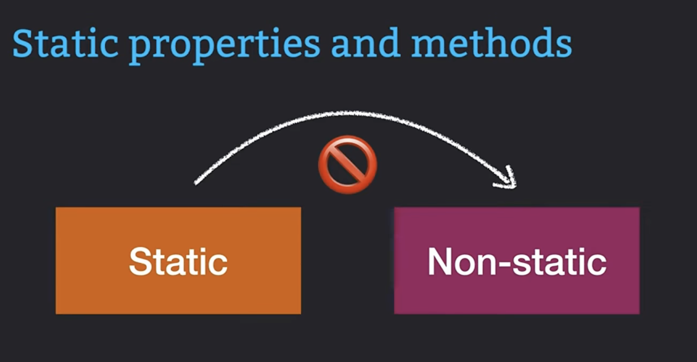

- 结构体self和Self的区别：self一般用于调用结构体成员的数值，Self一般用于调用结构体成员的数据类型

```swift
import Cocoa

//1️⃣给结构体属性设置访问权限
//1.创建一个银行账户结构体 其中现金fund这个属性 我们希望它只给外部读的权限 不给外部写的权限 那就用private(set)
struct BankAccount {
    private(set) var fund = 0
    mutating func deposit(amount: Int) {
        fund += amount
    }
    
    mutating func withdraw(amount: Int) {
        if fund > amount {
            fund -= amount
        } else {
            print("Fund not enough.")
        }
    }
}

var account = BankAccount()
print(account.fund)
account.deposit(amount: 10)
print(account.fund)
account.withdraw(amount: 5)
print(account.fund)
account.withdraw(amount: 10)
//account.fund = 20 给fund设置private(set)后 就不能从外部修改属性值

//2️⃣static静态成员
struct School {
    static var studentsName = [String]()
    static var studentNumber = 0
    static func add(name: String) {
        studentsName.append(name)
        studentNumber += 1
    }
    
}

print(School.studentsName)
print(School.studentNumber)
School.add(name: "intsur") //无需创建新的School实体 直接用结构体本体就行
print(School.studentsName)
print(School.studentNumber)

//一般两种情况下使用static
//1.用作可全局调用的结构体常量成员
struct AppInfo {
    static let version = "V1.0"
    static let name = "MyFirstApp"
    static let homeURL = "https://www.intsur.com"
}
//2.用作创建 结构体内的一个示例
struct Employee {
    let username: String
    let password: String
    
    static let exmaple = Employee(username: "test", password: "123")
}
print(Employee.exmaple)

//CheckoutPoint6📋
struct ManualCar {
    let model: String
    let seatsNum: Int
    let maxGear: Int
    private(set) var gear = 1
    mutating func changeGear(difference: Int) {
        gear += difference
        if gear < 1 {
            gear = 1
        } else if gear > maxGear {
            gear = maxGear
        }
    }
    func showGearNumber() {
        print("Gear: \(gear) now.")
    }
    func showModel() {
        print("Model: \(model).")
    }
    func showSeats() {
        print("Seats: \(seatsNum)")
    }
}

var SuzukiSwiftMT = ManualCar(model: "Suzuki Swift 1.5L NA MT", seatsNum: 5, maxGear: 5)
SuzukiSwiftMT.showModel()
SuzukiSwiftMT.showSeats()
SuzukiSwiftMT.showGearNumber()
SuzukiSwiftMT.changeGear(difference: +1)
SuzukiSwiftMT.showGearNumber()
SuzukiSwiftMT.changeGear(difference: +5)
SuzukiSwiftMT.showGearNumber()
SuzukiSwiftMT.changeGear(difference: -3)
SuzukiSwiftMT.showGearNumber()
SuzukiSwiftMT.changeGear(difference: -5)
SuzukiSwiftMT.showGearNumber()
```

### Day12：类、继承、CheckPoint7

- 类和结构体有五个区别：

  1. 类可以继承，有子类父类。结构体就不行。
  2. 类不会自动初始化。
  3. 如果复制了一个类的实体，所有复制出来的数据都共享一份资源。
  4. 当所有类的复制实体被销毁时，类允许通过初始化器，重新初始化。
  5. 常量类实体的变量成员可以被改变。

- override：只有在子类和父类方法名、参数返回值类型名称都完全相同的情况下重载才生效。

- final：加在子类名前，意思是该子类不会有子类继承它。

- 因为类的属性成员必须被初始化，所以在子类中，必须用super.init再初始化父类的属性成员。

- Deinitializer：析构器

  1. 析构器不需要用func关键字来声明
  2. 析构器没有参数和返回值
  3. 析构器在类的最后一个实体被销毁时自动启用
  4. 我们从不直接调用析构器
  5. 结构体没有析构

- 有四种情况：类定实体定，类定实体不定，类不定实体定，类不定实体不定。

  其实就是指针常量和常量指针的概念。所以class的特性是用指针去控制一块内存里的数据，而struct是直接控制一块内存里的数据。
  
- assertionFailure( )（断言）：当代码执行到断言，程序就会丢出错误，并终止执行。只在调试模式下生效，发布模式下这些断言会被移除。

```swift
import Cocoa

//1️⃣初始化一个类
class Employee {
    let hours: Int
    
    init(hours: Int) {
        self.hours = hours
    }
    
    func work() {
        print("I works \(hours) hours a day.")
    }
    
    func fightWord() {
        print("I like working!")
    }
}

//2️⃣创建两个子类
final class Developer: Employee {
    func develop() {
        print("I develop apps \(hours) hours a day.")
    }
    
    override func fightWord() {
        print("I like developing!")
    }
}

final class Manager: Employee {
    func manage() {
        print("I manage company \(hours) hours a day.")
    }
    
    override func fightWord() {
        print("I like managing!")
    }
}

let Intsur = Developer(hours: 16)
Intsur.develop()
Intsur.fightWord()

let Steve = Manager(hours: 8)
Steve.manage()
Steve.fightWord()

//3️⃣子类的初始化
class Vehicle {
    var isElectric: Bool
    init(isElectric: Bool) {
        self.isElectric = isElectric
    }
}

class Car: Vehicle {
    var isTwoDoor: Bool
    init(isElectric: Bool, isTwoDoor: Bool) {
        self.isTwoDoor = isTwoDoor
        super.init(isElectric: isElectric) // super相当于调用了父类。当子类需要初始化时，必须将父类的所有属性也初始化。
    }
}

let ModelY = Car(isElectric: true, isTwoDoor: false)

//4️⃣类的所有实例共享同一份数据
class User {
    var username: String
    
    init(username: String) {
        self.username = username
    }
    
    func copy() -> User {
        var user = User(username: "nil")
        user.username = username
        return user
    }
}

let user1 = User(username: "nil")
let user2 = user1
user2.username = "Taylor"
//原nil值被改成了Taylor
print(user1.username)
print(user2.username)

//也可以自建一个copy函数，专门用来做拷贝
let user3 = User(username: "nil")
let user4 = user3.copy()
user4.username = "Taylor"
print(user3.username)
print(user4.username)

//5️⃣析构器Deinit
class Users {
    init() {
        print("User init.")
    }
    deinit {
        print("User delete.")
    }
}

//每一个作用域的结束 就会触发到析构器
for _ in 1...3 {
    let user = Users()
    print("User is using.")
}
//类的实例如果是存在数组里 那么在数组元素被销毁时 析构器才触发
var users = [Users]()
for _ in 1...3 {
    let user = Users()
    users.append(user)
    print("User appended.")
}
users.removeAll()

//6️⃣常量类和常量类成员
class Student {
    var name = "nil"
}

let intsur = Student()
print(intsur.name)
intsur.name = "IntSur" // 虽然实体是let的，但实体的成员依旧可以改变，因为成员是var的。
print(intsur.name)

//有四种情况：类定实体定，类定实体不定，类不定实体定，类不定实体不定。
//其实就是指针常量和常量指针的概念。所以class的特性是用指针去控制一块内存里的数据，而struct是直接控制一块内存里的数据。
 
//CheckPoint7📋
class Animal {
    let leg: Int
    init(leg: Int) {
        self.leg = leg
    }
    
    func speak() {
        assertionFailure("This should nerver be called.")//断言：当代码执行到这一行，程序就会丢出错误，并终止执行。只在调试模式下生效，发布模式下这些断言会被移除。
    }
}

class Dog: Animal {
    override func speak() {
        print("Barking...")
    }
}

class Corgi: Dog {
    override func speak() {
        print("Corgi barking")
    }
}

class Poodle: Dog {
    override func speak() {
        print("Poodle barking")
    }
}

class Cat: Animal {
    var isTame: Bool
    init(leg: Int, isTame: Bool) {
        self.isTame = isTame
        super.init(leg: leg)
    }
    
    override func speak() {
        print("Meowing...")
    }
}

class Persian: Cat {
    override func speak() {
        print("Persian meowing")
    }
}

class Lion: Cat {
    override func speak() {
        print("Lion roaring")
    }
}
```

### Day13：协议、拓展、CheckPoint8

- protocol：协议。类似于基类的概念，但与基类不同的是，**协议的子结构体必须包含协议里的所有成员，而子类不用**。
- 协议的方法不需要写全函数，只需给出入参和返回值即可。
- 协议作为参数传入函数，作用：可以让协议派生出的子结构体们无缝使用该函数。
- 协议不支持直接声明存储属性，必须指明计算属性{ get } { get set }
- 一个结构体可以同时继承多个协议
- Opaque return types：不透明返回类型。因为有了协议，所以多种自定义的结构体之间具有共性，当函数返回值需要返回这些自定义结构体类型时，就可以用不透明返回类型进行模糊地返回一些类型，这样比较有灵活性。
- 用extentions拓展的好处：
  1. 代码完整度：在结构体后面点一下，就能调用拓展的方法。
  2. 代码整洁性：如果不用拓展，那全局函数就会堆得到处都是。  
  3. 内部访问权限：因为是直接加在原数据结构里的，所以可以直接调用结构体里的数据。可以写出类似于sort和sorted这类可改动原字符串，不改动原字符串的方法。
- 拓展中不能新增存储属性，但可以新增计算属性。
- 拓展能实现：即拥有完全自定义的初始化器，又能使用swift自带的聪明的初始化器。
- 拓展需要放在代码顶部
- set、array、dictionary在swift中都属于一个名为“Collection”的协议
- 拓展+协议能实现：让自定义结构体的方法也能和类方法一样，有默认值，也能重写方法。

```swift
import Cocoa

//1️⃣创建一个协议
protocol Vehicle {
    var name: String { get }// 协议的属性必须指明{ get } { get set }
    var seats: Int { get set }
    func estimateTime(for distance: Int) -> Int
    func travel(distance: Int)
}

protocol Electric {
    var isElectric: Bool { get }
}

struct Car: Vehicle, Electric {//一个结构体可以同时继承多个协议
    let name = "Car"
    var seats = 5
    let isElectric = false
    func estimateTime(for distance: Int) -> Int {
        distance / 50
    }
    func travel(distance: Int) {
        print("I'm driving \(distance) kms.")
    }
    func openRoof() {
        print("It's a good day.")
    }
}

struct Bicycle: Vehicle {
    let name = "Bicycle"
    var seats = 1
    func estimateTime(for distance: Int) -> Int {
        distance / 10
    }
    func travel(distance: Int) {
        print("I'm driving \(distance) kms.")
    }
}

func commute(distance: Int, vehicle: Vehicle) {// 协议作为参数传入函数，作用：可以让协议派生出的子结构体们无缝使用该函数。
    if vehicle.estimateTime(for: distance) > 100 {
        print("\(vehicle.name) is too slow!")
    } else {
        vehicle.travel(distance: distance)
    }
}

func getTravelEstimateTime(vehicles: [Vehicle], distance: Int) -> [Int] {
    var estimateTimes = [Int]()
    for vehicle in vehicles {
        estimateTimes.append(vehicle.estimateTime(for: distance))
    }
    return estimateTimes
}

let car = Car()
commute(distance: 100, vehicle: car)

let bicycle = Bicycle()
commute(distance: 100, vehicle: bicycle)

var times = getTravelEstimateTime(vehicles: [car, bicycle], distance: 100)
print(times)

//2️⃣不透明返回值some Equatable
//为了在面对很复杂的结构体数据类型时，能更灵活得返回出同一协议的值，不透明返回值起了作用。
func getRandomNum() -> some Equatable {
    Int.random(in: 1...6)// 此处，以后想把Int改成Double，直接改函数内容就行，不需要再修改函数返回值。
}

print(getRandomNum() == getRandomNum())

//3️⃣拓展
var quote = "  Stay hungry Stay foolish.   "
extension String {
    //会返回值
    func trimmed() -> String {
        self.trimmingCharacters(in: .whitespacesAndNewlines)
    }
    //不会返回值
    mutating func trim() {
        self = self.trimmed()
    }
    //拓展里不能新增存储属性，但能新增计算属性。以下将分解出的组件字符串直接放入数组内
    var lines: [String] {
        self.components(separatedBy: .newlines)
    }
}
print(quote.trimmed())
print(quote) // trimmed不改变原字符串
print(quote.trim())
print(quote)// trim改变原字符串

let somewords = """
Line1
Line2
Line3
Line4
Line5
"""
print(somewords.lines)
print(somewords.lines.count)

//拓展能实现：即拥有完全自定义的初始化器，又能使用swift自带的聪明的初始化器。
struct Book {
    let bookName: String
    let pages: Int
    var readHours: Int
}

extension Book {//把初始化器放到拓展里
    init(bookName: String, pages: Int) {
        self.bookName = bookName
        self.pages = pages
        self.readHours = pages / 50
    }
}

//即拥有完全自定义的初始化器
let book1 = Book(bookName: "Steve Jobs", pages: 200)
//又能使用swift自带的聪明的初始化器
let book2 = Book(bookName: "Elon Musk", pages:100, readHours: 25)
print(book1)
print(book2)

//4️⃣协议+拓展
extension Collection { //set、array、dictionary在swift中都属于一个名为“Collection”的协议
    var isNotEmpty: Bool{
        isEmpty == false
    }
}

let array1 = [1, 2, 3]
if array1.isNotEmpty {
    print("Array's length is \(array1.count)")
}

protocol Person {
    var name: String { get set }
    func sayHello()//结构体里的空函数
}

extension Person {
    func sayHello() {//设定空函数的默认值,写法类似于上面即可以用自定义的初始化器，又可以用swift的初始化器
        print("Hi, I'm \(name)")
    }
}

//新建的结构体可以不写该函数
struct Creator: Person {
    var name: String
}
let Elon = Creator(name: "Elon Musk")
Elon.sayHello()

struct Designer: Person {
    var name: String
    func sayHello() {
        print("Less is more.")
    }
}
let Steve = Designer(name: "Steve Jobs")
Steve.sayHello()

//CheckPoint8📋
protocol Building {
    var type: String { get }
    var rooms: Int { get }
    var cost: Int { get }
    var estateAgent: String { get }
}

extension Building {
    func salesSummary() {
        print("Contact to \(estateAgent) to buy \(type).")
    }
}

struct House: Building {
    let type = "House"
    var rooms: Int
    var cost: Int
    var estateAgent: String
}

struct Office: Building {
    let type = "Office"
    var rooms: Int
    var cost: Int
    var estateAgent: String
}

let house1 = House(rooms: 10, cost: 100_000, estateAgent: "HengDa")
house1.salesSummary()

let office1 = Office(rooms: 100, cost: 100_000_000, estateAgent: "Wanda")
office1.salesSummary()

//协议拓展是一个swifty的语法，甚至有面向协议编程，所以以下是进阶内容
//1.返回自身类型
extension Numeric {
    func square() -> Self { //这么写：所有的算数类型都能用这个拓展
        self * self
    }
}

//2.Equatable、Comparable协议
struct User: Equatable, Comparable {// 这行也可以直接写成struct User: Comparable,因为Comparable就已经包含了Equatable
    let name: String
    static func <(lsh: User, rsh: User) -> Bool {
        lsh.name < rsh.name
    }
}

let user1 = User(name: "Steve")
let user2 = User(name: "Elon")

print(user1 == user2)
print(user1 != user2)
print(user1 < user2)
print(user1 <= user2)
print(user1 > user2)
print(user1 >= user2)
```

### Day14：可选项、空合并、可选链、CheckPoint9

- 可选项允许我们使用可能缺失真实值的数据 

- 所有数据类型都可以是可选的：Int？String？...

- if let ：可选项有真实值时，跑if let里的代码。

  guard let：可选项没有真实值时，跑guard let里的代码。其中，return是必须的。

```swift
import Cocoa

//1️⃣初始化可选类型，什么数据类型都有对应的可选类型
var username: String? = nil
if let unwrappedName = username {
    print("username: \(unwrappedName)")
} else {
    print("unwrappedName is empty")
}

//以字典为例，使用可选类型
let opposites = ["Player1": "Luke", "Player2": "Link"]
if let playerOpposites = opposites["Player3"] {
    print(opposites["Player3", default: "nil"])
}

//可选项类型的跟踪技术：
func square(number: Int) -> Int {
    number * number
}

var number: Int? = nil

if let number = number { //判断可选类型是否存在值，这种用法被称为跟踪。只有在有值的时候，跟踪内的代码才会执行，执行完成这些代码后，number又变回了  nil。这非常安全。
    print(square(number: number))
}

//2️⃣在函数中使用 guard...else{...return}
func printSquare(of number: Int?) {
    guard let number = number else {
        print("number is nil")
        return
    }
    print("\(number) * \(number) = \(number * number)")
}

printSquare(of: number)
printSquare(of: 10)

//3️⃣空合并：nil coalescing
let captains = [
    "OnePiece": "Luffy"
]
//字典的传统防止nil值的写法
let captain1 = captains["Anoums", default: "N/A"]
//通用的空合并写法，除了字典，其他数据类型都能用
let captain = captains["Anoums"] ?? "N/A"

print(captain)
print(captain1)

let tvShows = ["Shameless", "Bark Matter"]
let show = tvShows.randomElement() ?? "N/A"

struct Book {
    let bookName: String?
    let author: String?
}

let SteveJobs = Book(bookName: "Steve Jobs", author: nil)
let SteveAuthor = SteveJobs.author ?? "N/A"
print(SteveAuthor)
//空合并用于检错并纠正
let input = ""
let unwrappedInput = Int(input) ?? 0 //空字符串不能被转换成整形，所以返回nil
print(unwrappedInput)

//4️⃣可选链
let emptyBook: Book? = nil
let bookName = emptyBook?.bookName?.first?.uppercased() ?? "Unkown" //这个可选链的意思：emptyBook这个Book类型的实体有没有真实值？如果有的话，它的bookName属性有没有真实值？如果有的话，bookName存在第一个字符吗？如果有的话，那就大写，赋值给bookName。只要这条链路上有一个非真实值，那么就执行空合并。

//5️⃣当不在乎报错类型的时候，可以使用try？，这样那么返回nil，要么返回成功的值。
enum UserErrorCode: Error {
    case Network_Failed
    case UserID_Outloop
}

func getUserID(id userID: Int) throws -> String{
    if userID >= 100 { throw UserErrorCode.UserID_Outloop }
    return "getUserID success."
}

//do catch常规写法
do {
    try getUserID(id: 11)
} catch UserErrorCode.UserID_Outloop{
    print("UserID out of loop now!")
} catch UserErrorCode.Network_Failed{
    print("Network failed now!")
} catch {
    print("Unkown error!")
}
//try?写法
let result = (try? getUserID(id: 100)) ?? "getUserID failed!"
print(result)// 忽略了具体是什么报错，只关心返回是否成功。

//CheckPoint9📋
func randomPickArray(of array: [Int]?) {
    array?.randomElement() ?? Int.random(in: 1...100 )
}
//CheckPoint9拓展：如果传入的array连数组元素类型也不确认，该如何处理？Ans：双重空合并
func randomPickArray(of array: [Int?]?) {
//    let randomIn100 = Int.random(in: 1...100) 这样写会有问题：如果数组元素确实是nil，那这个randomIn100常量就白创建了，会浪费资源。这时候可以用lazy关键字，让randomIn100只有在被调用的时候，再进行生成随机数。
    lazy var randomIn100 = Int.random(in: 1...100)
    (array?.randomElement() ?? randomIn100) ?? randomIn100
}
```

### Day15：一小时超快复习

## SwiftUI项目

### Day16：WeSplit项目第一部分

#### 项目文件目录简介：

- 显示文件格式：偏好设置→通用

- 项目主函数文件：main主函数，起了个线程，一直会跑。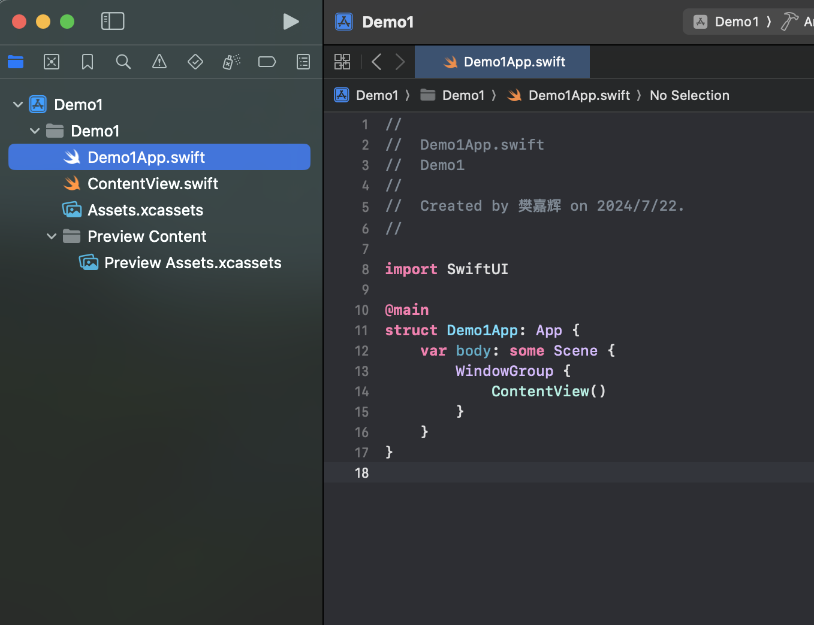
- 资产文件：存放所有用到的图片资源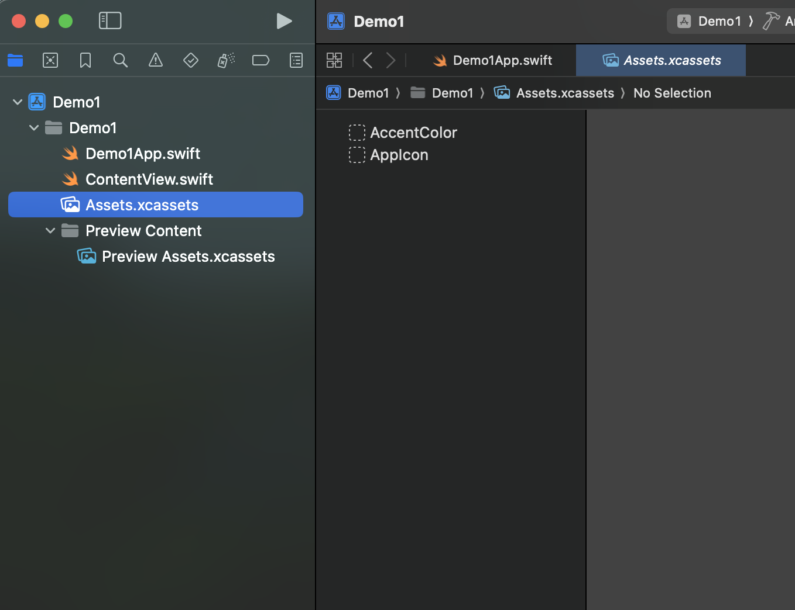
- Preview Content:预览数据信息

#### ContentView初始化代码解析：

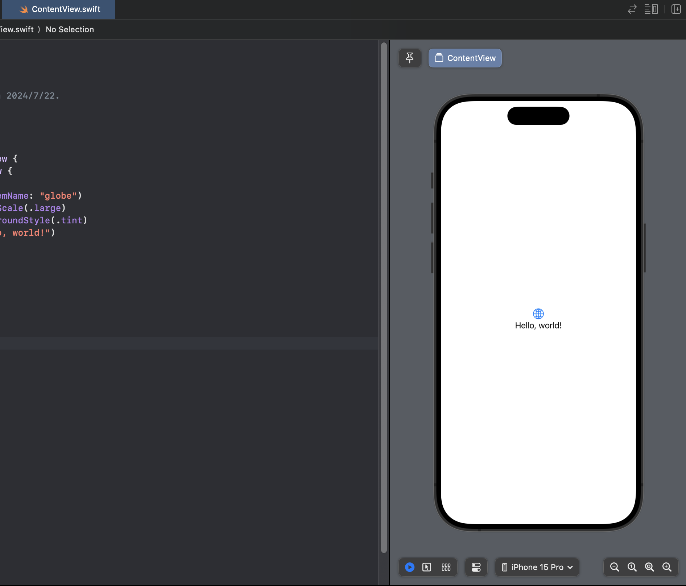

```swift
import SwiftUI

struct ContentView: View {//从View协议中创建ContentView
    var body: some View {//创建名为body的计算属性，返回不透明返回类型。
        VStack {//一个垂直堆叠视图容器，它将子视图垂直排列。
            Image(systemName: "globe")
                .imageScale(.large)
                .foregroundStyle(.tint)//设置图像的前景色为当前视图的色调（tint color）
            Text("Hello, world!")
        }
        .padding()//为 VStack 视图添加默认的内边距，使其内容与视图边界之间有一些空间。
    }
}
//#后的代码不会被上传，仅用于在画布（canvas）上预览app使用
#Preview {
    ContentView()
}
```

#### 表单案例：

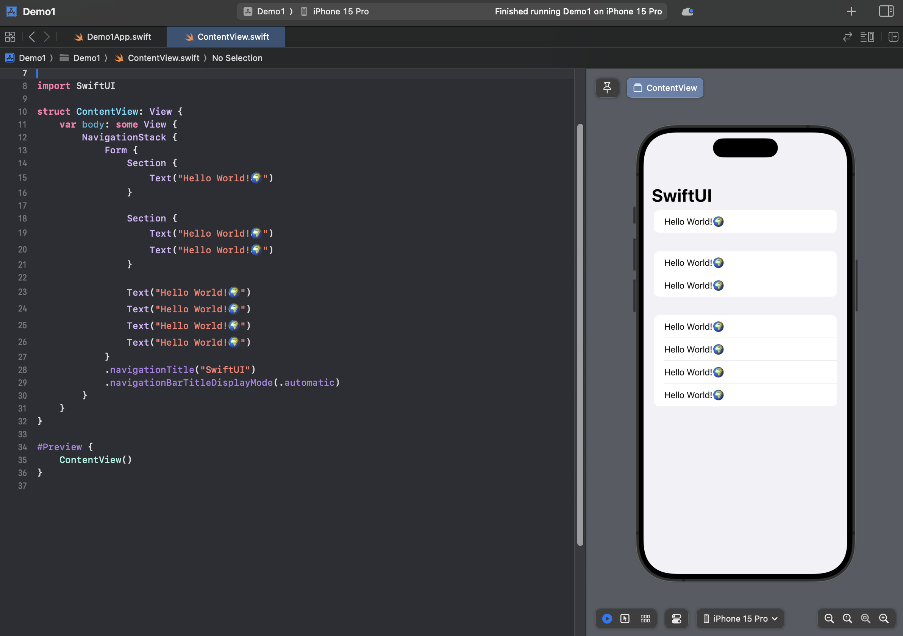

```swift
import SwiftUI

struct ContentView: View {
    var body: some View {
        NavigationStack {//导航栏视图
            Form {//表单视图
                Section {//章节视图
                    Text("Hello World!🌍")
                }
                
                Section {
                    Text("Hello World!🌍")
                    Text("Hello World!🌍")
                }
                
                Text("Hello World!🌍")
                Text("Hello World!🌍")
                Text("Hello World!🌍")
                Text("Hello World!🌍")
            }
            .navigationTitle("SwiftUI")//导航栏标题
            .navigationBarTitleDisplayMode(.automatic)//导航栏标题显示模式
        }
    }
}

#Preview {
    ContentView()
}
```

#### 点按钮次数案例：

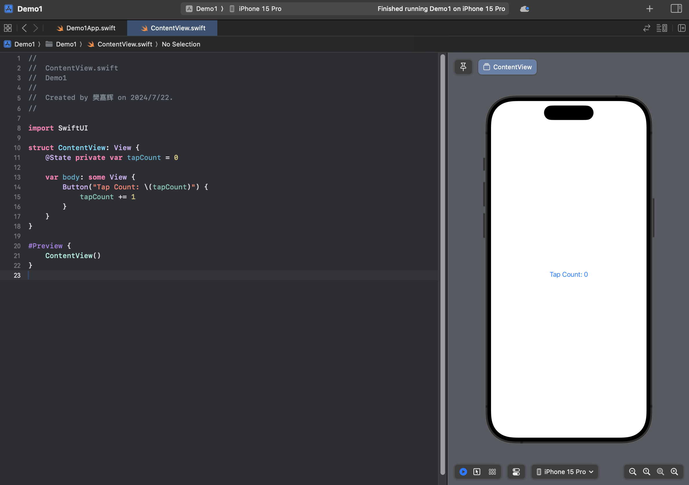

```swift
import SwiftUI

struct ContentView: View {
    @State private var tapCount = 0//@State：属性包装器（property wrapper），它用于声明一个可以被视图重新渲染时改变的可变状态。属性包装器允许计算属性中的闭包方法更改这个值，Apple官方推荐加上private以增加数据安全性。
    
    var body: some View {
        Button("Tap Count: \(tapCount)") {
            tapCount += 1
        }
    }
}

#Preview {
    ContentView()
}
```

#### 输入框绑定变量案例：

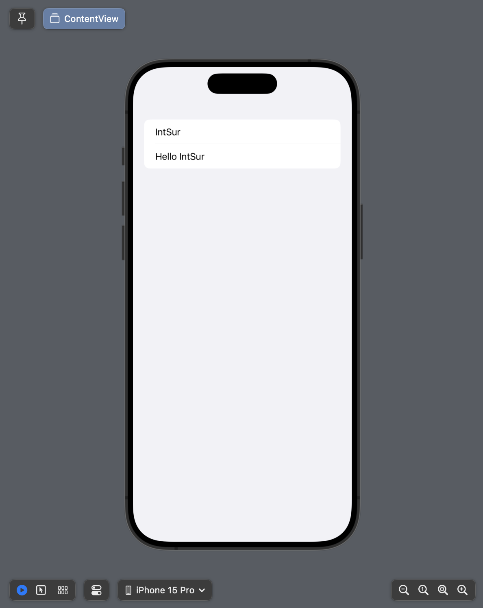

```swift
import SwiftUI

struct ContentView: View {
    @State private var name = ""//存储用户输入的变量
    var body: some View {
        Form {
            TextField("Enter your username:", text: $name)//TextField必须有一个与之绑定的变量名，在这里是name，前面的$是指双向绑定：此TextField可以同时读取和修改name。
            Text("Hello \(name)")//这里只读，所以没有$
        }
    }
}

#Preview {
    ContentView()
}
```

#### 选择框绑定变量案例：

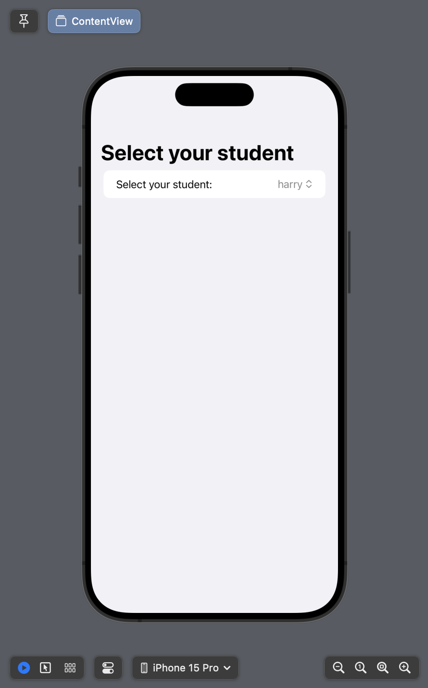

```swift
import SwiftUI

struct ContentView: View {
    let students = ["harry", "Hermione", "Ron"]
    @State private var name = ""
    var body: some View {
        NavigationStack {
            Form {
                Picker("Select your student:", selection: $name) {//创建一个选择器，选择到的数据会被同步进双向绑定的name中
                    ForEach(students, id: \.self) { //用循环创建出一个数组的text视图，并将循环到的所有text视图放入picker中。其中id: \.self，\ 引入了关键路径，. 表示当前元素，self 表示该元素本身。
                      	Text($0)
                    }
                }
            }
            .navigationTitle("Select your student")
        }
    }
}

#Preview {
    ContentView()
}
```

### Day17：WeSplit项目第二部分

#### 完成基础框架：

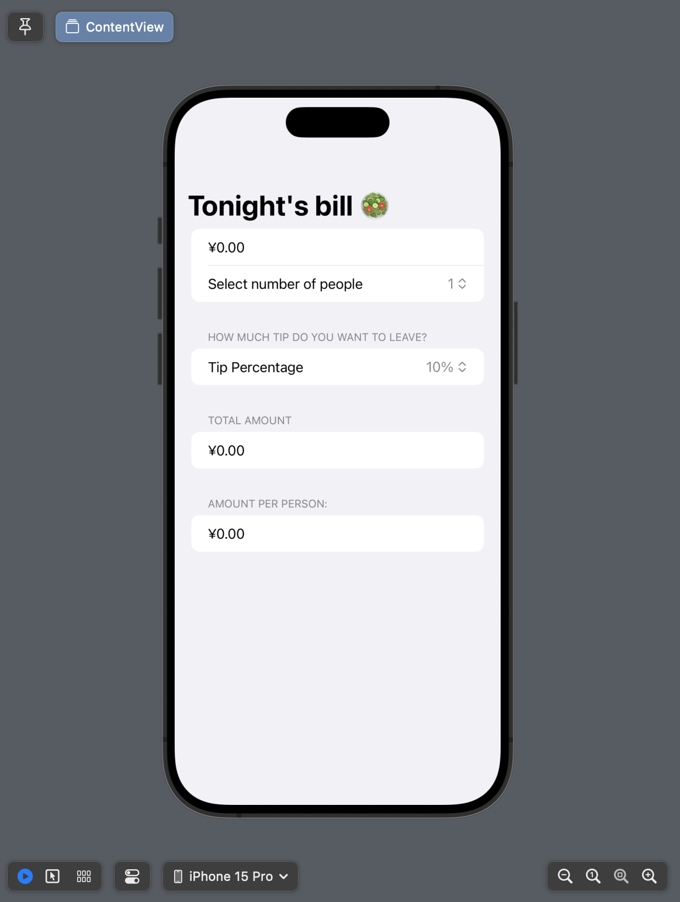

```swift
import SwiftUI

struct ContentView: View {
    @State private var checkAmount = 0.0
    @State private var numberOfPeople = 0
    @State private var tipPercentage = 10
    @FocusState private var amountIsFocused: Bool//@FocusState专门用于绑定Focus
    
    let tipPercentages = [0, 10, 15, 20]
    
    var totalPerPerson: Double {//用于计算每个人平摊费用的计算属性
        let peopleCount = Double(numberOfPeople + 2)
        let tipSelection = Double(tipPercentage)
        let tipValue = checkAmount / 100 * tipSelection
        let grandTotal = checkAmount + tipValue
        let amountPerPerson = grandTotal / peopleCount
        return amountPerPerson
    }
    
    var body: some View {
        NavigationStack {
            Form {
                Section {
                    TextField("Amount", value: $checkAmount, format: .currency(code: Locale.current.currency?.identifier ?? "USD"))// 如果双绑定数据类型（$checkAmount）是数字，那就用value；如果是字符串，那要用text。format设置了货币类型。
                        .keyboardType(.decimalPad)// 输入键盘使用数字键盘
                        .focused($amountIsFocused)// 设置输入框focusflag，以供关闭键盘
                    Picker("Select number of people", selection: $numberOfPeople) {// 选择器双向绑定的是numberOfPeople
                        ForEach(2..<98) {// 用循环生成2～98个人的全部视图，传给选择器进行显示。这里只能用开区间，不能用闭区间。
                            Text("\($0)")
                        }
                    }// .pickerStyle(.navigationLink) //navigationLink：点击选择器后会跳入新界面中供用户选择，这很好，但并不喜欢这个效果，所以把它注释掉了。
                }
                
                Section("How much tip do you want to leave?") {//章节文本显示
                    Picker("Tip Percentage", selection: $tipPercentage) {
                        ForEach(tipPercentages, id: \.self) {
                            Text("\($0)%")
                        }
                    }
                    .pickerStyle(.segmented)//选择器样式为滑块
                }
                
                Section {
                    Text(totalPerPerson, format: .currency(code: Locale.current.currency?.identifier ?? "USD"))
                }
            }
            .navigationTitle("Tonight's bill 🥗")//为什么navigationTitle要写在NavigationStack里？因为相当于新增了一个标题进NavigationStack，在标题后再进行显示表单等视图元素。
            .toolbar {//修饰符toolbar()让我们可以指定视图的工具栏项。这些工具栏项可能出现在屏幕上的各个位置 - 顶部的导航栏中、底部的特殊工具栏区域等。
                if amountIsFocused {//如果输入框被选中
                    Button("Done") {//在右上角生成Done的按钮
                        amountIsFocused = false//将输入框flag关闭
                    }
                }
            }
        }
    }
}

#Preview {
    ContentView()
}

```

### Day18：WeSplit项目优化

#### 代码优化：

```swift
    var userCurrency = Locale.current.currency?.identifier ?? "USD"
    
    var grandTotal: Double {
        let tipAmount = checkAmount / 100 * Double(tipPercentage)
        return checkAmount + tipAmount
    }
    
    var totalPerPerson: Double {
        let peopleCount = Double(numberOfPeople + 1)
        return grandTotal / peopleCount
    }
```

### Day19：距离转换器Convertor案例

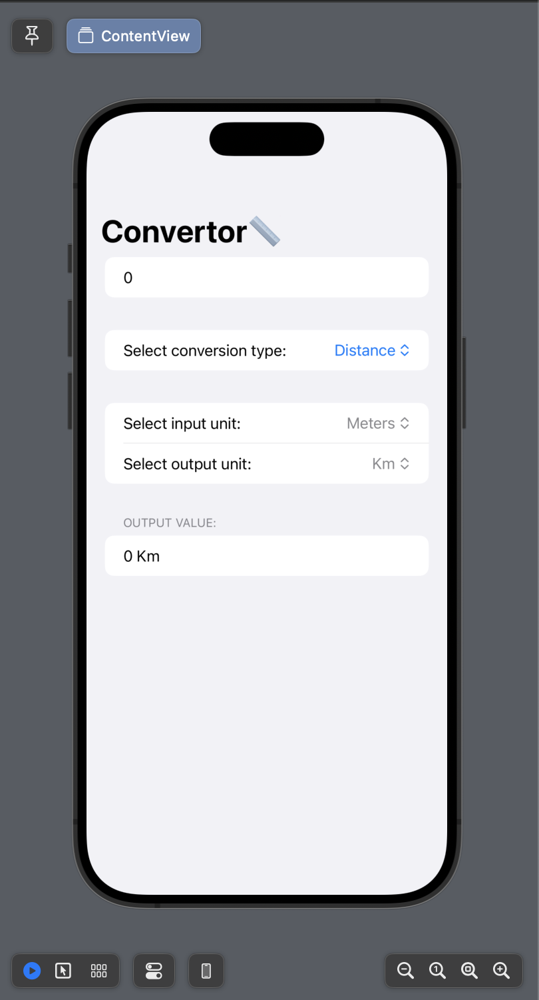

#### 原始写法：

```swift
import SwiftUI

struct ContentView: View {
    @State private var inputValue = 0.0
    @State private var inputUnit = ""
    @State private var outputUnit = ""
    @FocusState private var focusFlag: Bool
    
    let units = ["Meters", "KiloMeters", "Yards", "Feet", "Miles"]
    
    var result: String {
        let inputToMetersMultiplier: Double
        let outputToMetersMultiplier: Double
        
        switch inputUnit {
        case "KiloMeters":
            inputToMetersMultiplier = 1000.0
        case "Yards":
            inputToMetersMultiplier = 0.9144
        case "Feet":
            inputToMetersMultiplier = 0.3048
        case "Miles":
            inputToMetersMultiplier = 1609.34
        default:
            inputToMetersMultiplier = 1.0
        }
        
        switch outputUnit {
        case "KiloMeters":
            outputToMetersMultiplier = 0.001
        case "Yards":
            outputToMetersMultiplier = 1.09361
        case "Feet":
            outputToMetersMultiplier = 3.28084
        case "Miles":
            outputToMetersMultiplier = 0.000621371`
        default:
            outputToMetersMultiplier = 1.0
        }
        
        return "\((inputValue * inputToMetersMultiplier * outputToMetersMultiplier).formatted()) \(outputUnit.lowercased())"
    }
    
    var body: some View {
        NavigationStack {
            Form {
                Section {
                    TextField("Input value:", value: $inputValue, format: .number)
                        .keyboardType(.decimalPad)
                        .focused($focusFlag)
                }
                
                Picker("Select input unit:", selection: $inputUnit) {
                    ForEach(units, id:\.self) {
                        Text($0)
                    }
                }.pickerStyle(.menu)
                
                Picker("Select output unit:", selection: $outputUnit) {
                    ForEach(units, id:\.self) {
                        Text($0)
                    }
                }.pickerStyle(.menu)
                
                Section("Output Value:") {
                    Text(result)
                }
            }
            .navigationTitle("Convertor📏")
            .toolbar {
                if focusFlag {
                    Button("Done") {
                        focusFlag = false
                    }
                }
            }
        }
    }
}

#Preview {
    ContentView()
}
```

#### 优化写法：

1. 无需自己写转换逻辑，调用Apple自带的测量和基础API（MeasurementFormatter和Measurement）即可完成聪明的翻译+本地化转换（根据用户所在地和使用语言选择合适爹转换单位）
2. 不仅仅可以换算距离，还可以换算质量，温度，时间

```swift
import SwiftUI

struct ContentView: View {
    @State private var inputValue = 0.0
    @State private var inputUnit: Dimension = UnitLength.meters// 类级关系：Dimension → UnitLength → meters
    @State private var outputUnit: Dimension = UnitLength.kilometers// 类级关系：Dimension → UnitLength → kilometers
    @State private var selectedUnit = 0
    @FocusState private var focusFlag: Bool
    
    let conversions = ["Distance", "Mass", "Temperature", "Time"]// 转换单位的种类：距离，质量，温度，时间
    let units = [
        [UnitLength.meters, UnitLength.kilometers, UnitLength.yards, UnitLength.feet, UnitLength.miles],
        [UnitMass.grams, UnitMass.kilograms, UnitMass.ounces, UnitMass.pounds],
        [UnitTemperature.celsius, UnitTemperature.fahrenheit, UnitTemperature.kelvin],
        [UnitDuration.milliseconds, UnitDuration.seconds, UnitDuration.minutes, UnitDuration.hours]
    ]// 创建二维数组，以对应inputUnit和outputUnit
    
    let formatter: MeasurementFormatter// MeasurementFormatter 是 Swift 中用于格式化度量单位的类
    
    var result: String {
        let inputMeasurement = Measurement(value: inputValue, unit: inputUnit)//设定输入值和单位
        let outputMeasurement = inputMeasurement.converted(to: outputUnit)//转换到输出单位
        return formatter.string(from: outputMeasurement).capitalized//用formatter器输出对应输出值的字符串值，并且首字母大写。
    }
    
    var body: some View {
        NavigationStack {
            Form {
                Section {
                    TextField("Input value:", value: $inputValue, format: .number)
                        .keyboardType(.decimalPad)
                        .focused($focusFlag)
                }
                
                Section {
                    Picker("Select conversion type:", selection: $selectedUnit) {
                        ForEach(0..<4) { index in
                            Text(conversions[index])
                        }
                    }
                    .pickerStyle(.menu)
                }
                
                Picker("Select input unit:", selection: $inputUnit) {
                    ForEach(units[selectedUnit], id:\.self) {
                        Text(formatter.string(from: $0).capitalized)
                    }
                }
                
                Picker("Select output unit:", selection: $outputUnit) {
                    ForEach(units[selectedUnit], id:\.self) {
                        Text(formatter.string(from: $0).capitalized)
                    }
                }
                
                Section("Output Value:") {
                    Text(result)
                }
            }
            .navigationTitle("Convertor📏")
            .toolbar {
                if focusFlag {
                    Button("Done") {
                        focusFlag = false
                    }
                }
            }
            .onChange(of: selectedUnit) {// 每当选中单位类型发生变化，输入和输出单位都要对应变化
                inputUnit = units[selectedUnit][0]
                outputUnit = units[selectedUnit][1]
            }
        }
    }
    
    init() {// 以下代码写init里 是因为没法写在ContentView的开头
        formatter = MeasurementFormatter()
        formatter.unitOptions = .providedUnit// 让swift使用我们提供出的单位，不让swift使用自己从用户地区默认读出来的单位
        formatter.unitStyle = .medium// 显示的单位风格
    }
}

#Preview {
    ContentView()
}
```

### Day20：猜棋第一部分

#### 视图中的三种堆栈：

##### VStack、HStack、ZStack：

垂直堆栈、水平堆栈、Z轴堆栈。

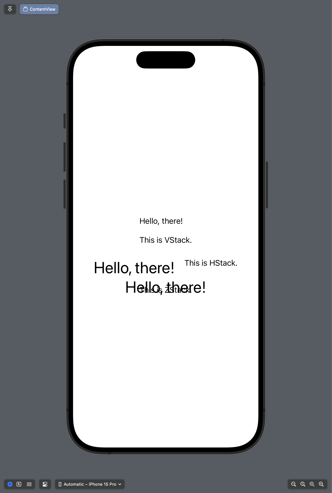

```swift
import SwiftUI

struct ContentView: View {
    var body: some View {
        VStack(alignment: .leading, spacing: 20) {
            Text("Hello, there!")
            Text("This is VStack.")
          // Spacer() 插空
        }
        .padding(16)
        HStack(alignment: .top, spacing: 20) {
            Text("Hello, there!").font(.largeTitle)
            Text("This is HStack.")
        }
        ZStack(alignment: .centerFirstTextBaseline) {
            Text("Hello, there!").font(.largeTitle)
            Text("This is ZStack.")
        }
    }
}

#Preview {
    ContentView()
}
```

##### 文本信息背景颜色、视图堆栈背景颜色：

**Tip!!!:View code的实际视图效果是根据代码结构、代码顺序进行的。在初次接触这块时，我总觉得自己写出的code和心中所想的视图完全是两个样子，这时就要从代码结构、代码顺序的角度出发，思考一下问题出在哪。**（这个问题会在Day23视图和修饰符中详细讲解）

```swift
struct ContentView: View {
    var body: some View {
        ZStack {
            Color.blue// 创建一个背景颜色为蓝色，长宽为safeArea尺寸的，是ZStack自身的视图
          
            Text("Hello, my bgcolor is ")
                .background(.gray)// 创建一个背景颜色为灰色的子视图，该子视图的灰色覆盖在ZStack自身视图的蓝色上
        }
	      .background(.gray)// 在ZStack作用域后紧接着写的属性修饰符，将应用于ZStack的子视图们。如果ZStack自身的视图和子视图们同时存在，优先应用于Stack视图。
        .frame(minWidth: 150, maxWidth: 200, minHeight: 150,  maxHeight: 200)// 将应用于ZStack子视图们
    }
}
```

或者把ZStack的frame设置成无限宽或无限高，也能做出全屏背景颜色的效果。

```swift
VStack {
            Image(systemName: "globe")
                .imageScale(.large)
                .foregroundStyle(.tint)
            Text("Hello, world!")
        }
        .frame(maxWidth: .infinity, maxHeight: .infinity)//frame设置成无限宽或无限高，也能实现背景全indigo
        .padding()
        .background(.indigo)
```


##### 能跟随系统颜色模式变化的颜色(primary)、自定义RGB：

```swift
struct ContentView: View {
    var body: some View {
        ZStack {
            Text("Hello, my bgcolor is ")
                .foregroundColor(Color(red: 0, green: 0, blue: 50))// 自定义RGB
        }
        .frame(width: 200, height: 200)
        .background(.primary)//能跟随系统颜色模式变化的颜色(primary)
    }
}
```

##### 能跟随系统颜色模式变化的颜色(secondary)、安全区域、毛玻璃效果、圆角：


```swift
struct ContentView: View {
    var body: some View {
        ZStack {
            HStack(spacing: 0) {
                Color.yellow
                Color.blue
            }
            Text("This is forest glasses effect.")
                .padding(50)
                .background(.ultraThinMaterial)
                .foregroundColor(.secondary)// 能跟随系统颜色模式变化的颜色(primary)。半透明，配合毛玻璃效果能映射出背景的颜色。
                .cornerRadius(20)
        }
        .ignoresSafeArea()
    }
}
```

#### 渐变效果：

##### 线性渐变：

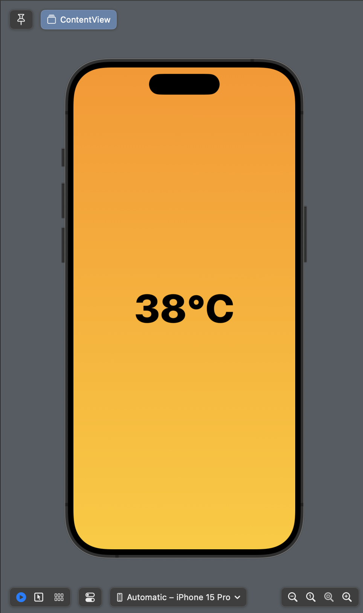

```swift
struct ContentView: View {
    let displayTemp = Measurement<UnitTemperature>(value: 38, unit: .celsius)//相比于Day19案例里的老写法，这个新API更安全，并且更方便
    
    var body: some View {
        ZStack {
            LinearGradient(colors: [.orange, .yellow], startPoint: .top, endPoint: .bottom)// 线性渐变，可选多种颜色
            VStack {
                Text(displayTemp.formatted())
                    .font(.system(size: 70, weight: .heavy))
            }
        }
        .ignoresSafeArea()
    }
}
```

##### 多段式线性渐变：

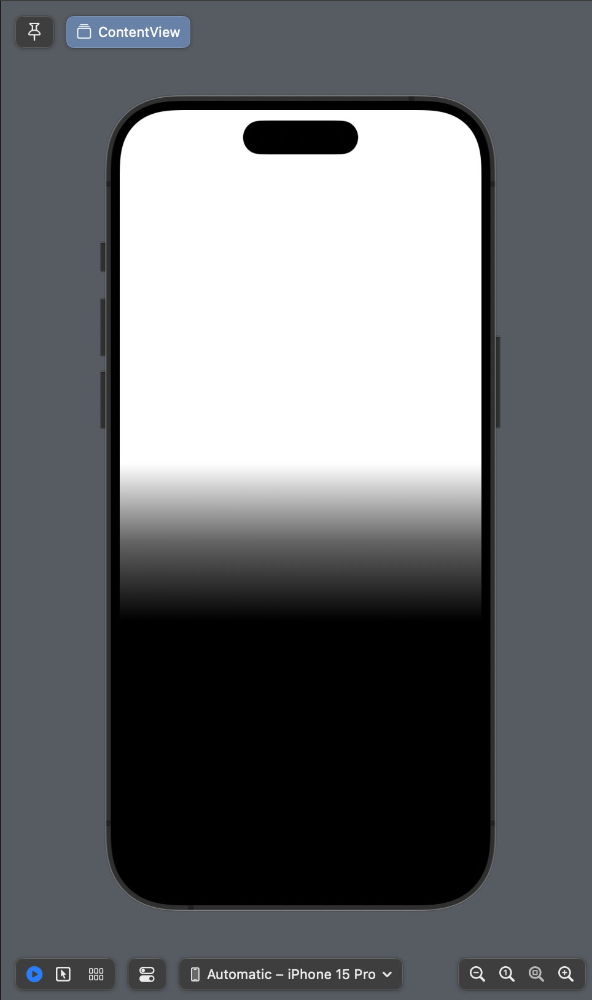

```swift
struct ContentView: View {
    let displayTemp = Measurement<UnitTemperature>(value: 38, unit: .celsius)
    
    var body: some View {
        ZStack {
            LinearGradient(stops: [
                Gradient.Stop(color: .white, location: 0.45),//第一段：从头到45%的区域是纯白
                Gradient.Stop(color: .black, location: 0.65) //第三段：从头到65%的区域是纯黑
            ], startPoint: .top, endPoint: .bottom)
        }
        .ignoresSafeArea()
    }
}
```

##### 径向渐变：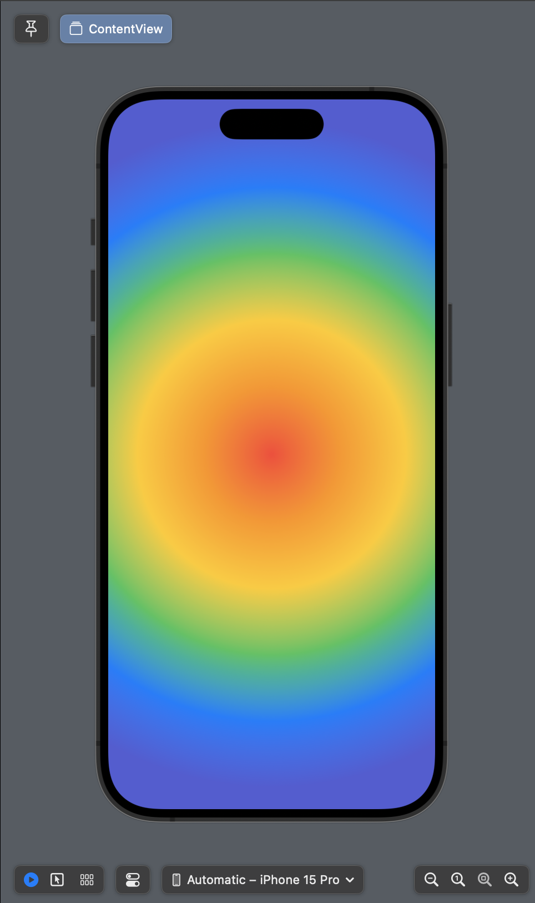

```swift
struct ContentView: View {
    let displayTemp = Measurement<UnitTemperature>(value: 38, unit: .celsius)
    
    var body: some View {
        ZStack {
            RadialGradient(colors: [.red, .orange, .yellow, .green , .blue, .indigo], center: .center, startRadius: 2, endRadius: 400)
        }
        .ignoresSafeArea()
    }
}
```

##### 角渐变：

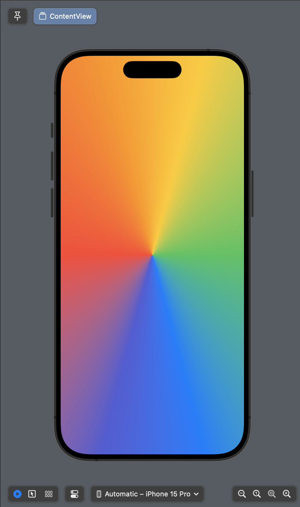

```swift
struct ContentView: View {
    let displayTemp = Measurement<UnitTemperature>(value: 38, unit: .celsius)
    
    var body: some View {
        ZStack {
            AngularGradient(colors: [.red, .orange, .yellow, .green , .blue, .indigo, .red], center: .center, angle: Angle(degrees: 180))
        }
        .ignoresSafeArea()
    }
}
```

##### 背景修饰符颜色的渐变：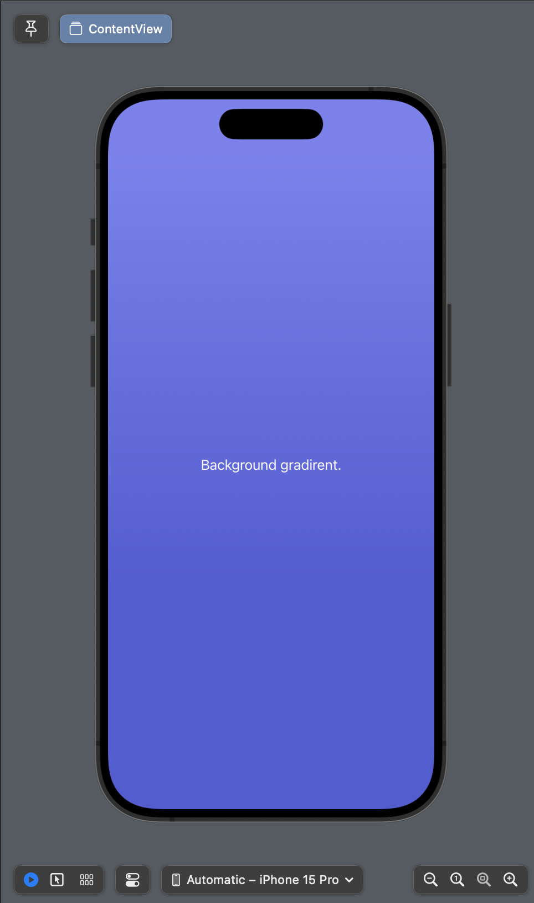

```swift
struct ContentView: View {
    var body: some View {
        Text("Background gradirent.")
            .frame(maxWidth: .infinity, maxHeight: .infinity)
            .foregroundColor(.white)
            .background(.indigo.gradient)
    }
}
```

#### 按钮：

##### 按下普通按钮，以触发对应语句：

```swift
import SwiftUI

struct ContentView: View {
    var body: some View {
        Button("Button1", action: executePrint )
    }
    
    func executePrint() {
        print("Button1 is pressed.")
    }
}

#Preview {
    ContentView()
}
```

##### 按钮角色：

设置不同的按钮角色，屏幕阅读器的效果也不同，这对障碍人士很重要。

```swift
struct ContentView: View {
    var body: some View {
        Button("Delete", role: .destructive) {
            print("Deleted something...")
        }
    }
}
```

##### SwiftUI默认的按钮样式：

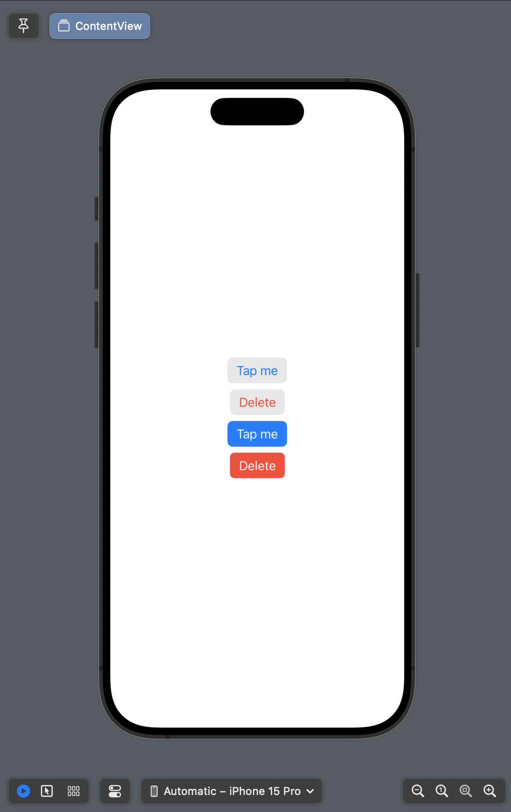

```swift
struct ContentView: View {
    var body: some View {
        Button("Tap me") { }
            .buttonStyle(.bordered)
        
        Button("Delete", role: .destructive) { }
            .buttonStyle(.bordered)
        
        Button("Tap me") { }
            .buttonStyle(.borderedProminent)
      			.tint(.blue)
        
        Button("Delete", role: .destructive) { }
            .buttonStyle(.borderedProminent)
    }
}
```

##### 自定义的按钮样式：

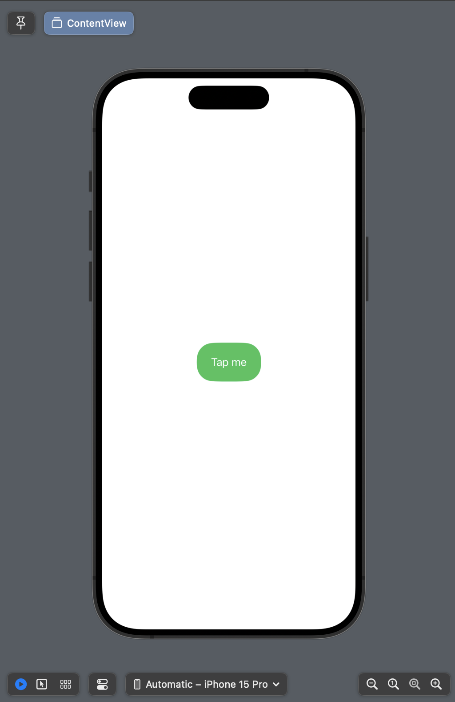

```swift
struct ContentView: View {
    var body: some View {
        Button {
            print("Button is pressed.")
        } label: {
            Text("Tap me")
                .frame(maxWidth: 100, maxHeight: 60)
                .foregroundStyle(.white)
                .background(.green)
                .cornerRadius(26)
        }
    }
}
```

##### 图片显示：

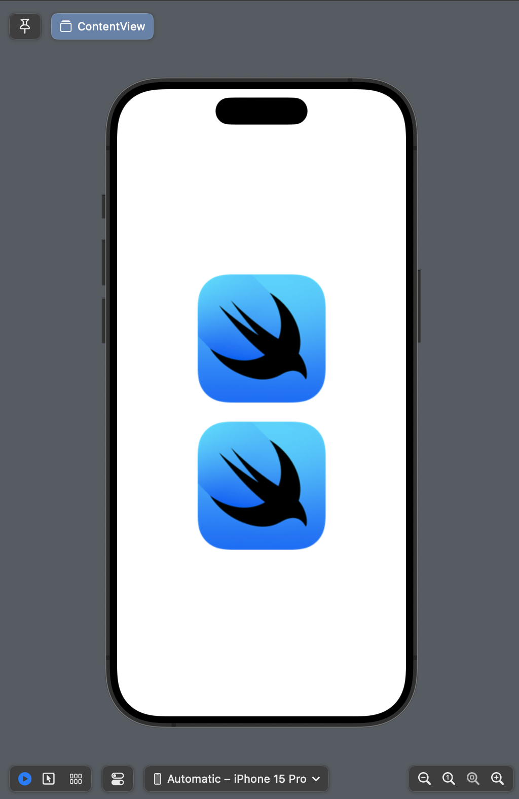

```swift
struct ContentView: View {
    var body: some View {
        Image("SwiftUI")
        Image(decorative: "SwiftUI")// 不带阅读器效果
    }
}
```

##### SF Symbols：

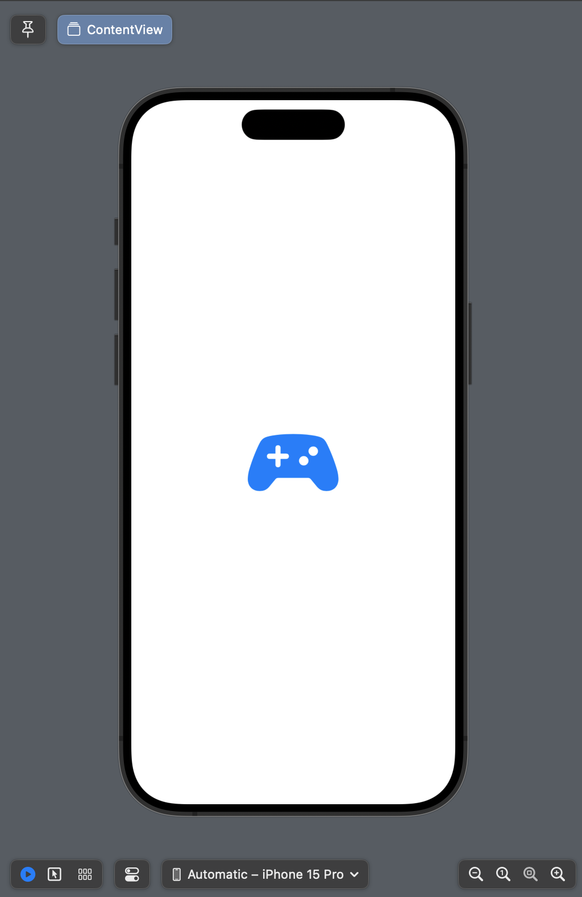

```swift
struct ContentView: View {
    var body: some View {
        Image(systemName: "gamecontroller.fill")
            .font(.system(size: 78))
            .foregroundColor(.blue)
    }
}
```

##### 图片和SF Symbols组合：


```swift
struct ContentView: View {
    var body: some View {
        Button("Game Controller", systemImage: "gamecontroller.fill") {
            
        }
    }
}
```

```swift
struct ContentView: View {
    var body: some View {
        Button {
            
        } label: {
//            写法1
//            VStack {
//                Image(systemName: "gamecontroller.fill")
//                    .font(.system(size: 88))
//                Text("Game Controller")
//            }
//            写法2:用Label样式写，Swift能更聪明地做自适应导航。
            Label("Game Controller", systemImage: "gamecontroller.fill")
        }
    }
}
```

#### 弹页面告警：

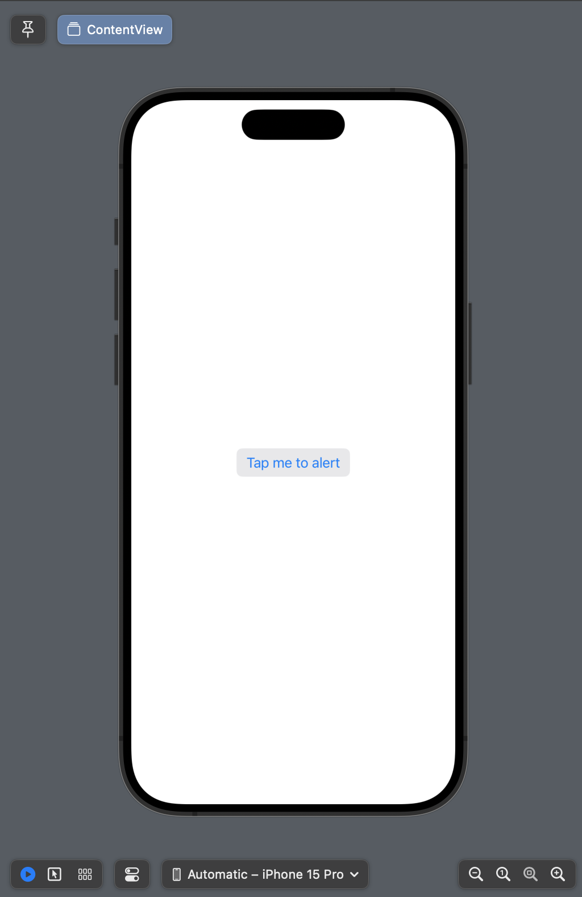

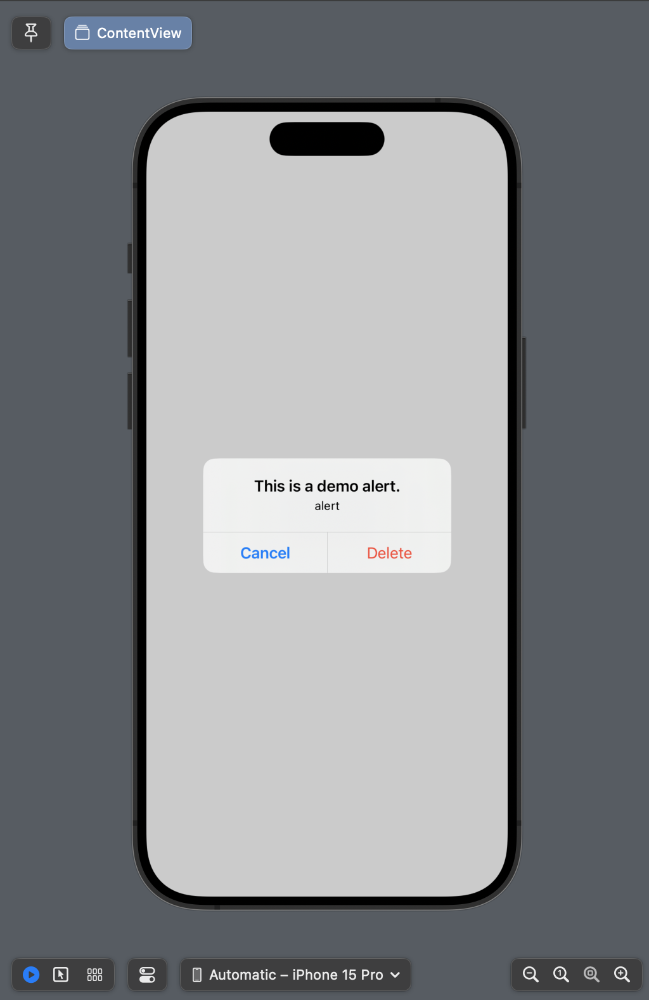

```swift
struct ContentView: View {
    @State private var isAlert = false
    
    var body: some View {
        Button("Tap me to alert") {
            isAlert = true
        }        .buttonStyle(.bordered)
        .alert("This is a demo alert.", isPresented: $isAlert) {
            // 这个闭包的所有代码执行完毕后，会自动解除报警，将$isAlert变量变为false。
            Button("Cancel", role: .cancel) { }
            Button("Delete", role: .destructive) { }
        } message: {
            //告警框里的备注说明
            Text("alert")
        }
    }
}
```

### Day21：猜棋第二部分

#### 选择国旗、判断国旗功能实现、UI界面实现（合并至Day22）

### Day22：猜棋第三部分

#### 调整模拟器的系统偏好设置

可以设置模拟器的明暗模式和系统字体大小

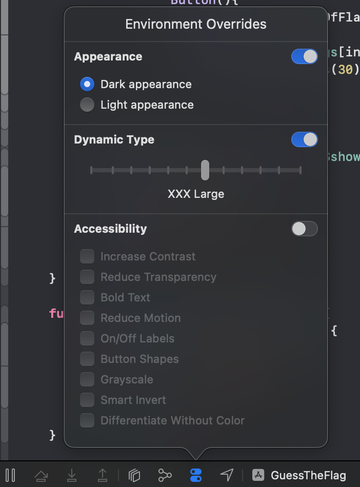

#### 加入计分功能、做错时提示正确答案、8次做题结束后重新开始、做对一次就删除这次的正确答案

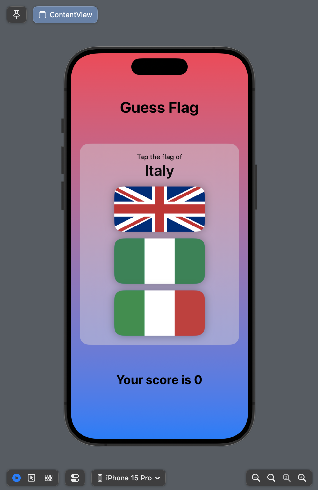

```swift
import SwiftUI

struct ContentView: View {
    static let originCountryFlags = ["Estonia", "France", "Germany", "Ireland", "Italy", "Nigeria",
                                "Poland", "Spain", "UK", "Ukraine", "US"]
    @State private var countryFlags = originCountryFlags.shuffled()
    @State private var correctAnswer = Int.random(in: 0...2)
    @State private var showScore = false
    @State private var alertTitle = ""
    @State private var score = 0
    @State private var remainingTime = 8
    @State private var restart = false
    
    var body: some View {
        ZStack {
            LinearGradient(colors: [.pink, .blue], startPoint: .top, endPoint: .bottom)
                .ignoresSafeArea()
            VStack{
                Text("Guess Flag")
                    .font(.largeTitle.bold())
                    .padding(.top, 20)
                
                Spacer()
                
                VStack(spacing: 15) {
                    VStack {
                        Text("Tap the flag of")
                            .font(.subheadline.weight(.medium)) //.subheadline是ios内置的可以随着用户环境字体变化的字体
                        Text("\(countryFlags[correctAnswer])")
                            .font(.largeTitle.weight(.semibold)) //.largeTitle是ios内置的可以随着用户环境字体变化的字体
                    }
                    
                    ForEach(0..<3) { indexOfFlag in
                        Button(){
                            tappedFlag(indexOfFlag)
                        } label: {
                            Image(countryFlags[indexOfFlag])
                                .clipShape(.buttonBorder)
                                .shadow(radius: 10)
                        }
                    }
                }
                .frame(maxWidth: .infinity)
                .padding(.vertical, 20)
                .background(.ultraThinMaterial)
                .clipShape(.rect(cornerRadius: 20))
                
                Spacer()
                
                Text("Your score is \(score)")
                    .font(.title.bold())
                
                Spacer()
            }
            .padding(20)
        }
        .alert(alertTitle, isPresented: $showScore) {
            Button("Continue") {
                refreshFlag()
            }
        } message: {
//            Text("Your score is \(score)")
            if remainingTime > 1 {
                Text("Remaining \(remainingTime) times")
            } else {
                Text("Remaining \(remainingTime) time")
            }
        }
        .alert(alertTitle, isPresented: $restart) {
            Button("Restart") {
                refreshFlag()
            }
        } message: {
//            Text("Your score is \(score)")
            if remainingTime > 1 {
                Text("Remaining \(remainingTime) times")
            } else {
                Text("Remaining \(remainingTime) time")
            }
        }
    }
    
    func tappedFlag(_ indexOfFlag: Int) {
        let needsThe = ["UK", "US"]
        let selectFlag = countryFlags[indexOfFlag]
        
        if indexOfFlag == correctAnswer {
            alertTitle = "Correct!"
            score += 1
        } else {
            if needsThe.contains(selectFlag) {
                alertTitle = "Wrong!The country of this flag is the \(selectFlag)"
            } else {
                alertTitle = "Wrong!The country of this flag is \(selectFlag)"
            }
            score -= 1
        }
        remainingTime -= 1
        
        if remainingTime == 0 {
            restart = true
        } else {
            showScore = true
        }
    }
    
    func refreshFlag() {
        countryFlags.remove(at: correctAnswer)
        countryFlags.shuffle()
        correctAnswer = Int.random(in: 0...2)
        if restart == true {
            remainingTime = 8
            score = 0
            countryFlags = Self.originCountryFlags
        }
    }
}

#Preview {
    ContentView()
}
```

### Day23：视图和修饰符第一部分

UIKit和SwfitUI一个很大的区别：UIKit的View用的是class，不管你生成的view实例有没有用到父类（UIView）中的属性，这些属性都会带给你的实例。而SwfitUI则是非常轻便简单的结构体，不带任何父类属性。所以用类时，app经常运行奔溃，性能也被浪费。

#### 修饰符的原理：

修饰符并不修改视图元素的属性，而是一层层包上去的。

```swift
struct ContentView: View {
    var body: some View {
        Button("Tap me") {
            //是不是很疑惑为什么不是一个200x200大小的红色背景按钮？那就打印看下这个按钮到底是什么类型。
            //实际上是一个被修饰符层层包裹的ContentView类型，所以修饰符的先后顺序决定了视图的样式。
            print(type(of: self))
        }
        .background(.red)
        .frame(width: 200, height: 200)
    }
}
```

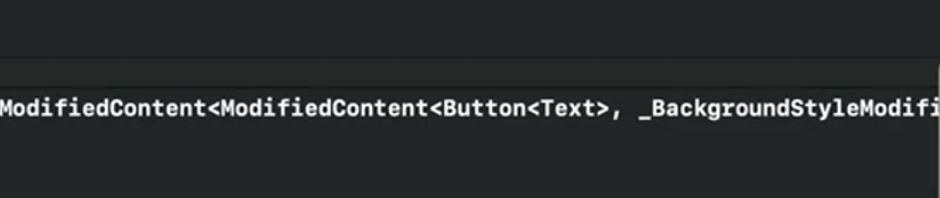

利用修饰符的先后顺序就能写出不同的效果：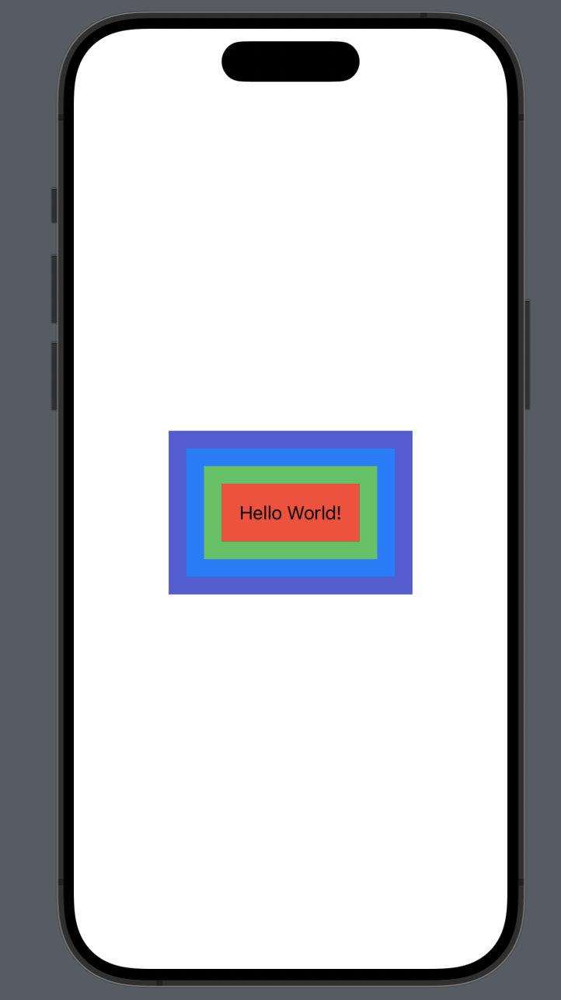

```swift
struct ContentView: View {
    var body: some View {
        Text("Hello World!")
            .padding()
            .background(.red)
            .padding()
            .background(.green)
            .padding()
            .background(.blue)
            .padding()
            .background(.indigo)
    }
}
```

#### some View：

some View是个不透明返回值，返回给body。SwiftUI在创建body时能大概认识这个视图，但在闭包内我们需要返回给SwiftUI实际的视图类型，比如Text、Image等等。

这时思考两个问题：

1.当一个包含多种视图类型的VStack被返回给body时，SwiftUI是怎么知道视图的具体类型的？

​	A：VStack会返回含有多个视图类型的元组视图类型。例如：VStack里是两个Text，那就返回包含两个Text类型的元组。

2.如果没有Stack，直接返回给body多个视图，SwiftUI是怎么处理的？

​	A：SwiftUI自动给body一个特殊属性以收容所有视图，这种特殊属性叫做视图生成器（ViewBuilder），它能将松散的view属性收容到元组视图中。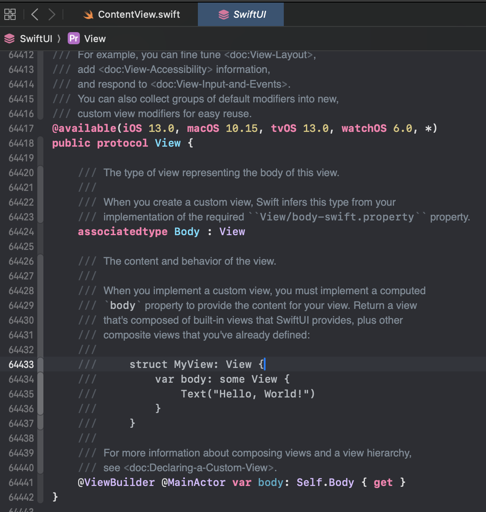

#### 三元运算符在修饰符里的作用：

相比于传统if else，能节省很多性能。如果用if else写，那就要不断地创建button，删除button。而三元运算符+修饰符，是一直监控的。

```swift
@State private var istapped = false
    
    var body: some View {
        Button("Temperature") {
            istapped.toggle()
        }
        .foregroundColor(istapped ? .green : .red)
    }
```

环境修饰符和普通修饰符：

环境修饰符：加在Stack闭包后的修饰符。

普通修饰符：加在普通view闭包后的修饰符。

环境修饰符是把修饰符修饰到子视图身上的，如果子视图也有该类的修饰符，那就以子视图的修饰符优先。（.blur这个修饰符除外）

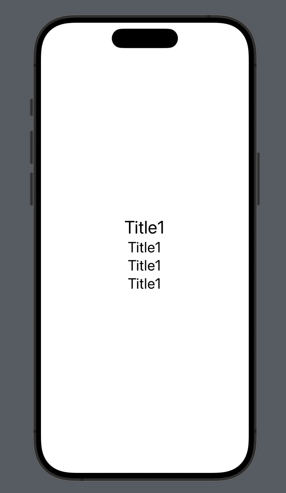

```swift
var body: some View {
        VStack {
            Text("Title1")
                .font(.largeTitle)
            Text("Title1")
            Text("Title1")
            Text("Title1")
        }
        .font(.title)
    }
```

#### 将复杂的视图拆分成一个个属性：

因为SwiftUI不允许结构体内的存储属性相互调用，所以可以使用计算属性进行包装多个视图。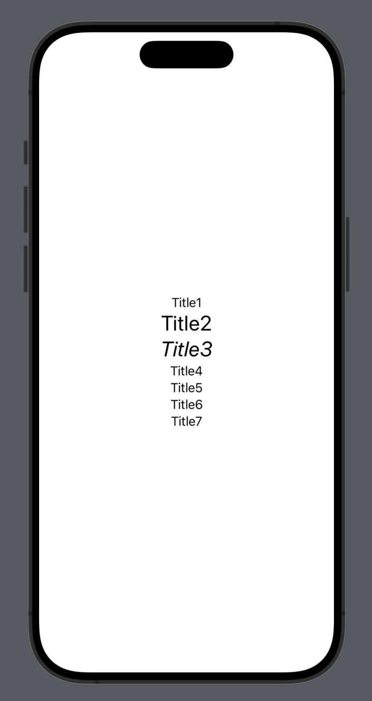

```swift
struct ContentView: View {
    let view1 = Text("Title1")
        
    let view2 = Text("Title2")
        .font(.title)
    
    let view3 = Text("Title3")
        .font(.title)
        .italic()
    
    //1.多视图写法1
    var views1: some View {
        VStack {
            Text("Title4")
            Text("Title5")
        }
    }
    //2.多视图写法2
    var views2: some View {
        Group {
            Text("Title4")
            Text("Title5")
        }
    }
    //3.多视图写法3
    @ViewBuilder var views3: some View {
        Text("Title6")
        Text("Title7")
    }
    
    var body: some View {
        VStack {
            view1
            view2
            view3
            views1
            views3
        }
    }
}
```

#### 自定义视图:

这样的创建视图的效率极高，性能极好。

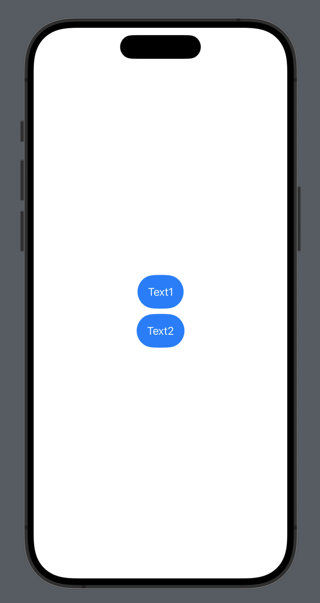

```swift
struct blueCapsuleText: View {
    var text: String
    
    var body: some View {
        Text(text)
            .padding()
            .foregroundStyle(.white)
            .background(.blue)
            .containerShape(.capsule)
    }
}

struct ContentView: View {
    var body: some View {
        blueCapsuleText(text: "Text1")
        blueCapsuleText(text: "Text2")
    }
}
```

#### 自定义修饰符:

```swift
//自定义修饰符
struct blueCapsuleModifier: ViewModifier {
    func body(content: Content) -> some View {
        content
            .padding()
            .foregroundColor(.white)
            .background(.blue)
            .containerShape(.capsule)
    }
}
//拓展view，以更方便地使用自定义修饰符
extension View {
    func blueCapsuleStyle() -> some View {
        modifier(blueCapsuleModifier())//这行代码返回了一个ModifiedContent类型
    }
}

struct ContentView: View {
    var body: some View {
        Text("Text1")
            .blueCapsuleStyle()
    }
}
```

添加水印案例：

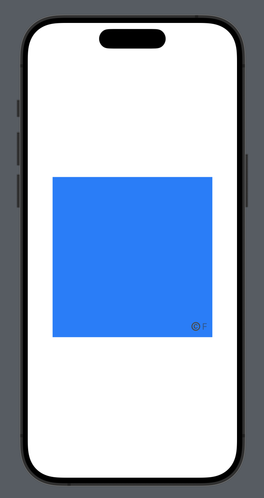

```swift
struct WaterMark: ViewModifier {
    var waterMarkText: String
    
    func body(content: Content) -> some View {
        ZStack(alignment: .bottomTrailing) {
            content//作为Z堆栈最下面的视图，是被打水印的图层
            
            Text(waterMarkText)//水印样式
                .foregroundStyle(.secondary)
                .padding(.all, 10)
        }
    }
}

extension View {
    func waterMarkStyle() -> some View {
        modifier(WaterMark(waterMarkText: "©️F"))
    }
}

struct ContentView: View {
    var body: some View {
        Color.blue
            .frame(width: 300, height: 300)
            .waterMarkStyle() 
    }
}
```

#### 使用**泛型**，自定义网格堆栈结构体：

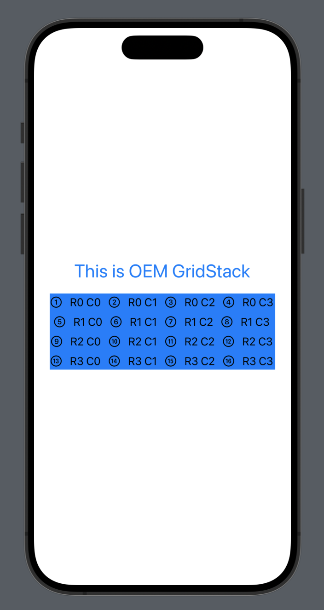

```swift
struct GridStack<Content: View>: View {
    var rows: Int
    var column: Int
    @ViewBuilder var content: (Int, Int) -> Content//1.用@ViewBuilder，让闭包返回元组视图
    
    var body: some View {
        VStack {
            ForEach(0..<rows, id: \.self) { row in
                HStack {
                    ForEach(0..<column, id: \.self) { column in
                        content(row, column)
                    }
                }
            }
        }
    }
}

struct ContentView: View {
    var body: some View {
        ZStack {
            GridStack(rows: 4, column: 4, content: { row, col in
//                HStack() { //2.用HStack，让闭包返回元组视图
                    Image(systemName: "\(row*4 + col + 1).circle")
                    Text("R\(row) C\(col)")
                        .padding(3)
//                }
            })
        }
        .background(.blue)
    }
}
```

### Day24：视图和修饰符第二部分

#### 改进1:

用三元运算符实时渲染，当小费为0%时，渲染总价字体颜色为红色

```swift
Section("Total amount") {
    Text(grandTotal, format: .currency(code: userCurrency))
        .foregroundStyle(tipPercentage == 0 ? .red : .primary)
}
```

#### 改进2:

将旗帜图案的视图写成自定义结构体，分成小模块放在其他文件里。

```swift
//ContentView.swift
ForEach(0..<3) { indexOfFlag in
  Button(){
      tappedFlag(indexOfFlag)
  } label: {
      FlagImageView(flagImageName: countryFlags[indexOfFlag])
  }
}

//FlagImage.swift
import SwiftUI

struct FlagImageView: View {
    var flagImageName: String
    
    var body: some View {
        Image(flagImageName)
            .clipShape(.buttonBorder)
            .shadow(radius: 10)
    }
}

#Preview {
    FlagImageView(flagImageName: "Germany")
}

```

### Day25：项目1-3总结案例：石头剪刀布

该案例已基于视频课中的案例进行优化，实现了现实生活中的石头剪刀布，并做得更公平更随机性。


```swift
import SwiftUI

struct ContentView: View {
    let gestures = ["✊", "✋", "✌️", "❔"]
    let resultColors: [String: Color] = [
        "winnerColor": Color(red: 0, green: 0.9, blue: 0),
        "loserColor": Color(red: 0.9, green: 0, blue: 0)
    ]
    
    @State private var computerSelected = 3
    @State private var winnerText = " "
    @State private var didYouWin = Bool.random()
    @State private var score = 0
    @State private var correctTimes = 0
    @State private var remainingTimes = 10
    @State private var remainingTimeZero = false
    
    var body: some View {
        ZStack {
            VStack {
                Spacer()
                
                Text("Computer is playing...")
                    .font(.title)
                Spacer()
                Text(gestures[computerSelected])
                    .font(.system(size: 150))
                Spacer()
                
                Text(winnerText)
                    .font(.system(size: 30, weight: .bold, design: .monospaced))
                    .foregroundStyle(didYouWin == true ? resultColors["winnerColor", default: .black] : resultColors["loserColor", default: .black])
                
                Spacer()
                Text("Choose your gesture：")
                Spacer()
                
                HStack {
                    ForEach(0..<3) { index in
                        Button(gestures[index]) {
                            computerSelected = Int.random(in: 0...2)
                            let winnerSelection = [1, 2, 0]
                            
                            if winnerSelection[computerSelected] == index {
                                winnerText = "You win!"
                                didYouWin = true
                                score += 1
                                correctTimes += 1
                            } else if computerSelected == winnerSelection[index] {
                                winnerText = "You lose!"
                                didYouWin = false
                                score -= 1
                            } else {
                                winnerText = " "
                            }
                            
                            remainingTimes -= 1
                            
                            if remainingTimes == 0 {remainingTimeZero = true}
                        }
                        .background(.ultraThinMaterial)
                        .cornerRadius(20)
                    }
                }
                .font(.system(size: 80))
                
                Spacer()
                
                Text("Your score: \(score)")
                    .font(.title)
                Text("Remaining times: \(remainingTimes)")
                    .font(.subheadline)
                
                Spacer()
            }
            .alert("Game over!", isPresented: $remainingTimeZero) {
                Button("Restart") {
                    restartGame()
                }
            } message: {
                Text("Your guessing winning rate is \(correctTimes*10) %")
            }
        }
        .frame(maxWidth: .infinity, maxHeight: .infinity)
        .background(.blue.gradient)
    }
    
    func restartGame() {
        remainingTimes = 10
        score = 0
        correctTimes = 0
        computerSelected = 3
        winnerText = " "
        remainingTimeZero = false
    }
}

#Preview {
    ContentView()
}
```

### Day26：项目四第一部分

#### Stepper()

```swift
struct ContentView: View {
    @State private var sleepTime = 8.0
    
    var body: some View {
        Stepper("\(sleepTime.formatted()) h", value: $sleepTime, in: 8...12, step: 2)
    }
}
```

#### DatePicker()

```swift
DatePicker("Select a date", selection: $dateInfo)
						.labelsHidden()//去掉时间选择器的label，但又不影响辅助旁白

DatePicker("Select a date", selection: $dateInfo, displayedComponents: .hourAndMinute)//只显示小时和分钟
            .labelsHidden()

DatePicker("", selection: $dateInfo, in: dateInfo..., displayedComponents: .date)
            .labelsHidden()//in后面加的单边范围
```

#### Date

Date这个对象是非常复杂的，因为时间不是绝对的，可能有闰年可能有闰天。试试在终端下"cal 9 1752"命令，你就会发现为了算准公历，人们把公元日历修改了。

#### 自定义时间的分和秒、获取时间的分和秒

```swift
struct ButtonModifier: ViewModifier {
    func body(content: Content) -> some View {
        content
            .padding()
            .background(.ultraThinMaterial)
            .cornerRadius(20)
    }
}

extension View {
    func oemButtonStyle() -> some View {
        modifier(ButtonModifier())
    }
}

struct ContentView: View {
    @State private var sleepTime: Date? = nil
    
    var body: some View {
        //自定义格式显示时间
        Text(Date.now.formatted(date: .complete, time: .shortened))
        
        Button("Tap to get time") {
            oemGetTime()
        }
        .oemButtonStyle()
        
        Button("Tap to set time") {
            oemSetTime()
        }
        .oemButtonStyle()
    }
    
    func oemSetTime() {
        //自定义时间的分和秒
        var dateComponents = DateComponents()
        dateComponents.hour = 8
        dateComponents.minute = 0
        let date1 = Calendar.current.date(from: dateComponents) ?? .now
        //Calendar.current.date(from: dateComponents)的意思是：
        //Calendar.current：这是一个表示当前用户日历的 Calendar 对象。它通常使用的是当前系统设置的历法（例如公历）。
        //date(from:)：这是 Calendar 的一个方法，用于将 DateComponents 转换为一个 Date 对象。
        //dateComponents：这是一个 DateComponents对象，包含了构成日期和时间的各个部分，如年、月、日、小时、分钟等。
        //所以Calendar.current.date(from: dateComponents)返回的是一个可选值。
        
        print("Time has been set to \(date1)")
    }
    
    func oemGetTime() {
        //获取时间的分和秒
        let getTime = Calendar.current.dateComponents([.hour, .minute], from: .now)
        let hour = getTime.hour ?? 0
        let minute = getTime.minute ?? 0
        
        print("hour is \(hour), minute is \(minute)")
    }
}
```

#### 机器学习：

CoreML

##### 机器学习App：Create ML

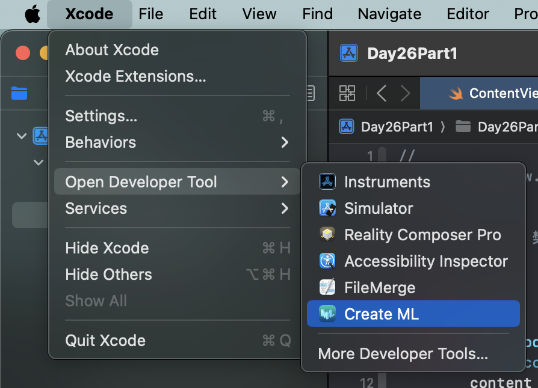

##### 选择表格回归：

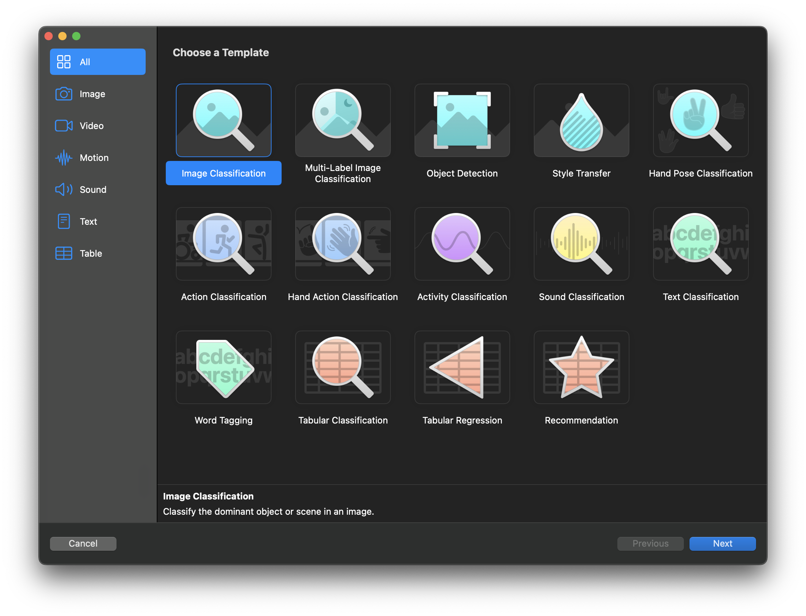

##### 导入csv文件：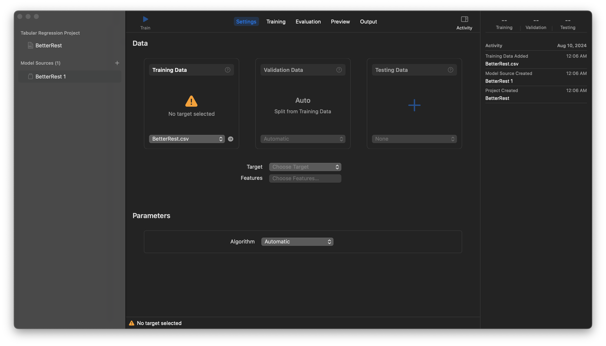

##### 选择target：

这里我们为了推算出用户实际需要的睡眠，所以选择actualSleep参数。并将Features全选，因为我们需要参考每个数对实际睡眠时间的影响。算法选择自动。

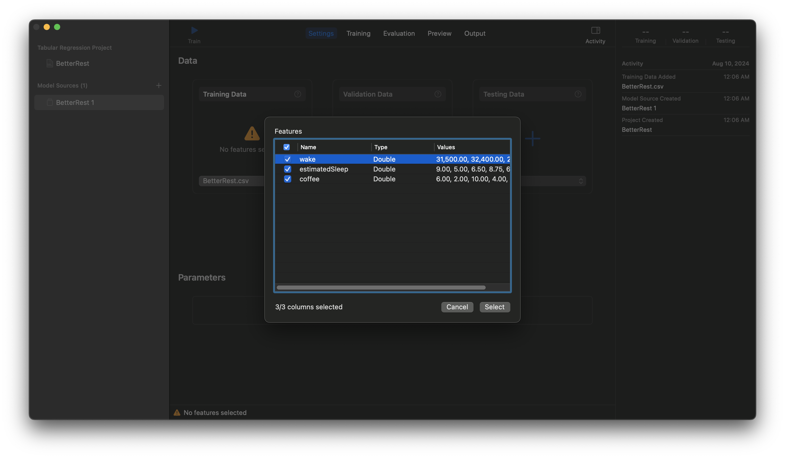

##### 开始训练

点击train按钮，等待训练完成。

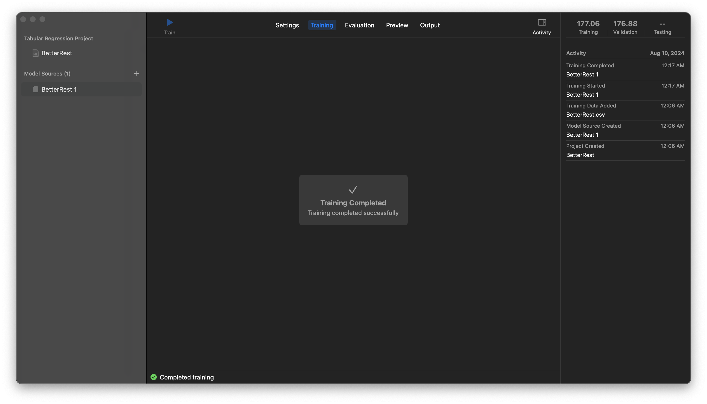

##### 训练结果：

Root Mean Square Error：

均方根误差：常用于衡量模型预测值或估计量与观测值之间差异的一种指标。它代表预测值和观察值之差的二阶样本矩的平方根，或该差值的平方平均数。这里就代表我们训练出的模型推断出的实际睡眠时间和实际情况的误差在3分钟以内。

##### 导出模型文件：

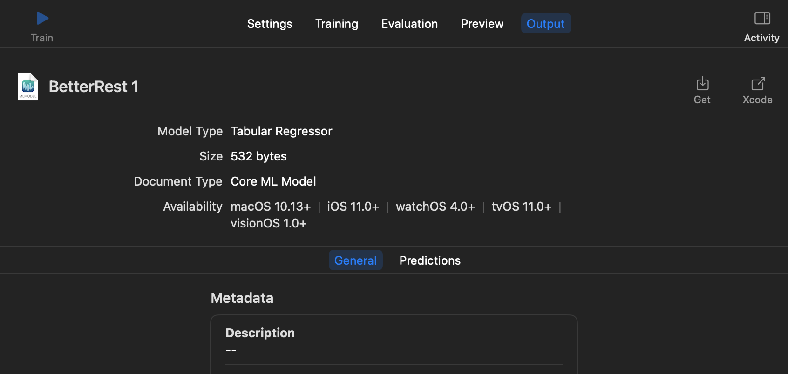

##### 机器学习的专门课程链接🔗：

https://www.youtube.com/watch?v=a905KIBw1hs

### Day27：项目四第二部分

#### 构建app基本界面

```swift
struct ContentView: View {
    @State private var wakeUpTime = Date.now
    @State private var sleepAmount = 0.0
    @State private var coffeeAmount = 0
    
    var body: some View {
        NavigationStack {
            VStack {
                Text("When do you want to wake up?")
                    .font(.headline)
                DatePicker("Select your wake up time:", selection: $wakeUpTime, displayedComponents: .hourAndMinute)
                    .labelsHidden()
                
                Text("How much time do you want to sleep?")
                    .font(.headline)
                Stepper("\(sleepAmount.formatted()) h", value: $sleepAmount, in: 1...24, step: 0.25)
                
                Text("How much coffee do you drink a day？")
                    .font(.headline)
                Stepper("\(coffeeAmount.formatted()) cup(s)", value: $coffeeAmount, in: 1...20, step: 1)
            }
            .padding()
            .navigationTitle("BetterSleep🛏️")
            .toolbar {
                Button("Calculate") {
                    calculateActualSleep()
                }
            }
        }
    }
    
    func calculateActualSleep() {
        //using CoreML calculating actual sleeping time
        
    }
}
```

#### 导入MLmodel文件

Tip：导入的模型文件名称决定了代码内模型类的名称


#### 调用CoreML API


```swift
import SwiftUI
import CoreML

struct ContentView: View {
    @State private var wakeUpTime = Date.now
    @State private var sleepAmount = 8.0
    @State private var coffeeAmount = 1
    
    @State private var alertTitle = " "
    @State private var alertMessage = " "
    @State private var isCalculateDown = false
    
    var body: some View {
        NavigationStack {
            ZStack {
                VStack {
                    Text("When do you want to wake up?")
                        .font(.headline)
                        .padding(.top, 40)
                    DatePicker("Select your wake up time:", selection: $wakeUpTime, displayedComponents: .hourAndMinute)
                        .labelsHidden()
                    
                    Spacer()
                    
                    Text("How much time do you want to sleep?")
                        .font(.headline)
                    Stepper("\(sleepAmount.formatted()) h", value: $sleepAmount, in: 1...24, step: 0.25)
                        .padding(.horizontal,30)
                    
                    Spacer()
                    
                    Text("How much coffee do you drink a day？")
                        .font(.headline)
                    Stepper("\(coffeeAmount.formatted()) cup(s)", value: $coffeeAmount, in: 0...20, step: 1)
                        .padding(.horizontal,30)
                    
                    Spacer()
                }
                .padding()
                .navigationTitle("BetterSleep🛏️")
                .toolbar {
                    Button("Calculate") {
                        calculateActualSleep()
                    }
                }
            }
            .frame(maxWidth: .infinity, maxHeight: .infinity)
            .background(.indigo.gradient)
            .alert(alertTitle, isPresented: $isCalculateDown) {
                Button("OK") {} 
            } message: {
                Text(alertMessage)
            }
        }
    }
    
    func calculateActualSleep() {
        do {
            //初始化机器学习ML模型配置
            let config = MLModelConfiguration()
            let model = try SleepCalculator(configuration: config)
            
            //获取睡醒时间的秒数
            let tmpWakeUpTime = Calendar.current.dateComponents([.hour, .minute], from: wakeUpTime)
            let tmp_estimatedSleep = (tmpWakeUpTime.hour ?? 0) * 60 * 60 + (tmpWakeUpTime.minute ?? 0) * 60
            
            //调用机器学习模型推算出实际需要睡多久
            let prediction = try model.prediction(wake: Double(tmp_estimatedSleep), estimatedSleep: sleepAmount, coffee: Double(coffeeAmount))
            
            //调用聪明的苹果API：Date类型直接减去double类型，算出实际需要睡眠的时间，
            let bedTime = wakeUpTime - prediction.actualSleep
            
            alertTitle = "Your bedtime is:"
            alertMessage = "\(bedTime.formatted(date: .omitted, time: .shortened))"
            
            isCalculateDown = true
        } catch {
            alertTitle = "Error model init!!!"
            alertMessage = "Try again later!"
        }
    }
}
```

#### 优化：

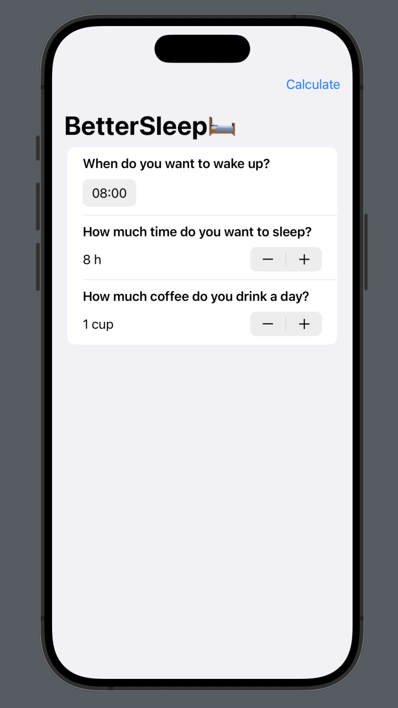

##### 设置初始入睡时间

```swift
@State private var wakeUpTime = defaultWakeUpTime

//优化一：自定义初始化起床时间，避免让用户每次手动选择。使用static让defaultWakeUpTime在结构体内共享。
static var defaultWakeUpTime: Date {
    var defaultTime = DateComponents()
    defaultTime.hour = 8
    defaultTime.minute = 0
    return Calendar.current.date(from: defaultTime) ?? Date.now
}
```

##### 改变为from表单 去除分隔符

```swift
//优化二：视图改变为from表单
                    Form {
                        VStack(alignment: .leading, spacing: 10) {
                            Text("When do you want to wake up?")
                                .font(.headline)
                            DatePicker("Select your wake up time:", selection: $wakeUpTime, displayedComponents: .hourAndMinute)
                                .labelsHidden()
                        }

                        VStack(alignment: .leading, spacing: 10) {
                            Text("How much time do you want to sleep?")
                                .font(.headline)
                            Stepper("\(sleepAmount.formatted()) h", value: $sleepAmount, in: 1...24, step: 0.25)
                        }
                        
                        VStack(alignment: .leading, spacing: 10) {
                            Text("How much coffee do you drink a day？")
                                .font(.headline)
                            Stepper("\(coffeeAmount.formatted()) cup(s)", value: $coffeeAmount, in: 0...20, step: 1)
                        }
                    }
```

##### cup(s)优化

`inflect: true` 是 Swift 的一个语言特性，它会根据插值的值自动调整字符串的形式，通常用于处理单复数形式。

```swift
Stepper("^[\(coffeeAmount) cup](inflect: true)", value: $coffeeAmount, in: 0...20)
```

#### 使用Section让Text文字更清晰

```swift
//优化四：使用Section让Text文字更清晰
Section("When do you want to wake up?") {
                            DatePicker("Select your wake up time:", selection: $wakeUpTime, displayedComponents: .hourAndMinute)
                                .labelsHidden()
}
```

#### 自定义Section样式

```swift
Section() {
      Stepper("\(sleepAmount.formatted()) h", value: $sleepAmount, in: 1...24, step: 0.25)
      } header: {//优化五：自定义Section样式
      Text("How much time do you want to sleep?")
//                                .font(.title)
      }
```

用Picker替换Stepper

```swift
//优化六：用上Picker
Picker("cups", selection: $coffeeAmount) {
    ForEach(0..<21) { index in
        Text("\(index)")
    }
}
```

### Day28：项目四第三部分

见Day27的优化部分

### Day29：项目五第一部分

#### List：

##### list和form的不同：

- form能接受用户输入，list不能。
- form不能处理动态数据，list能。

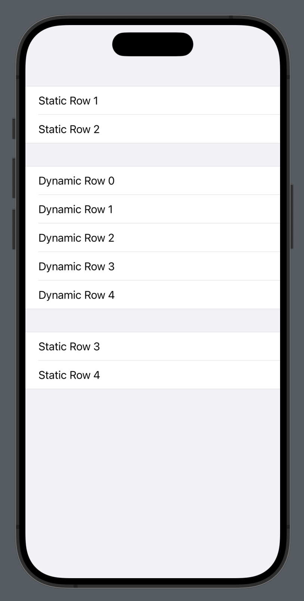

```swift
struct ContentView: View {
    var body: some View {
      	//list也能这么用
      	//List(0..<5) {
        //   Text("Dynamic Row \($0)")
        //}
        List {
            Section {
                Text("Static Row 1")
                Text("Static Row 2")
            }
            
            Section {
                ForEach(0..<5) {
                    Text("Dynamic Row \($0)")
                }
            }
            
            Section {
                Text("Static Row 3")
                Text("Static Row 4")
            }
        }
        .listStyle(.grouped)//苹果系统设置选择栏样式
    }
}

```

##### list常用来遍历显示字符串数组：

```swift
struct ContentView: View {
    let names = ["Steve", "Musk", "Gates"]
    
    var body: some View {
        List {
            Text("Name list:")
            ForEach(names, id: \.self) {
                Text("\($0)")
            }
        }
    }
}
```

#### Bundle：

不同类的应用、文件资源都会被打包到一个bundle内。我们可以使用bundle去打开一些项目内的文件。将 文件拖放到 Xcode 项目的文件浏览器（左侧的导航栏）中，通常放在 `Assets` 或 `Resources` 文件夹下，或者直接放在项目的根目录下。

```swift
func readfileUsingBundle() {
 //找到bundle.main中的文件URL
        if let fileURL = Bundle.main.url(forResource: "somefile", withExtension: "txt") {
            print(fileURL)
           //根据文件URL打开文件，读取文件内容
            if let fileContent = try? String(contentsOf: fileURL) {
                print(fileContent)
            }
        }
    }
```


#### 字符串处理：

```swift
    func characterWorks() {
        //1.分割字符串
        let string1 = "a b c"
        let chars1 = string1.components(separatedBy: " ")
        print("chars1 = \(chars1)")
        
        let string2 = """
        a
        b
        c
        """
        let chars2 = string2.components(separatedBy: "\n")
        print("chars2 = \(chars2)")
        let chars3 = chars2.randomElement()
        print(chars2.randomElement() ?? "")
        
        //2.修剪字符串：将字符前后多余的空白和换行符去除
        let trimmedString = chars3?.trimmingCharacters(in: .whitespacesAndNewlines)
//        print("trimmedString = \(trimmedString)")
        
        //3.检查字符串拼写
        //这里使用的UITextChecker()是较老的Objective-C API
        let word = "swift"
        let checker = UITextChecker()
        let range = NSRange(location: 0, length: word.utf16.count)
        
        let misspelledRange = checker.rangeOfMisspelledWord(in: word, range: range, startingAt: 0, wrap: false, language: "en")
        let allGood = misspelledRange.location == NSNotFound
        print("misspelledRange = \(allGood)")
    }

```

### Day30：项目五第二部分

#### 构建WordScramble界面，实现字符输入并显示的功能：

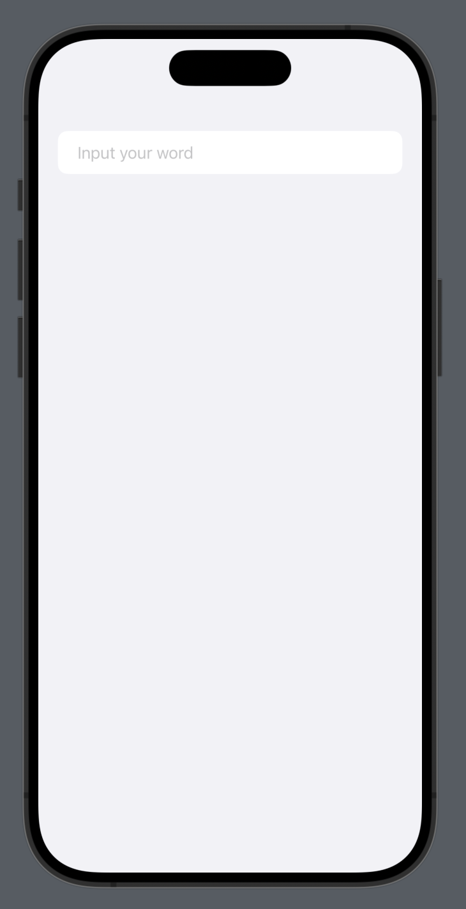

```swift
struct ContentView: View {
    @State private var storedWord = [String]()
    @State private var inputWord = ""
    @State private var rootWord = ""
    
    var body: some View {
        NavigationStack {
            List {
                Section {
                    VStack {
                        TextField("Input your word", text: $inputWord)
                            .textInputAutocapitalization(.never)//自动去除输入字符串大写
                    }
                }

                Section {
                    ForEach(storedWord, id: \.self) { word in
                        HStack {
                            Image(systemName: "\(word.count).circle")//用SF字符表示字符串总数
                            Text(word)
                        }
                    }
                }
            }
        }
        .navigationTitle(rootWord)
        .onSubmit(storeInputWords)
    }
    
    func storeInputWords() {
        //将inputword转为小写、去空格换行
        let tmpWord = inputWord.lowercased().trimmingCharacters(in: .whitespacesAndNewlines)
        //不存储空字符串
        guard tmpWord.count > 0 else { return }
        //添加字符串时新增动画
        withAnimation {
            storedWord.insert(tmpWord, at: 0)
        }
        
        inputWord = ""
    }
}
```

#### 导入start.txt到bundle：

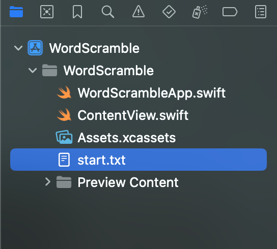

#### 从start.txt中读取单词，显示在navigation标题：

```swift
		.onAppear(perform: startGame)//一旦该视图被显示，就触发括号中的函数。

    func startGame() {
        //打开文件随机获取字符串到rootWord
        if let fileURL = Bundle.main.url(forResource: "start", withExtension: "txt") {
            if let fileContents = try? String(contentsOf: fileURL) {
                let fileWords = fileContents.components(separatedBy: "\n")
                rootWord = fileWords.randomElement() ?? "Null String"
                return
            }
        }
        //报错并直接闪退app
        fatalError("Error opening file")
    }
```

#### 检查输入字符串，完成游戏：

1. 是否原创
2. 是否在txt文件内存在
3. 是否有拼写错误


```swift
struct ContentView: View {
    @State private var storedWord = [String]()
    @State private var inputWord = ""
    @State private var rootWord = ""
    
    @State private var alertTitle = ""
    @State private var alertMessage = ""
    @State private var alertFlag = false
    
    var body: some View {
        NavigationStack {
            List {
                Section {
                    VStack {
                        TextField("Input your word", text: $inputWord)
                            .textInputAutocapitalization(.never)//自动去除输入字符串大写
                    }
                }

                Section {
                    ForEach(storedWord, id: \.self) { word in
                        HStack {
                            Image(systemName: "\(word.count).circle")//用SF字符表示字符串总数
                            Text(word)
                        }
                    }
                }
            }
            .navigationTitle(rootWord)
            .onSubmit(storeInputWords)//一旦有东西被提交，就触发括号中的函数。
            .onAppear(perform: startGame)//一旦该视图被显示，就触发括号中的函数。
            .alert(alertTitle, isPresented: $alertFlag) { } message: {
                Text(alertMessage)
            }
        }
    }
    
    func storeInputWords() {
        //将inputword转为小写、去空格换行
        let tmpWord = inputWord.lowercased().trimmingCharacters(in: .whitespacesAndNewlines)
        //不存储空字符串
        guard tmpWord.count > 0 else { return }
        
        guard isOriginal(checkWord: tmpWord) else {
            setAlerts(alertTitleIn: "Not an original word.", alertMessageIn: "Try an original word.")
            return
        }
        
        guard isSpellable(checkWord: tmpWord) else {
            setAlerts(alertTitleIn: "Not a spellable word.", alertMessageIn: "Try a spellable word.")
            alertFlag = true
            return
        }
        
        guard isInFile(checkWord: tmpWord) else {
            setAlerts(alertTitleIn: "Not an InFile word.", alertMessageIn: "Try an InFile word.")
            alertFlag = true
            return
        }
        
        //添加字符串时新增动画
        withAnimation {
            storedWord.insert(tmpWord, at: 0)
        }
        
        inputWord = ""
    }
    
    func startGame() {
        //打开文件随机获取字符串到rootWord
        if let fileURL = Bundle.main.url(forResource: "start", withExtension: "txt") {
            if let fileContents = try? String(contentsOf: fileURL) {
                let fileWords = fileContents.components(separatedBy: "\n")
                rootWord = fileWords.randomElement() ?? "Null String"
                return
            }
        }
        //报错并直接闪退app
        fatalError("Error opening file")
    }
    //设置alert报错
    func setAlerts(alertTitleIn: String, alertMessageIn: String) {
        alertTitle = alertTitleIn
        alertMessage = alertMessageIn
        alertFlag = true
    }
    //是否原创
    func isOriginal(checkWord: String) -> Bool {
        !storedWord.contains(checkWord)
    }
    //是否在txt文件内存在
    func isInFile(checkWord: String) -> Bool {
        var tmpWord = rootWord
        for char in tmpWord {
            if let pos = tmpWord.firstIndex(of: char) {
                tmpWord.remove(at: pos)
            } else {
                return false
            }
        }
        return true
    }
    //是否有拼写错误
    func isSpellable(checkWord: String) -> Bool {
        let checker = UITextChecker()
        let checkRange = NSRange(location: 0, length: checkWord.utf16.count)
        let missSpelledRange = checker.rangeOfMisspelledWord(in: checkWord, range: checkRange, startingAt: 0, wrap: false, language: "en")
        return missSpelledRange.location == NSNotFound
    }
}
```

### Day31：项目五第三部分

#### 新增重启游戏按钮：

```swift
.toolbar {
                Button("New Game") {
                    startGame()
                }
            }
            
 func startGame() {
        rootWord = ""
        storedWord.removeAll()
        score = 0
        
        //打开文件随机获取字符串到rootWord
        if let fileURL = Bundle.main.url(forResource: "start", withExtension: "txt") {
            if let fileContents = try? String(contentsOf: fileURL) {
                let fileWords = fileContents.components(separatedBy: "\n")
                rootWord = fileWords.randomElement() ?? "Null String"
                return
            }
        }
        //报错并直接闪退app
        fatalError("Error opening file")
    }
            
```

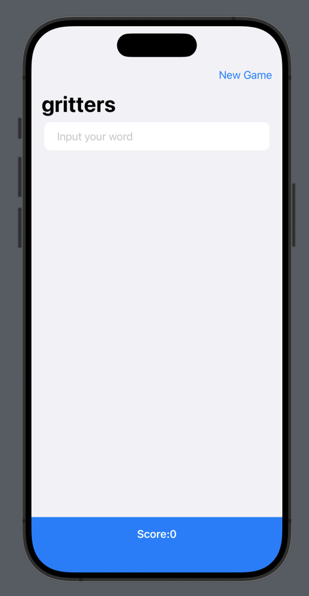

```swift
//安全区视图
            .safeAreaInset(edge: .bottom, alignment: .center, content: {
                Text("Score:\(score)")
                    .font(.headline)
                    .padding()
                    .frame(maxWidth: .infinity)
                    .background(.blue)
                    .foregroundColor(.white)
                
            })
```

### Day32：项目六第一部分

#### 动画：

动画有三种写法：

##### 1. 修饰符

高斯模糊、五种动画效果：

###### default:

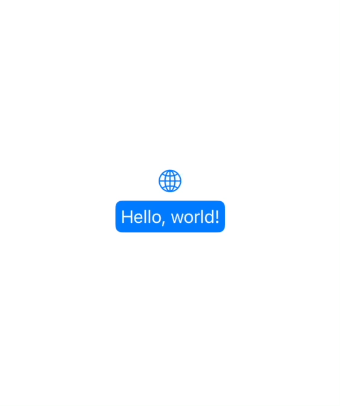

```swift
struct BlueButton: ViewModifier {
    func body(content: Content) -> some View {
        content
            .padding(5)
            .foregroundColor(.white)
            .background(.blue)
            .containerShape(.buttonBorder)
    }
}

extension View {
    func blueButtonStyle() -> some View {
        modifier(BlueButton())
    }
}

struct ContentView: View {
    @State private var animationScale = 1.0
    
    var body: some View {
        VStack {
            Image(systemName: "globe")
                .imageScale(.large)
                .foregroundStyle(.tint)
            Button("Hello, world!") {
                animationScale += 0.1
            }
            .blueButtonStyle()
            .scaleEffect(animationScale)//缩放比例
            .blur(radius: (animationScale - 1) * 3) //高斯模糊
            .animation(.default, value: animationScale)//动画效果
        }
        .padding()
    }
}
```

###### linear:

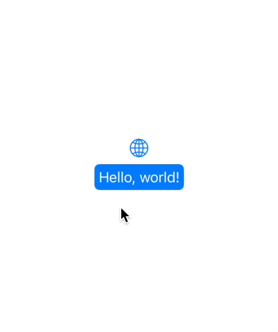

```swift
.animation(.linear, value: animationScale)
```

###### 自定义spring：

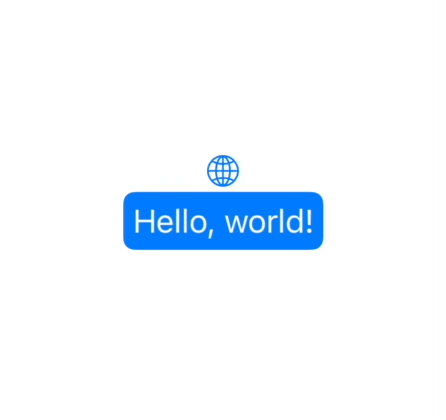

```swift
.animation(.spring(duration: 0.5, bounce: 0.9), value: animationScale)
```

###### easeInOut+延时：

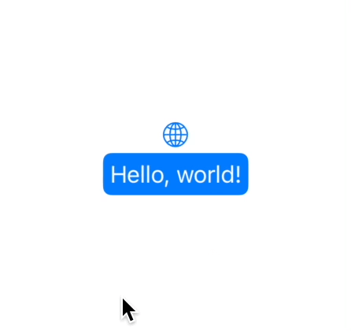

```swift
.animation(.easeInOut(duration: 1).delay(1), value: animationScale)
```

###### easeInOut+重复：

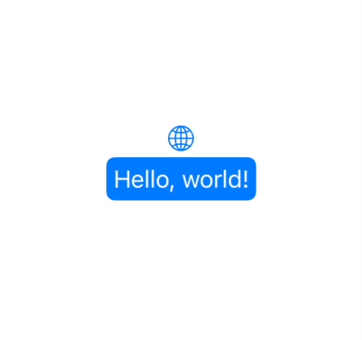

```swift
.animation(.easeInOut(duration: 1).repeatCount(3, autoreverses: true), value: animationScale)
```

tip：当repeatCount为2时，效果如下：


###### 脉冲光波扩散效果：

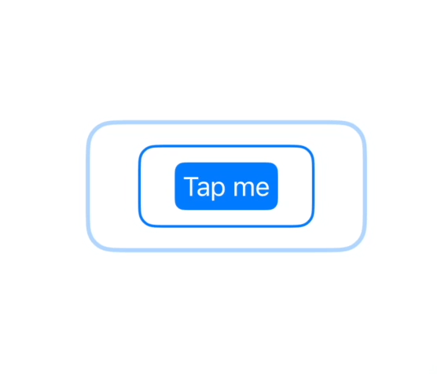

```swift
struct ContentView: View {
    @State private var animationScale = 1.0
    @State private var animationScale2 = 2.0
    
    var body: some View {
        VStack {
            Button("Tap me") {
                
            }
            .blueButtonStyle()
            .overlay {
                RoundedRectangle(cornerRadius: 6)
                    .stroke(.blue)
                    .scaleEffect(animationScale)
                    .opacity(5 - animationScale)
                    .animation(.easeOut(duration: 1.6).repeatForever(autoreverses: false), value: animationScale)
                RoundedRectangle(cornerRadius: 6)
                    .stroke(.blue)
                    .scaleEffect(animationScale2)
                    .opacity(3 - animationScale2)
                    .animation(.easeOut(duration: 1.6).repeatForever(autoreverses: false), value: animationScale2)
            }
            .onAppear {
                animationScale += 1
                animationScale2 += 1
            }
        }
        .padding()
    }
}
```

##### 2. 绑定动画系数

动画是UI视图的修饰符。

SwiftUI动画的原理：swift先获取动画应用前的视图状态a，再获取动画应用后的视图状态b，最后自动生成a到b的动画。

Stepper + $animationScale.animation()也能实现动画

```swift
Stepper("Scale number", value: $animationScale.animation(), in: 1...20)
```

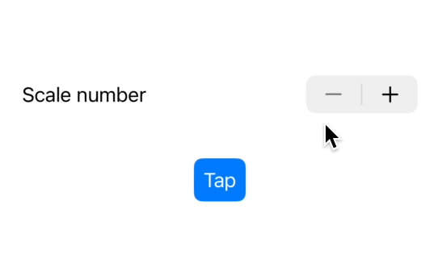

```swift
struct ContentView: View {
    @State private var animationScale = 1.0
    
    var body: some View {
        VStack {
            Stepper("Scale number", value: $animationScale.animation(
                .easeInOut(duration: 1)
                .repeatCount(3, autoreverses: true)
            ), in: 1...10)
                .padding(30)
            
            Button("Tap") {
                animationScale += 1
            }
            .padding(8)
            .background(.blue)
            .foregroundStyle(.white)
            .clipShape(.buttonBorder)
            .scaleEffect(animationScale)
        }
    }
}
```

##### 3. 闭包函数

###### 3D旋转动画+动画闭包写法：


```swift
struct ContentView: View {
    @State private var animationScale = 1.0
    @State private var rotateAngle = 0.0
    
    var body: some View {
        VStack {
            Button("Rotate") {
                withAnimation(.spring(duration: 1, bounce: 0.8)) {
                    rotateAngle += 360
                }
            }
            .padding()
            .background(.blue)
            .foregroundStyle(.white)
            .clipShape(.capsule)
            .rotation3DEffect(.degrees(rotateAngle), axis: (x: 0.0, y: 0.0, z: 1.0))
        }
    }
}
```

### Day33：项目六第二部分

#### 利用修饰符先后顺序，多动画修饰符能实现各种各样的效果：

##### 效果一：

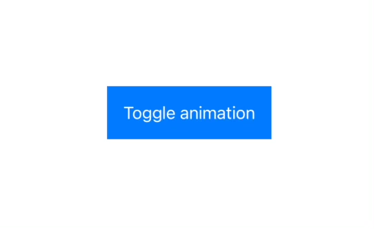

```swift
    @State private var isAnimationOn = true
    
    var body: some View {
        VStack {
            Button("Toggle animation") {
                isAnimationOn.toggle()
            }
            .padding()
            .foregroundStyle(.white)
            .background(isAnimationOn ? .blue : .indigo)
            .animation(.default, value: isAnimationOn)
            .clipShape(.rect(cornerRadius: isAnimationOn ? 0 : 15))
            .animation(.spring(duration: 1, bounce: 0.9), value: isAnimationOn)
        }
    }
```

##### 效果二：

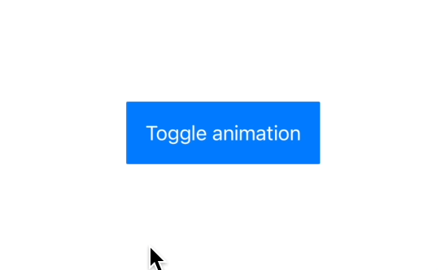

```swift
struct ContentView: View {
    @State private var isAnimationOn = true
    
    var body: some View {
        VStack {
            Button("Toggle animation") {
                isAnimationOn.toggle()
            }
            .padding()
            .foregroundStyle(.white)
            .background(isAnimationOn ? .blue : .indigo)
            .animation(nil, value: isAnimationOn)
            .clipShape(.rect(cornerRadius: isAnimationOn ? 0 : 15))
            .animation(.spring(duration: 1, bounce: 0.9), value: isAnimationOn)
        }
    }
}
```

#### 手势：

##### 拖拽卡片，松手就回到原位：

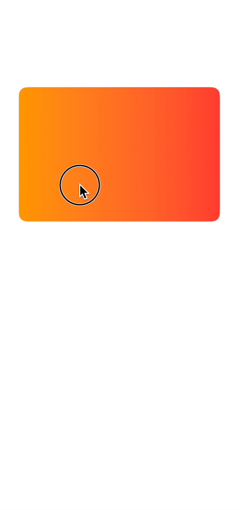

```swift
struct ContentView: View {
    @State private var dragAmount = CGSize.zero
    
    var body: some View {
        VStack {
            LinearGradient(colors: [.orange, .red], startPoint: .bottomLeading, endPoint: .bottomTrailing)
                .frame(width: 300, height: 200)
                .clipShape(.rect(cornerRadius: 12))
                .offset(dragAmount)
                .gesture(//手势创建
                    DragGesture()
                        .onChanged {dragAmount = $0.translation}//同步拖拽偏移量
                        .onEnded {_ in dragAmount = .zero}//拖拽后回到原位
                )
        }
    }
}
```

##### 为干巴巴的拖拽手势加上动画：

拖拽和归位都是bouncy的：

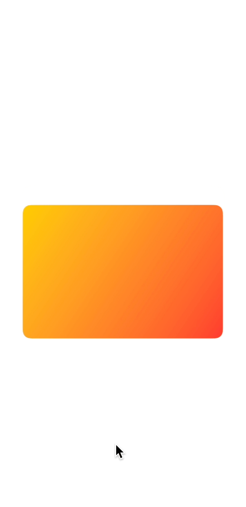

```swift
struct ContentView: View {
    @State private var dragAmount = CGSize.zero
    
    var body: some View {
        VStack {
            LinearGradient(colors: [.yellow, .red], startPoint: .topLeading, endPoint: .bottomTrailing)
                .frame(width: 300, height: 200)
                .clipShape(.rect(cornerRadius: 12))
                .offset(dragAmount)
                .gesture(//手势创建
                    DragGesture()
                        .onChanged {dragAmount = $0.translation}//同步拖拽偏移量
                        .onEnded {_ in dragAmount = .zero}//拖拽后回到原位
                )
                .animation(.bouncy, value: dragAmount)
        }
    }
}
```

只有归位才有bouncy动画：

```swift
struct ContentView: View {
    @State private var dragAmount = CGSize.zero
    
    var body: some View {
        VStack {
            LinearGradient(colors: [.yellow, .red], startPoint: .topLeading, endPoint: .bottomTrailing)
                .frame(width: 300, height: 200)
                .clipShape(.rect(cornerRadius: 12))
                .offset(dragAmount)
                .gesture(
                    DragGesture()
                        .onChanged {dragAmount = $0.translation}
                        .onEnded {_ in
                            withAnimation(.bouncy) {
                                dragAmount = .zero
                            }
                        }
                )
        }
    }
}
```

##### 字符串+延迟拖移效果：

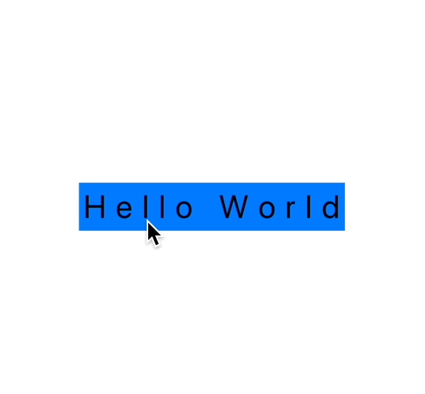

```swift
struct ContentView: View {
    let words = Array("Hello World")
    @State private var dragAmount = CGSize.zero
    
    var body: some View {
        HStack(spacing: 0) {
            ForEach(0..<words.count, id: \.self) { num in
                Text(String(words[num]))
                    .font(.title)
                    .padding(4)
                    .background(.blue)
                    .offset(dragAmount)
                    .animation(.linear.delay(Double(num) / 20), value: dragAmount)//实现延迟拖移效果
            }
        }
        .gesture(
            DragGesture()
                .onChanged {dragAmount = $0.translation}
                .onEnded {_ in dragAmount = .zero}
        )
    }
}
```

#### 动画效果：

##### 比例动画：


```swift
struct ContentView: View {
    @State private var isShowRectangle = false
    
    var body: some View {
        Button("Tap me") {
            withAnimation {
                isShowRectangle.toggle()
            }
        }
        
        if isShowRectangle {
            Rectangle()
                .fill(.blue)
                .frame(width: 160, height: 160)
                .clipShape(.rect(cornerRadius: 20))
                .transition(.scale)//动画效果
        }

    }
}
```

##### 先后不一致动画：


```swift
.transition(.asymmetric(insertion: .slide, removal: .scale))//先后不一致动画：先滑入，后缩小消失
```

#### 自定义动画修饰符：

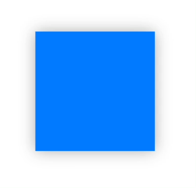

```swift
struct OEMRotate: ViewModifier {
    let angle: Double
    let anchor: UnitPoint
    
    func body(content: Content) -> some View {
        content
            .rotationEffect(.degrees(angle) , anchor: anchor)
            .clipped()//防止动画越界
    }
}

extension AnyTransition {
    static var pivot: AnyTransition {
        .modifier(
            active: OEMRotate(angle: -90, anchor: .topLeading),//激活状态
            identity: OEMRotate(angle: 0, anchor: .topLeading)//非激活状态
        )
    }
}

struct ContentView: View {
    @State private var isShowRectangle = false
    
    var body: some View {
        ZStack {
            Rectangle()
                .fill(.blue)
                .frame(width: 160, height: 160)
                .shadow(radius: 10, x: 0, y: 0)
            
            if isShowRectangle {
                Rectangle()
                    .fill(.indigo)
                    .frame(width: 160, height: 160)
                    .shadow(radius: 10, x: 0, y: 0)
                    .transition(.pivot)
            }
        }
        .onTapGesture {
            withAnimation {
                isShowRectangle.toggle()
                print(isShowRectangle)
            }
        }
    }
}
```

### Day34：项目六第三部分

基于项目二

#### 被选择的旗帜加上动画：

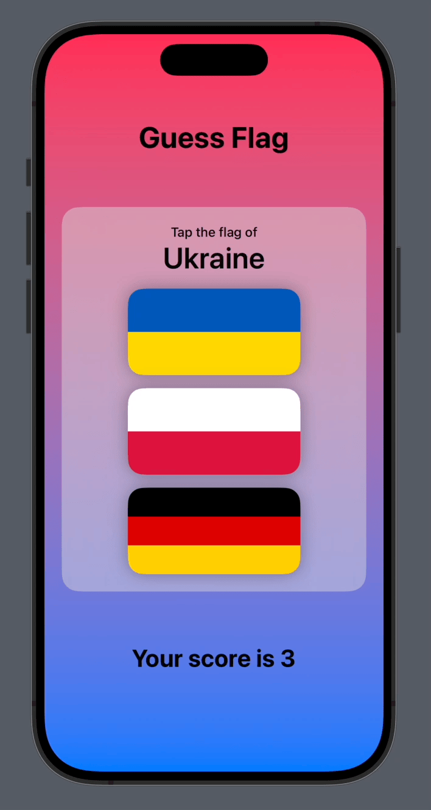

```swift
@State private var selectedFlag = -1

...

.rotation3DEffect(.degrees(selectedFlag == indexOfFlag ? 360 : 0), axis: (x: 1.0, y: 0.0, z: 0.0))
                        .animation(.bouncy, value: selectedFlag)

...


selectedFlag = indexOfFlag

```

#### 没有选择的旗帜加上不透明度、缩小、饱和度归0：

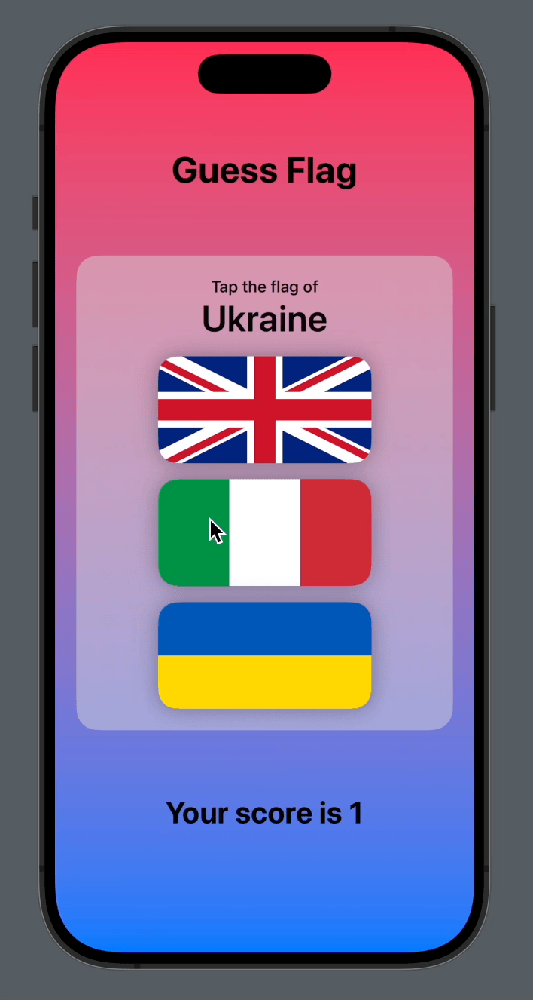

```swift
.rotation3DEffect(.degrees(selectedFlag == indexOfFlag ? 360 : 0), axis: (x: 1.0, y: 0.0, z: 0.0))
                        .opacity(selectedFlag == -1 || selectedFlag == indexOfFlag ? 1 : 0.5)
                        .scaleEffect(selectedFlag == -1 || selectedFlag == indexOfFlag ? 1 : 0.5)
												.saturation(selectedFlag == -1 || selectedFlag == indexOfFlag ? 1 : 0)//饱和度
                        .animation(.bouncy, value: selectedFlag)
```


### Day36：项目七第一部分

#### 实际开发中，类和结构体的用法：

类（引用类型）用于：多个地方共享同一份数据。（一旦有一个地方修改数据，那其他地方的数据都会被同步修改。）

结构体（值类型）用于：多个地方不共享同一份数据。（有一个地方修改数据，其他地方的数据不会被修改到 。）

##### @State用于监听struct实例：

```swift
struct User {
    var userName = "IntSur"
    var userID = "42"
}

struct ContentView: View {
    @State private var user = User()//User 是一个结构体，是值类型。当我们在 ContentView 中使用 @State private var user = User() 时，user 是 User 结构体的一个副本。每次 SwiftUI 更新视图时，如果 user 的值发生变化，SwiftUI 实际上会创建一个新的 User 实例，而不是修改原来的实例。
    var body: some View {
        VStack {
            Text("""
                 UserName = \(user.userName)
                 UserID = \(user.userID)
                 """)
            TextField("", text: $user.userName)
            TextField("", text: $user.userID)
        }
        .padding()
    }
}
```

##### @State+@Observable用于监听class实例：

```swift
@Observable//加上@Observable，让类也可以被同步更新和绑定
class User {
    var userName = "IntSur"
    var userID = "42"
}

struct ContentView: View {
    @State private var user = User()//User 是一个类，是引用类型。当我们在 ContentView 中使用 @State private var user = User() 时，user 变量实际上是一个对 User 实例的引用。我们可以直接通过 user.userName 或 user.userID 修改这个实例的属性，而这些修改会在所有引用这个实例的地方反映出来。
    
    var body: some View {
        VStack {
            Text("""
                 UserName = \(user.userName)
                 UserID = \(user.userID)
                 """)
            TextField("", text: $user.userName)
            TextField("", text: $user.userID)
        }
        .padding()
    }
}
```

##### 了解@Observable宏的工作原理：

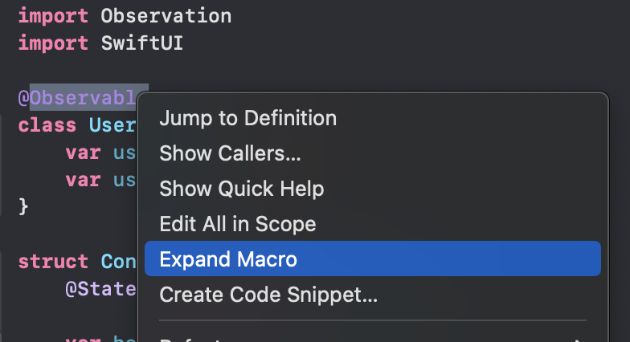

#### sheet：

##### 调用sheet浮动界面视图：

调用sheet浮动界面视图的方式类似于alert

```swift
struct SheetView: View {
    let name: String
    
    var body: some View {
        Text("Hello, \(name)!")
    }
}

struct ContentView: View {
    @State private var showSheet = true
    
    var body: some View {
        Button("Show sheet") {
            showSheet.toggle()
        }
        .sheet(isPresented: $showSheet) {
            SheetView(name: "IntSur")
        }
    }
}
```

##### 用@Environment实现退出sheet视图：

```swift
struct SheetView: View {
    @Environment(\.dismiss) var dismiss//用@Environment实现退出sheet视图
    
    let name: String
    
    var body: some View {
        Text("Hello, \(name)!")
        Button("Tap to dismiss sheet") {
            dismiss()
        }
    }
}
```

#### 删除行：

##### List+onDelete实现删除行：

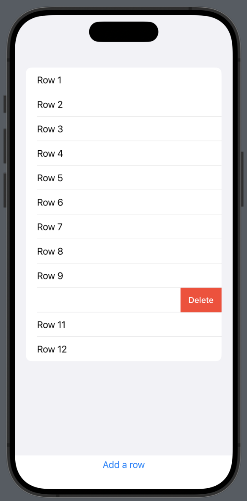

```swift
struct ContentView: View {
    @State private var rowNumbers = [Int]()
    @State private var addedNumber = 1
    
    var body: some View {
        List {
            ForEach(rowNumbers, id: \.self) {
                Text("Row \($0)")
            }
            .onDelete(perform: deleteRow)//调用onDelete，perform要求传入一个用来处理indexSet的闭包
        }
        
        Button("Add a row") {
            rowNumbers.append(addedNumber)
            addedNumber += 1
        }
    }
    
    /*我们把闭包写成一个单独函数，用来处理indexSet。
    这里的IndexSet是SwiftUI自包装的结构体，主要用于存储一组整数值，通常是表示集合中的索引。
    它是一个高效的方式来管理整数范围，特别是在需要表示一组连续或非连续的整数索引时。*/
    func deleteRow(at rowIndex: IndexSet) {
        rowNumbers.remove(atOffsets: rowIndex)
    }
}
```

##### 批量删除多行：

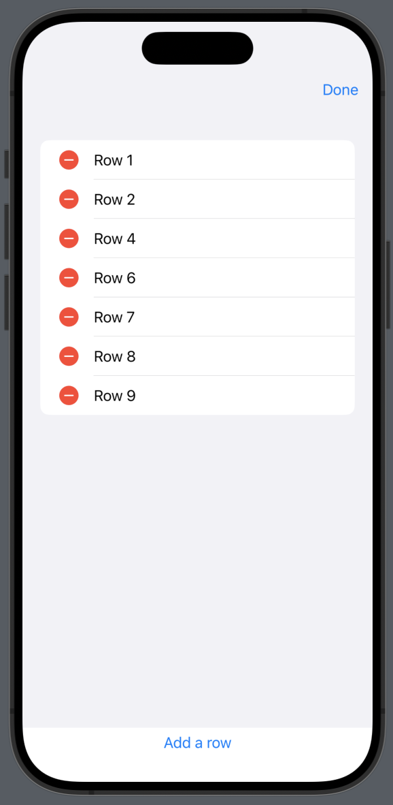

```swift
NavigationStack {
    ...
    .toolbar {
        EditButton()
    }
}        
```

#### app数据：

app预加载数据大小应控制在512KB以内，否则开app会很卡。这个预加载内容一般用来放：用户最后一次打开app查看的最后一条新闻等。

##### 原始方法实现存储用户上次使用app时的数据：

用这种方法存储数据的缺点：用户快速退出时，最新的操作数据无法同步至UserDefaults区域中。

```swift
struct ContentView: View {
    @State private var addedNumber = UserDefaults.standard.integer(forKey: "tap")
    
    var body: some View {
        Text("Number is \(addedNumber)")
        Button("Tap to add number") {
            addedNumber += 1
            /*
             这行代码使用了 UserDefaults 来保存数据，是在 iOS 开发中非常常见的一种方式。
             UserDefaults 提供了一种轻量级的方式来存储用户偏好设置或应用的简单配置数据。
             
             UserDefaults.standard:
             UserDefaults 是一个用于在应用程序中存储键值对的类。
             standard 是 UserDefaults 的单例实例，代表应用程序的默认数据库，用于存储和读取数据。
             
             set(_:forKey:):
             set 方法用于将数据存储到 UserDefaults 中。
             第一个参数 addedNumber 是你想要保存的数据，可以是 Int、Double、String、Bool、Array、Dictionary 或其他 Property List 类型。
             forKey: "tap" 是存储这个数据所使用的键，"tap" 是你用来标识和检索这个值的字符串键。
             */
            UserDefaults.standard.set(addedNumber, forKey: "tap")
        }
    }
}
```

##### 用内容包装器@AppStorage

这种写法的好处：用户快速退出时，最新的操作数据可以同步至UserDefaults区域中。

```swift
struct ContentView: View {
    @AppStorage("tapNumber") private var addedNumber = 0//@AppStorage括号里的key可以随意命名
    
    var body: some View {
        Text("Number is \(addedNumber)")
        Button("Tap to add number") {
            addedNumber += 1
        }
    }
}
```

##### 将app数据转码成json格式（或者其他类型的数据格式）：

```swift
struct UserInfo: Codable {//Codable:可编码的
    let firstName: String
    let secondName: String
}

struct ContentView: View {
    @State private var user = UserInfo(firstName: "Steve", secondName: "Jobs")
    
    var body: some View {
        Button("Save user info") {
            let encoder = JSONEncoder()//调用JSON编码器
            
            if let userData = try? encoder.encode(user) {//将用户数据编码为JSON格式
                UserDefaults.standard.set(userData, forKey: "usrInfo")//将JSON格式数据存到用户默认数据内存中
            }
        }
    }
}
```

### Day37：项目七第二部分

#### iExpense基本界面：

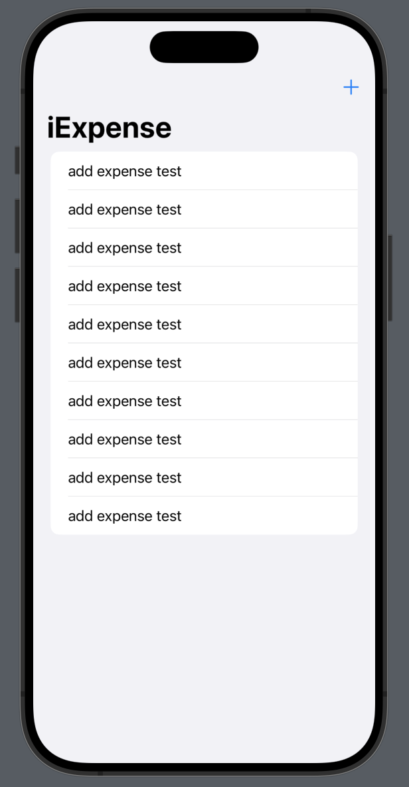

```swift
struct ExpenseItem {
    let name: String
    let type: String
    let amount: Double
}

@Observable
class Expenses {
    var items = [ExpenseItem]()
}

struct ContentView: View {
    @State private var expenses = Expenses()
    
    var body: some View {
        NavigationStack {
            VStack {
                List {
                    ForEach(expenses.items, id: \.name) {
                        Text("\($0.name)")
                    }
                    .onDelete(perform: { indexSet in
                        expenses.items.remove(atOffsets: indexSet)
                    })
                }
            }
            .navigationTitle("iExpense")
            .toolbar {
                Button("Add an expense", systemImage: "plus") {
                    expenses.items.append(ExpenseItem(name: "add expense test", type: "lunch", amount: 5))
                }
            }
        }
    }
}
```

#### 解决id.name不唯一的问题：

虽然在上面我们新建了动态list、用“+”加号toolbar新增item、设置了左滑删除item数据。但是foreach所用的id并不唯一，这是一个严重的逻辑错误，所以我们用以下代码解决这个不唯一问题。

##### UUID

```swift
struct ExpenseItem: Identifiable {//Identifiable协议专用于创建独一无二的数据
    let id = UUID()//创建一个独一无二的编码：UUID
    let name: String
    let type: String
    let amount: Double
}
...
ForEach(expenses.items) {//同时ForEach可以不用写id
                        Text("\($0.name)")
                    }
```

#### 新增一个AddView

##### 新增addview.swift，给用户填写消费信息：

```swift
import SwiftUI

struct AddView: View {
    @State private var name = ""
    @State private var type = "Personal"
    @State private var amount = 0.0
    
    let types = ["Buisness", "Personal"]
    
    var body: some View {
        NavigationStack {
            List {
                TextField("Name", text: $name)
                
                Picker("Type", selection: $type) {
                    ForEach(types, id: \.self) {
                        Text("\($0)")
                    }
                }
                
                TextField("Amount", value: $amount, format: .currency(code: "USD"))
                    .keyboardType(.decimalPad)
            }
        }
    }
}

#Preview {
    AddView()
}
```

##### 用sheet连接ContentView和AddView

```swift
//ContentView.Swift
@State private var showAddView = false
  
  .toolbar {
      Button("Add an expense", systemImage: "plus") {
          showAddView = true
      }
  }
  .sheet(isPresented: $showAddView) {
      AddView(expense: expenses)//将ContenView中创建的Expense实例传递到AddView中
  }
```

```swift
//AddView.Swift
...
var expense: Expenses
...
#Preview {
    AddView(expense: Expenses())
}
```

#### 数据提交功能：

```swift
//AddView.Swift
Button("Save") {
                    expense.items.append(ExpenseItem(name: name, type: type, amount: amount))
                }
```

#### 用JSON编解码方式保存用户数据：

这样，即使用户退出了app，也能将最后使用的数据保存下来。

```swift
struct ExpenseItem: Identifiable, Codable {//Identifiable协议专用于创建独一无二的数据
    var id = UUID()//创建一个独一无二的编码：UUID。这里不能使用let，是因为：常量不可被编码成JSON。
    let name: String
    let type: String
    let amount: Double
}

@Observable
class Expenses {
    var items = [ExpenseItem]() {
        didSet {
            if let encodedData = try? JSONEncoder().encode(items) {//转码成JSON
                UserDefaults.standard.set(encodedData, forKey: "expenseItems")//将JSON数据传入app退出也不丢失数据的内存中
            }
        }
    }
    
    init() {
        if let decodedData = UserDefaults.standard.data(forKey: "expenseItems") {//解码成ExpenseItem
            if let decodedItems = try? JSONDecoder().decode([ExpenseItem].self, from: decodedData) {//将解码出的数据赋值
                items = decodedItems
                return
            }
        }
        items = []
    }
}
```

#### 按下Save按钮后退出sheet：

```swift
@Environment(\.dismiss) var dismiss
...
.toolbar {
                Button("Save") {
                    expense.items.append(ExpenseItem(name: name, type: type, amount: amount))
                    dismiss()
                }
            }
```

#### 显示详细信息：

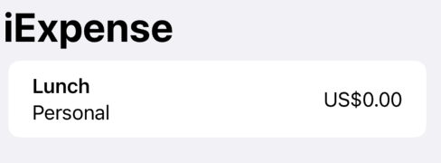

```swift
List {
                ForEach(expenses.items) { item in
                    HStack {
                        VStack(alignment: .leading) {
                            Text(item.name)
                                .font(.headline)
                            Text(item.type)
                        }
                        
                        Spacer()
                        
                        Text(item.amount, format: .currency(code: "USD"))
                    }
                }
                .onDelete(perform: { indexSet in
                    expenses.items.remove(atOffsets: indexSet)
                })
            }
```

### Day38：项目七第三部分

#### iExpense优化：

##### 获取用户环境偏好货币单位：

```swift
let currency = Locale.current.currency?.identifier ?? "USD"
...
TextField("Amount", value: $amount, format: .currency(code: currency))
```

##### 自定义不同货币数值下的样式：

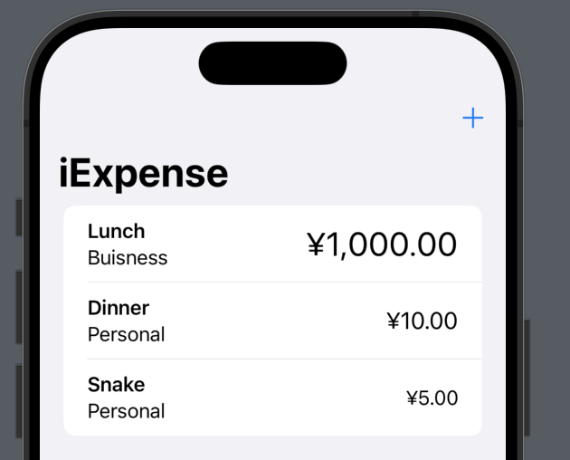

```swift
//新增OEM-currencyTitle.swift
import SwiftUI

extension View {
    func oemCurrencyStyle(items: ExpenseItem) -> some View {
        if items.amount < 10 {
            return self.font(.body)
        } else if items.amount < 100 {
            return self.font(.title3)
        } else {
            return self.font(.title)
        }
    }
}
```

#### 根据消费类别进行分组：

```swift
@Observable
class Expenses {
   ...
    
    var personalItems: [ExpenseItem] {
        items.filter { $0.type == "Personal" }
    }

    var buisnessItems: [ExpenseItem] {
        items.filter { $0.type == "Buisness" }
    }
    
    ...
}
```

#### 重写删除item函数，需分为删除buisness和personal：

```swift
struct ExpenseItem: Identifiable, Codable, Equatable //加上Equatable让实例可以被比较、被用上firstIndex。

...

func deleteItems(at offsets: IndexSet, in inputItems: [ExpenseItem]) {
        var indexOfDelItems = IndexSet()
        
        for offset in offsets {
            let item = inputItems[offset]
            
            if let index = expenses.items.firstIndex(of: item) {
                indexOfDelItems.insert(index)
            }
        }
        
        expenses.items.remove(atOffsets: indexOfDelItems)
    }
    
func deleteBuisnessItems(at offsets: IndexSet) {
    deleteItems(at: offsets, in: expenses.buisnessItems)
}
    
func deletePersonalItems(at offsets: IndexSet) {
    deleteItems(at: offsets, in: expenses.personalItems)
}
```

#### 新建分类后的section视图：

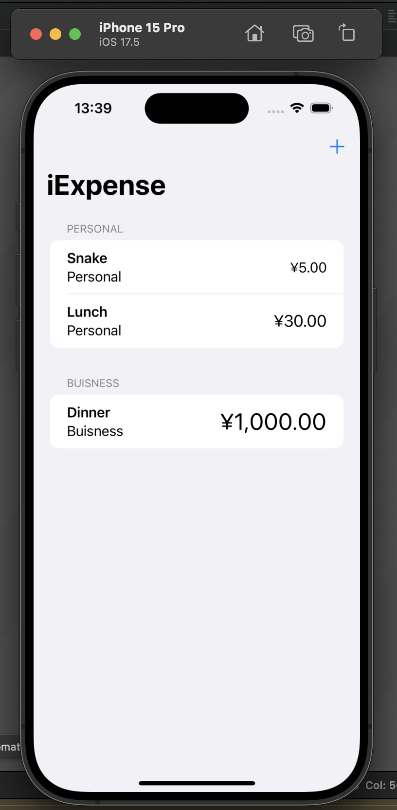

```swift
//ContentView.swift
List {
                TypeView(sectionTitle: "Personal", expenses: expenses.personalItems, deleteUsingType: deletePersonalItems)
                
                TypeView(sectionTitle: "Buisness", expenses: expenses.buisnessItems, deleteUsingType: deleteBuisnessItems)
            }

//TypeView.swift
import SwiftUI

struct TypeView: View {
    let sectionTitle: String
    let expenses: [ExpenseItem]
    let deleteUsingType: (IndexSet) -> Void
    
    let currency = Locale.current.currency?.identifier ?? "USD"
    
    var body: some View {
            Section(sectionTitle) {
                ForEach(expenses) { item in
                        HStack {
                            VStack(alignment: .leading) {
                                Text(item.name)
                                    .font(.headline)
                                Text(item.type)
                            }
                            
                            Spacer()
                            
                            Text(item.amount, format: .currency(code: currency))
                                .oemCurrencyStyle(items: item)
                        }
                }
                .onDelete(perform: deleteUsingType)
            }
    }
}

#Preview {
    TypeView(sectionTitle: "", expenses: [ExpenseItem](), deleteUsingType: {_ in })
}
```

### Day39：项目八第一部分

#### Image

##### 设置图片大小的相关修饰符：

```swift
struct ContentView: View {
    var body: some View {
        VStack {
            Image(.swiftui)
                .resizable()//自适应大小
                .scaledToFit()//适应frame
                .scaledToFill()//填充frame
                .frame(width: 80, height: 100)
//                .clipped()//裁剪到框架大小
        }
        .padding()
    }
}
```

##### 设置相对大小：

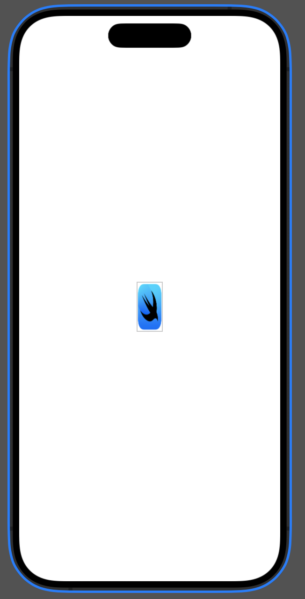

```swift
Image(.swiftui)
    .resizable()
    .containerRelativeFrame(.vertical) { size, axis in//设置垂直方向上，image的size为父视图size的0.1倍
        size * 0.1
    }
```

#### ScrollView

##### 创建滚动视图、懒加载Stack：

ScrollView中用ForEach一下子生成很多视图时，系统会卡顿，LazyStack能节约资源，当视图划到哪些地方再加载其数据。

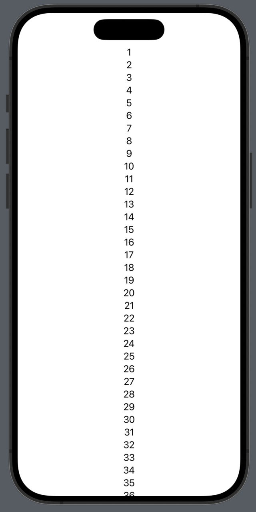

```swift
struct OEMText: View {
    var text: String
    
    var body: some View {
        Text(text)
    }
    
    init(text: String) {
        print("creatd an oem view \(text)")
        self.text = text
    }
}

struct ContentView: View {
    var body: some View {
        ScrollView(.horizontal) {//可以是水平 可以是垂直
            LazyHStack {//ScrollView中用ForEach一下子生成很多视图时，系统会卡顿，LazyStack能节约资源，当视图划到哪些地方再加载其数据。
                ForEach(1..<100) {
                    OEMText(text: "\($0)")
                }
            }
//            .frame(maxWidth: .infinity)
        }
    }
}
```

#### NavigationLink

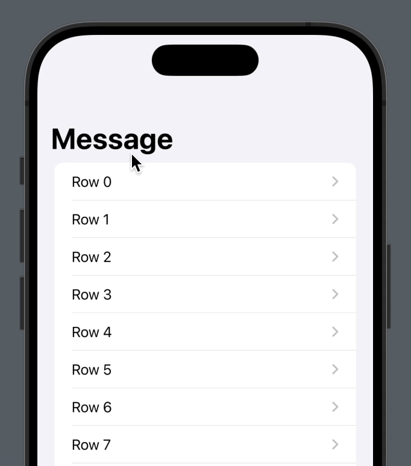

跳转至其他页面有sheet、navigationlink。sheet一般用于设置、表单信息收集；NavigationLink用于显示多内容信息。

```swift
struct ContentView: View {
    @State private var messages = ""
    
    var body: some View {
        NavigationStack {
            NavigationLink("Send Message") {
                Text("BestFriend")
                    .padding(.vertical)
                
                Spacer()
                
                TextField("Input your message", text: $messages)
                    .padding(10)
                    .background(Color(UIColor.systemGray6))
                    .cornerRadius(8)
                    .padding(.horizontal)
            }
            .navigationTitle("Message")
        }
    }
}
```

##### navigationlink多文本用label写法：

```swift
struct ContentView: View {
    @State private var messages = ""
    
    var body: some View {
        NavigationStack {
            NavigationLink {
                Text("BestFriend")
                    .padding(.vertical)
            } label: {
                VStack {
                    Text("Send a message")
                    Text("To your friend")
                }
            }
            .navigationTitle("Message")
        }
    }
}
```

##### navigationlink+foreach批量生成行视图：

生成的行会自动有一个小箭头，告诉用户这些行可以点击：

```swift
struct ContentView: View {
    @State private var messages = ""
    
    var body: some View {
        NavigationStack {
            List(0..<100) { row in
                NavigationLink("Row \(row)") {
                    Text("Detail \(row)")
                }
            }
            .navigationTitle("Message")
        }
    }
}
```

#### 多层JSON decode解析：

```swift
struct People: Codable {
    let name: String
    let address: Address
}

struct Address: Codable {
    let street: String
    let city: String
}

struct ContentView: View {
    var body: some View {
            Button("Decode JSON") {
                let JSON_Data = """
                {
                    "name": "Taylor Swift",
                    "address": {
                        "street": "555, NY Road",
                        "city": "New York"
                    }
                }
                """
                
                let data = Data(JSON_Data.utf8)
                let decoder = JSONDecoder()
                
                if let datas = try? decoder.decode(People.self, from: data) {
                    print(datas.address.city)
                }
            }
    }
}
```

#### 多行表格Grid：

##### 固定列宽：

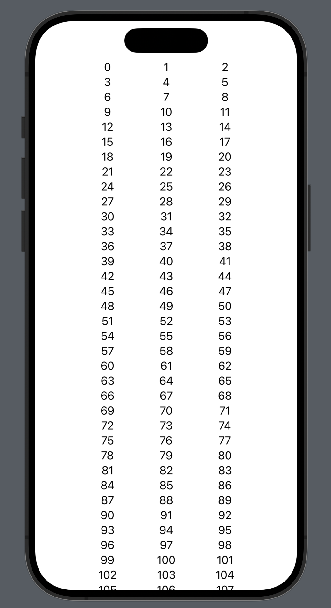

```swift
struct ContentView: View {
    let lines = [
        GridItem(.fixed(80)),
        GridItem(.fixed(80)),
        GridItem(.fixed(80))//固定列宽为80pt
    ]
    var body: some View {
        ScrollView {
            LazyVGrid(columns: lines) {
                ForEach(0..<1000) {
                    Text("\($0)")
                }
            }
        }
    }
}
```

##### 自适应列宽：

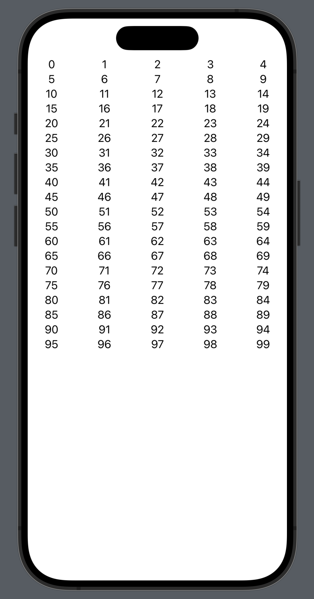

```swift
struct ContentView: View {
    let lines = [
        GridItem(.adaptive(minimum: 60, maximum: 100))
    ]
    var body: some View {
        ScrollView {
            LazyVGrid(columns: lines) {
                ForEach(0..<100) {
                    Text("\($0)")
                }
            }
        }
    }
}
```

### Day40：项目八第二部分

#### 导入素材文件：

json+jpgs

#### 新建宇航员swift文件：

```swift
//Astronauts.swift
import Foundation

struct Astronauts: Codable, Identifiable {
    let id: String
    let name: String
    let description: String
}
```

#### 新建自定义bundle拓展文件：

##### 拓展一个能自定义解码JSON数据的方法：

```swift
//Bundle-Codable.swift
import Foundation

extension Bundle {
    func decodeJSON(_ file: String) -> [String: Astronauts] {
        guard let fileURL = Bundle.main.url(forResource: file, withExtension: nil) else {//拿文件URL
            fatalError("Open \(file) fileURL failed")
        }
        
        guard let data = try? Data(contentsOf: fileURL) else {//提取文件里的JSON内容
            fatalError("Export \(file) JSON data failed")
        }
        
        let decoder = JSONDecoder()
        
        guard let decodedStrings = try? decoder.decode([String: Astronauts].self, from: data) else {//解码
            fatalError("decode \(file) JSON to String failed")
        }
        
        return decodedStrings
    }
}
```

##### 优化解码debug：

```swift
let decoder = JSONDecoder()
        
        //!!!十分好用的decode报错模版,推荐在自己的app中使用
        do {
            return try decoder.decode([String: Astronauts].self, from: data)
        } catch DecodingError.keyNotFound(let key, let context) {
            fatalError("Failed to decode \(file) from bundle due to missing key '\(key.stringValue)' - \(context.debugDescription)")
        } catch DecodingError.valueNotFound(let type, let context) {
            fatalError("Failed to decode \(file) from bundle due to missing \(type) value - \(context.debugDescription)")
        } catch DecodingError.typeMismatch(_, let context) {
            fatalError("Failed to decode \(file) from bundle due to type mismatch - \(context.debugDescription)")
        } catch DecodingError.dataCorrupted(_) {
            fatalError("Failed to decode \(file) from bundle because it appears to be invaild JSON.")
        } catch {
            fatalError("Failed to decode \(file) from bundle: \(error.localizedDescription)")
        }
```

##### 加入missionsJSON解析：

##### 加入missions结构体：

```swift
//Missions.swift
import Foundation

struct Missions: Codable, Identifiable {
    struct Roles: Codable {//嵌套结构体可以理清结构体逻辑
        let name: String
        let role: String 
    }
    
    let id: Int
    let launchDate: String?
    let crewRoles: [Roles]
    let description: String
}
```

##### 使用泛型拓展方法：

使用泛型代替拓展方法的返回值，这样就不用为了不同的返回值些不同的拓展方法。

```swift
import Foundation

extension Bundle {
    func decodeJSON<T: Codable>(_ file: String) -> T {//使用泛型，让返回值不用固定为单一返回类型
        ...
        do {
            return try decoder.decode(T.self, from: data)
        }
      	...
    }
}
```

#### 写出MoonShoot样式：


```swift
    let columns = [
        GridItem(.adaptive(minimum: 150))
    ]
    
    var body: some View {
        NavigationStack {
            ScrollView {
                LazyVGrid(columns: columns) {
                    ForEach(missionsData) { mission in
                        NavigationLink {
                            Text(mission.description)
                                .padding()
                        } label: {
                            VStack {
                                Image("apollo\(mission.id)")
                                    .resizable()
                                    .scaledToFit()
                                    .frame(width: 100, height: 100)
                                
                                Text(mission.displayName)
                                    .font(.headline)
                                Text(mission.launchDate ?? "N/A")
                                    .font(.caption)
                            }
                        }
                    }
                }
            }
            .navigationTitle("MoonShoot🚀")
        }
    }
```

##### 自定义解码数据的日期格式：

swift有专针对于JSON的日期格式解码器API，用该API能自定义日期格式。

```swift
//Bundle-Codable.swift
//告诉解码器，JSON里的日期格式是什么样的，年是哪个字段、月是哪个字段、日是哪个字段。这里的格式该怎么写取决于JSON文件里的日期格式。
    let decoder = JSONDecoder()
    let dateFormatter = DateFormatter()//创建一个 DateFormatter 实例
    dateFormatter.dateFormat = "y-MM-dd"//将decoder日期格式设置为日期格式 "2024-08-24"
    decoder.dateDecodingStrategy = .formatted(dateFormatter)//将 decoder 的 dateDecodingStrategy 属性设置为使用 dateFormatter 的日期格式。

//Missions.swift
//将解码出的日期收录到Date类型的变量
let launchDate: Date?//只有在解码时设置了解码日期格式 才能把launchDate类型注释为Date
...
var oemLaunchDate: String {
    launchDate?.formatted(date: .abbreviated, time: .omitted) ?? "N/A"//设置自定义时间格式
}

//ContentView.swift
Text(mission.oemLaunchDate)
          .font(.caption)
```

#### 制作卡片式滚动界面

##### 自定义app所用到的颜色：

为自己的app添加颜色有两种方法：

1.在Assets中直接添加颜色

2.直接用代码添加（这种方法更适合多人开发，其他开发人员能一目了然）

在这里我们演示第二种方式：

```swift
//  OEM-ShapeStyle.swift

import SwiftUI

extension ShapeStyle where Self == Color {//where 子句是一个约束，限定这个扩展只在 Self 类型等于 Color 时生效。Self 是一个特定类型的占位符，在协议上下文中，Self 代表当前类型（也就是遵循协议的类型）。
    static var darkBackground: Color {//static 关键字用于定义属于类型本身的属性或方法，而不是类型的具体实例。
        Color(red: 0.1, green: 0.1, blue: 0.2)
    }
    
    static var lightBackground: Color {
        Color(red: 0.2, green: 0.2, blue: 0.3)
    }
}
```

##### 美化卡片界面：

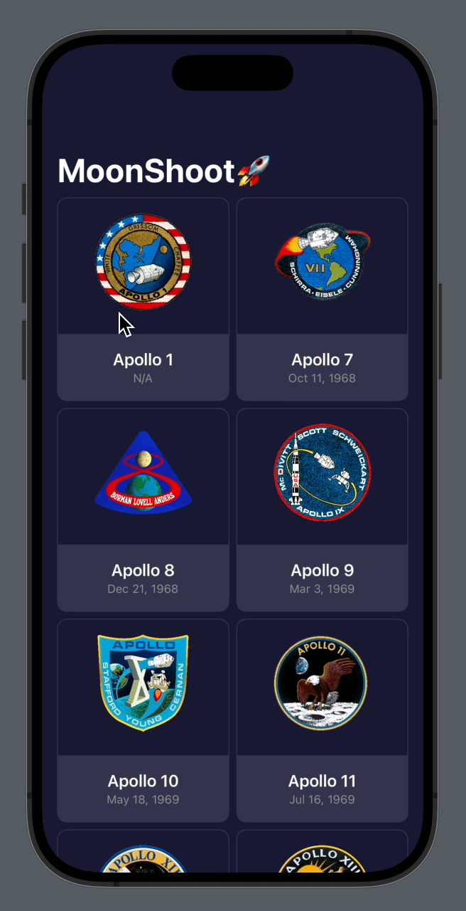

```swift
var body: some View {
        NavigationStack {
            ScrollView {
                LazyVGrid(columns: columns) {
                    ForEach(missionsData) { mission in
                        NavigationLink {
                            Text(mission.description)
                                .padding()
                        } label: {
                            VStack {
                                Image(mission.image)
                                    .resizable()
                                    .scaledToFit()
                                    .frame(width: 100, height: 100)
                                    .padding()
                                
                                VStack {
                                    Text(mission.displayName)
                                        .font(.headline)
                                        .foregroundStyle(.white)
                                    Text(mission.oemLaunchDate)
                                        .font(.caption)
                                        .foregroundStyle(.gray)
                                }
                                .padding(.vertical)
                                .frame(maxWidth: .infinity)
                                .background(.lightBackground)
                            }
                            .clipShape(.rect(cornerRadius: 10))
                            .overlay {
                                RoundedRectangle(cornerRadius: 10)
                                    .stroke(.lightBackground)
                            }
                        }
                    }
                }
                .padding([.horizontal, .bottom])
            }
            .navigationTitle("MoonShoot🚀")
            .background(.darkBackground)
            .preferredColorScheme(.dark)
        }
    }
```

### Day41：项目八第三部分

#### 构建MissionView界面：


```swift
//  MissionView.swift
import SwiftUI

struct MissionView: View {
    let mission: Missions
    
    var body: some View {
        ScrollView {
            VStack {
                Image(mission.image)
                    .resizable()
                    .scaledToFit()
                    .containerRelativeFrame(.horizontal) { width, axis in
                        width * 0.6
                    }
                VStack(alignment: .leading) {
                    Text("Mission highlights")
                        .font(.title.bold())
                        .padding(.bottom, 5)
                    
                    Text(mission.description)
                }
                .padding(.horizontal)
            }
            .padding(.bottom)
        }
        .navigationTitle(mission.displayName)
        .navigationBarTitleDisplayMode(.inline)
        .background(.darkBackground)
        .preferredColorScheme(.dark)
    }
}

#Preview {
    let missionsData: [Missions] = Bundle.main.decodeJSON("missions.json")
    return MissionView(mission: missionsData[0])
}
```

#### 在任务详细信息中显示此次任务船员的详细信息：

这个步骤中，一定要考虑未匹配宇航员的情况。以避免让app从后端接受垃圾无用的json信息。这在上架app时会被审核。


```swift
//MissionView.swift
struct CrewMember {//将missions、astronauts里同一个宇航员的信息集合在一起
    let role: String
    let astronaut: Astronauts
}

let mission: Missions
let crews: [CrewMember]
...
init(mission: Missions, astronauts: [String: Astronauts]) {//在初始化任务详细信息页视图时，同时构建自定义、需要组建missions、astronauts部分信息的宇航员的信息
        self.mission = mission
        
        self.crews = mission.crew.map{ crews in
            if let astronaut = astronauts[crews.name] {
                return CrewMember(role: crews.name, astronaut: astronaut)
            } else {
                fatalError("Missing astronauts' name.")//考虑未匹配宇航员的情况
            }
        }
    }
```

#### 自定义分隔栏：

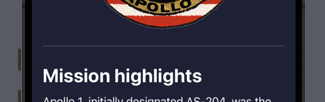

```swift
Rectangle()//自定义分隔栏
  .frame(height: 2)
  .foregroundColor(.lightBackground)
  .padding(.vertical)
```

#### 构建宇航员详细信息界面：


```swift
//  AstronautsView.swift

import SwiftUI

struct AstronautsView: View {
    let astronaut: Astronauts
    
    var body: some View {
        ScrollView {
            VStack(alignment: .leading) {
                Image(astronaut.id)
                    .resizable()
                    .scaledToFit()
                    .cornerRadius(10)
                    .shadow(radius: 20)
                    .padding(.bottom, 10)
                
                Rectangle()
                    .frame(height: 2)
                    .foregroundColor(.lightBackground)
                    .padding(.vertical)
                
                Text("Description")
                    .font(.title.bold())
                    .padding(.bottom, 6)
                
                Text(astronaut.description)
                    
            }
            .padding()
        }
        .background(.darkBackground)
        .navigationTitle(astronaut.name)
        .navigationBarTitleDisplayMode(.inline)
    }
}

#Preview {
    let astronautsData: [String: Astronauts] = Bundle.main.decodeJSON("astronauts.json")
    
    return AstronautsView(astronaut: astronautsData["grissom"]!)
        .preferredColorScheme(.dark)
}

```

### Day42：项目八第四部分

#### 在任务详情页中添加发射日期：

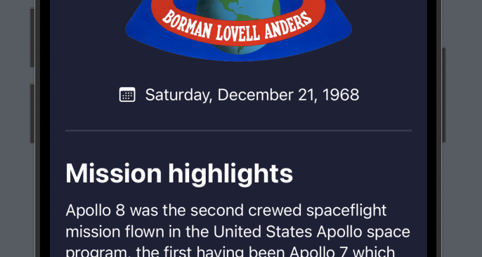

```swift
if let launchDate = mission.launchDate {
    Label(launchDate.formatted(date: .complete, time: .omitted), systemImage: "calendar")
        .padding(.top)
}
```

#### 优化代码结构：

##### 打包自定义分隔栏:

```swift
//  OEM-Divider.swift

import SwiftUI

struct OEM_Divider: View {
    var body: some View {
        Rectangle()
            .frame(height: 2)
            .foregroundColor(.lightBackground)
            .padding(.vertical)
    }
}

#Preview {
    OEM_Divider()
}
```

##### 打包Crew ScrollView：

```swift
//  CrewScrollView.swift
import SwiftUI

struct CrewScrollView: View {
    let crews: [MissionView.CrewMember]
    
    var body: some View {
        ScrollView(.horizontal, showsIndicators: false) {
            HStack {
                ForEach(crews, id: \.role) { crew in
                    NavigationLink {
                        AstronautsView(astronaut: crew.astronaut)
                    } label: {
                        HStack {
                            Image(crew.astronaut.id)
                                .resizable()
                                .frame(width: 104, height: 72)
                                .clipShape(.capsule)
                                .overlay {
                                    Capsule()
                                        .strokeBorder(.gray, lineWidth: 1)
                                        .shadow(radius: 20)
                                }
                                
                            VStack(alignment: .leading) {
                                Text(crew.astronaut.name)
                                    .font(.headline)
                                    .foregroundColor(.white)
                                Text(crew.role)
                                    .foregroundStyle(.gray)
                            }
                        }
                        .padding(.horizontal)
                    }
                }
            }
        }
    }
}

#Preview {
    CrewScrollView(crews: [])
}
```

#### 切换网格和列表视图：

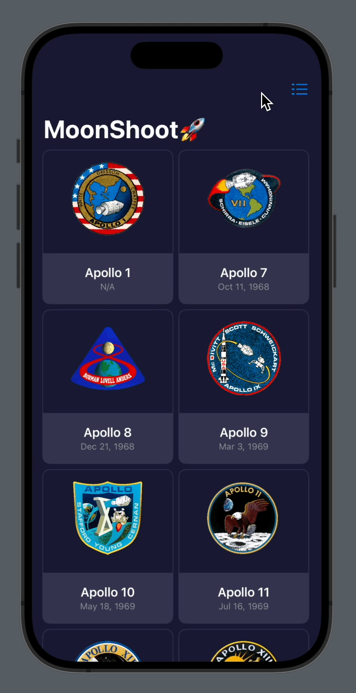

```swift
//  GridLayout.swift

import SwiftUI

struct GridLayout: View {
    let astronautsData: [String: Astronauts]//使用泛型后，需要在调用泛型的地方指明类型
    let missionsData: [Missions]
    
    let columns = [
        GridItem(.adaptive(minimum: 150))
    ]
    
    var body: some View {
        ScrollView {
            LazyVGrid(columns: columns) {
                ForEach(missionsData) { mission in
                    NavigationLink {
                        MissionView(mission: mission, astronauts: astronautsData)
                    } label: {
                        VStack {
                            Image(mission.image)
                                .resizable()
                                .scaledToFit()
                                .frame(width: 100, height: 100)
                                .padding()
                            
                            VStack {
                                Text(mission.displayName)
                                    .font(.headline)
                                    .foregroundStyle(.white)
                                Text(mission.oemLaunchDate)
                                    .font(.caption)
                                    .foregroundStyle(.gray)
                            }
                            .padding(.vertical)
                            .frame(maxWidth: .infinity)
                            .background(.lightBackground)
                        }
                        .clipShape(.rect(cornerRadius: 10))
                        .overlay {
                            RoundedRectangle(cornerRadius: 10)
                                .stroke(.lightBackground)
                        }
                    }
                }
            }
            .padding([.horizontal, .bottom])
        }
        .navigationTitle("MoonShoot🚀")
        .background(.darkBackground)
        .preferredColorScheme(.dark)//强制改变app只在暗色模式中使用
    }
}

#Preview {
    GridLayout(astronautsData: Bundle.main.decodeJSON("astronauts.json"), missionsData: Bundle.main.decodeJSON("missions.json"))
        .preferredColorScheme(.dark)
}

//ContentView.swift
struct ContentView: View {
    let astronautsData: [String: Astronauts] = Bundle.main.decodeJSON("astronauts.json")//使用泛型后，需要在调用泛型的地方指明类型
    let missionsData: [Missions] = Bundle.main.decodeJSON("missions.json")
    
    @State private var viewAsList = false
    
    var body: some View {
        NavigationStack {
            Group {
                if viewAsList {
                    ListLayout(astronautsData: astronautsData, missionsData: missionsData)
                } else {
                    GridLayout(astronautsData: astronautsData, missionsData: missionsData)
                }
            }
            .navigationTitle("MoonShoot🚀")
            .background(.darkBackground)
            .preferredColorScheme(.dark)//强制改变app只在暗色模式中使用
            .toolbar {
                Button {
                    viewAsList.toggle()
                } label: {
                    if viewAsList {
                        Label("View as Grid", systemImage: "square.grid.2x2")
                    } else {
                        Label("View as List", systemImage: "list.dash")
                    }
                }
            }
        }        
    }
}
```

##### 记住上次打开app的视图风格（网格/列表）：

```swift
@AppStorage("ViewType") private var viewAsList = false
```

### Day43：项目九第一部分

#### NavigationLink的缺点：

```swift
struct newView: View {
    var number: Int
    
    var body: some View {
        Text("Detail View \(number)")
    }
    
    init(number: Int) {
        self.number = number
        print("Init() loaded number:\(number)")
    }
}

struct ContentView: View {
    var body: some View {
        NavigationStack {
            NavigationLink("Tap me") {
                newView(number: 1000)
            }
        }
    }
}
```

这样的NavigationLink写法所带来的一个问题：在没有跳转页面前，SwiftUI已经提前加载了新页面的数据。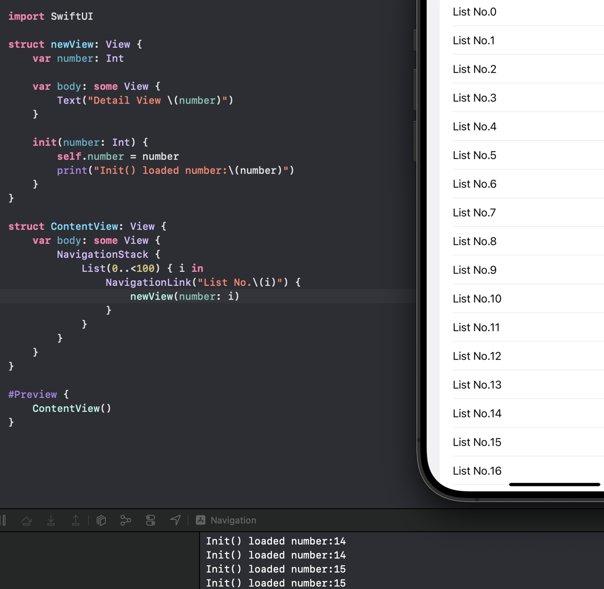

#### 解决上面的缺点：

使用 NavigationLink(title: StringProtocolStringProtocol,  value: Decodable & Encodable & Hashable))

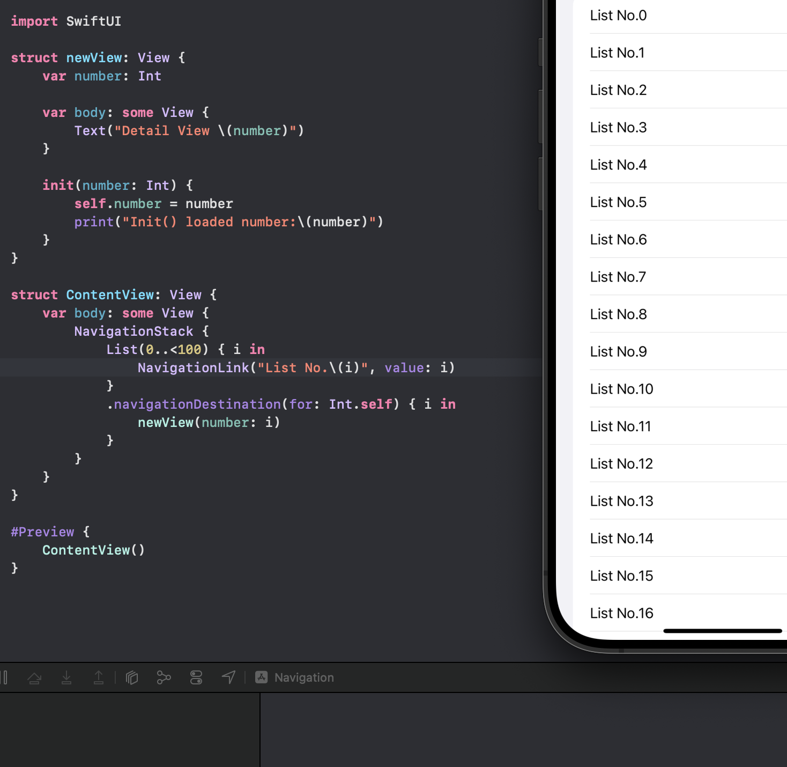

```swift
struct newView: View {
    var number: Int
    
    var body: some View {
        Text("Detail View \(number)")
    }
    
    init(number: Int) {
        self.number = number
        print("Init() loaded number:\(number)")
    }
}

struct ContentView: View {
    var body: some View {
        NavigationStack {
            List(0..<100) { i in
                NavigationLink("List No.\(i)", value: i)
            }
            .navigationDestination(for: Int.self) { i in
                newView(number: i)
            }
        }
    }
}
```

#### 用自定义结构体作为页面跳转所用到的值：

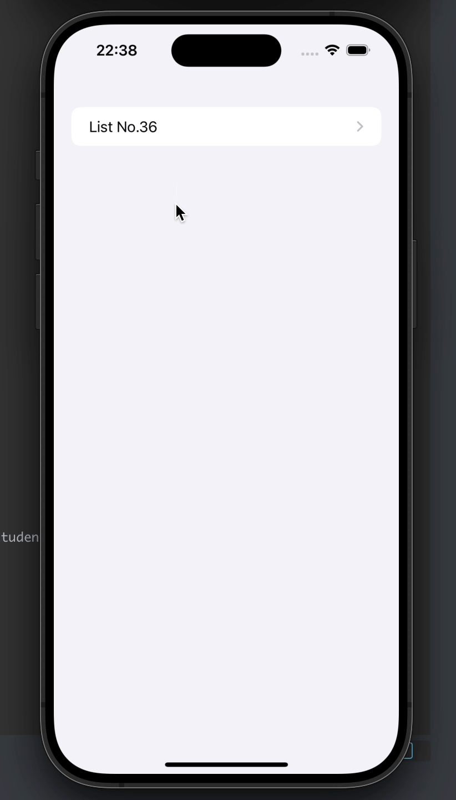

```swift
struct StudentInfo: Hashable {
    var id = UUID()
    var name: String
    var number: Int
}

struct newView: View {
    var number: Int
    
    var body: some View {
        Text("Detail View \(number)")
    }
    
    init(number: Int) {
        self.number = number
        print("Init() loaded number:\(number)")
    }
}

struct ContentView: View {
    var studentsInfo = [StudentInfo(name: "fan", number: 36)]
    
    var body: some View {
        NavigationStack {
            List {
                ForEach(studentsInfo, id: \.self) { student in
                    NavigationLink("List No.\(student.number)", value: student)
                }
            }
            .navigationDestination(for: StudentInfo.self) { student in
                Text("Student name is \(student.name)")
            }
        }
    }
}
```

### Day44：项目九第二部分

#### 自定义页面跳转逻辑：

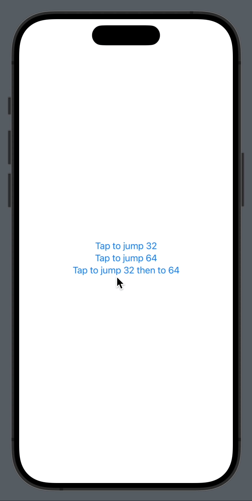

```swift
struct ContentView: View {
    @State private var path = NavigationPath()
    
    var body: some View {
        NavigationStack(path: $path) {
            VStack {
                Button("Tap to jump 32") {
                    path = [32]
                }
                
                Button("Tap to jump 64") {
                    path.append(64)
                }
                
                Button("Tap to jump 32 then to 64") {
                    path = [32, 64]
                }
            }
            .navigationDestination(for: Int.self) { path in
                Text("\(path)")
            }
        }
    }
}
```

#### 利用专门的NavigationPath类型用来存储既有Int又有String的导航路径：

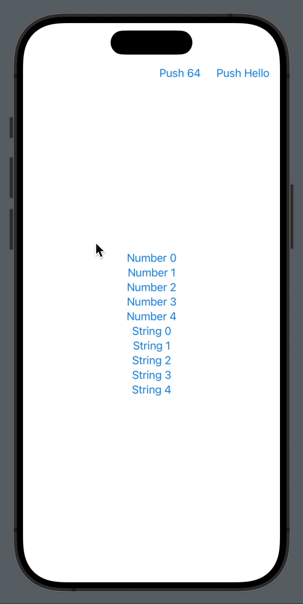

```swift
struct ContentView: View {
    @State private var path = NavigationPath()
    
    var body: some View {
        NavigationStack(path: $path) {
            VStack {
                ForEach(0..<5) { number in
                    NavigationLink("Number \(number)", value: number)
                }
                ForEach(0..<5) { number in
                    NavigationLink("String \(number)", value: String(number))
                }
            }
            .toolbar {
                Button("Push 64") {
                    path.append(64)
                }
                Button("Push Hello") {
                    path.append("Hello")
                }
            }
            .navigationDestination(for: Int.self) { number in
                Text("\(number)")
            }
            .navigationDestination(for: String.self) { string in
                Text("Page \(string)")
            }
        }
    }
}
```

#### 能无限随机生成子视图的视图：

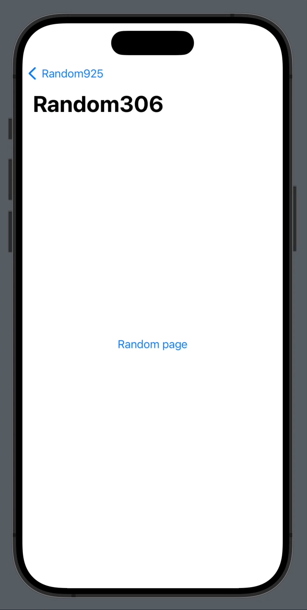

```swift
struct RandomView: View {
    var number: Int
    
    var body: some View {
        NavigationLink("Random page", value: Int.random(in: 0...1000))
            .navigationTitle("Random\(number)")
    }
}

struct ContentView: View {
    @State private var path = [Int]()
    
    var body: some View {
        NavigationStack(path: $path) {
            RandomView(number: 0)
                .navigationDestination(for: Int.self) { selection in
                    RandomView(number: selection)
                }
        }
    }
}
```

#### 一键返回主界面：

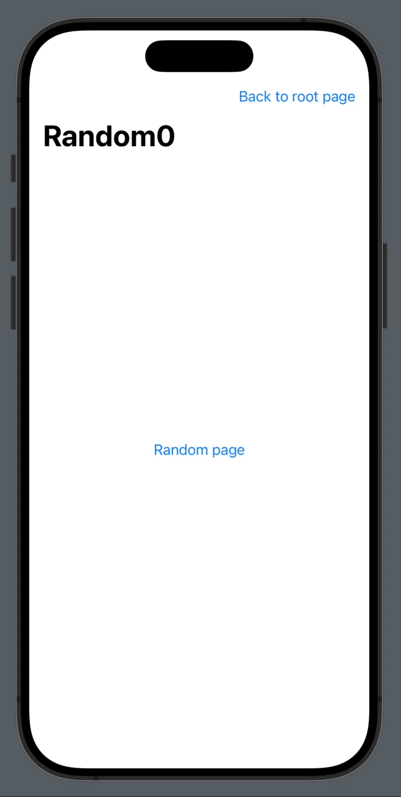

```swift
struct RandomView: View {
    var number: Int
    @Binding var path: [Int]//在 SwiftUI Binding用来将子视图中的某个属性与父视图中的状态进行绑定，使子视图能够读取并修改父视图的状态。
    
    var body: some View {
        NavigationLink("Random page", value: Int.random(in: 0...1000))
            .navigationTitle("Random\(number)")
            .toolbar {
                Button("Back to root page") {
                    path.removeAll()//普通类型path就用removeAll，如果是NavigationPath类型就给赋值新的空NavigationPath()
                }
            }
    }
}

struct ContentView: View {
    @State private var path = [Int]()
    
    var body: some View {
        NavigationStack(path: $path) {
            RandomView(number: 0, path: $path)
                .navigationDestination(for: Int.self) { selection in
                    RandomView(number: selection, path: $path)
                }
        }
    }
}
```

#### 保存加载页面路径：

有两种情况：1.路径数组为NavigationPath() 2.路径数组为[Int] ()这类单类型数组

使用class来存储path、实现存储path

```swift
//1.路径数组为NavigationPath()
@Observable
class PathStore {
    var path: NavigationPath {
        didSet {
            save()
        }
    }
    
    private let savePath = URL.documentsDirectory.appending(path: "SavedPath")//创建app路径下用于存储用户数据的文件
    
    init() {//初始化时加载path数据
        if let data = try? Data(contentsOf: savePath) {
            if let decoded = try? JSONDecoder().decode(NavigationPath.CodableRepresentation.self, from: data) {
                path = NavigationPath(decoded)
                return
            }
        }
        
        path = NavigationPath()
    }
    
    func save() {
        guard let representation = path.codable else { return }//对一个NavigationPath类型的path解包，并在解包失败时提前返回。
        
        do {
            let data = try JSONEncoder().encode(representation)
            try data.write(to: savePath)
        } catch {
            print("Failed to save navigation path.")
        }
    }
}

struct RandomView: View {
    var number: Int
    
    var body: some View {
        NavigationLink("Random page", value: Int.random(in: 0...1000))
            .navigationTitle("Random\(number)")
    }
}

struct ContentView: View {
    @State private var pathStore = PathStore()
    
    var body: some View {
        NavigationStack(path: $pathStore.path) {
            RandomView(number: 0)
                .navigationDestination(for: Int.self) { selection in
                    RandomView(number: selection)
                }
        }
    }
}

// 2.路径数组为[Int] ()这类单类型数组
@Observable
class PathStore {
    var path: [Int] {
        didSet {
            save()
        }
    }
    
    private let savePath = URL.documentsDirectory.appending(path: "SavedPath")//创建app路径下用于存储用户数据的文件
    
    init() {//初始化时加载path数据
        if let data = try? Data(contentsOf: savePath) {
            if let decoded = try? JSONDecoder().decode([Int].self, from: data) {
                path = decoded
                return
            }
        }
        
        path = []
    }
    
    func save() {
        do {
            let data = try JSONEncoder().encode(path)
            try data.write(to: savePath)
        } catch {
            print("Failed to save navigation path.")
        }
    }
}

struct RandomView: View {
    var number: Int
    
    var body: some View {
        NavigationLink("Random page", value: Int.random(in: 0...1000))
            .navigationTitle("Random\(number)")
    }
}

struct ContentView: View {
    @State private var pathStore = PathStore()
    
    var body: some View {
        NavigationStack(path: $pathStore.path) {
            RandomView(number: 0)
                .navigationDestination(for: Int.self) { selection in
                    RandomView(number: selection)
                }
        }
    }
}
```

### Day45：项目九第三部分

#### 自定义navigationbar效果：

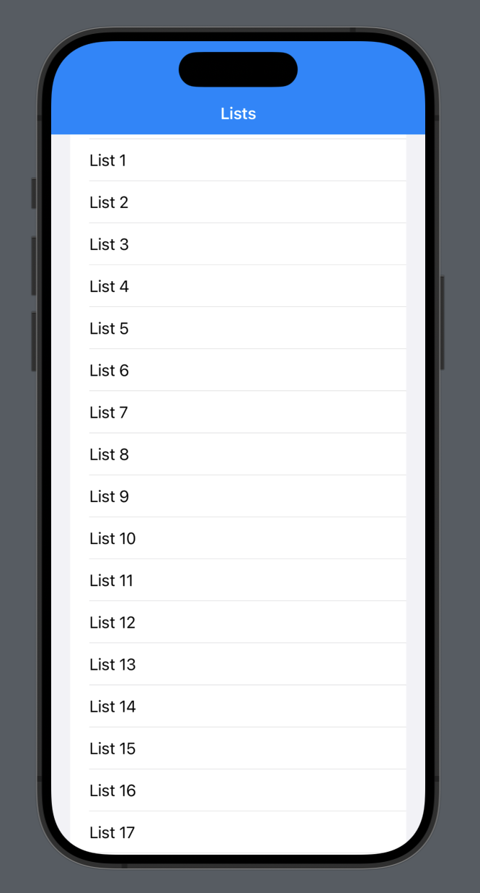

```swift
struct ContentView: View {
    var body: some View {
        NavigationStack {
            List {
                ForEach(0..<100) { i in
                    Text("List \(i)")
                }
            }
            .navigationTitle("Lists")
            .navigationBarTitleDisplayMode(.inline)//NavigationTitle 居中显示效果
            .toolbarBackground(.blue)//NavigationBar背景颜色
            .toolbarColorScheme(.dark)//NavigationBar强制使用黑夜模式
        }
    }
}
```


```swift
struct ContentView: View {
    var body: some View {
        NavigationStack {
            List {
                ForEach(0..<100) { i in
                    Text("List \(i)")
                }
            }
            .navigationTitle("Lists")
            .navigationBarTitleDisplayMode(.inline)//NavigationTitle 居中显示效果
            .toolbarBackground(.blue)//NavigationBar背景颜色
            .toolbarColorScheme(.dark)//NavigationBar强制使用黑夜模式
            .toolbar(.hidden, for: .navigationBar)//隐藏NavigationBar
        }
    }
}
```

#### 自定义Toolbar位置：

##### 使用ToolbarItem接口：

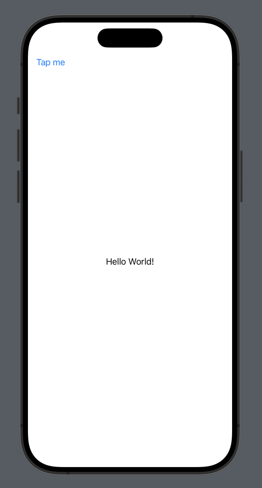

```swift
struct ContentView: View {
    var body: some View {
        NavigationStack {
            Text("Hello World!")
                .toolbar {
                    ToolbarItem(placement: .topBarLeading) {//把Toolbar位置前置
                        Button("Tap me") {
                            
                        }
                    }
                }
        }
    }
}
```

##### ToolbarItem接口placement参数：

当首参数为confirmationAction时，用.navigationBarBackButtonHidden()来取消返回键。

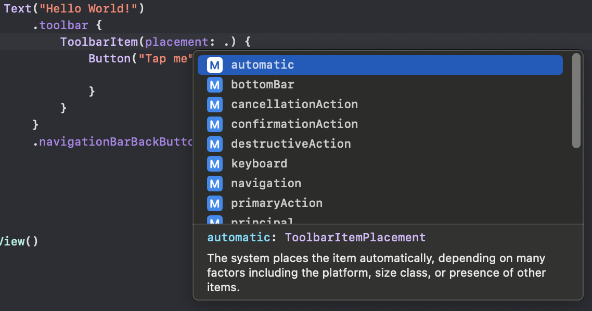

##### ToolbarItemGroup包装多个视图：

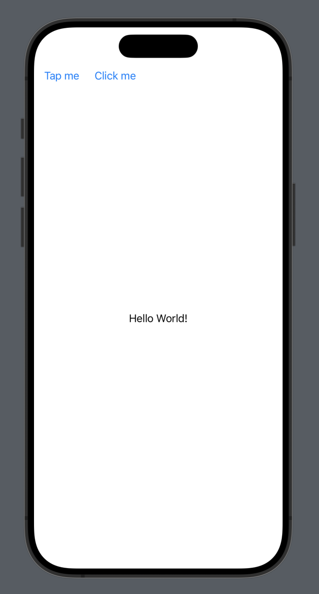

```swift
struct ContentView: View {
    var body: some View {
        NavigationStack {
            Text("Hello World!")
                .toolbar {
                    ToolbarItemGroup(placement: .topBarLeading) {
                        Button("Tap me") {
                            
                        }
                
                        Button("Click me") {
                            
                        }
                    }
                }
        }
    }
}
```

#### 将导航栏名字做成可以绑定的：

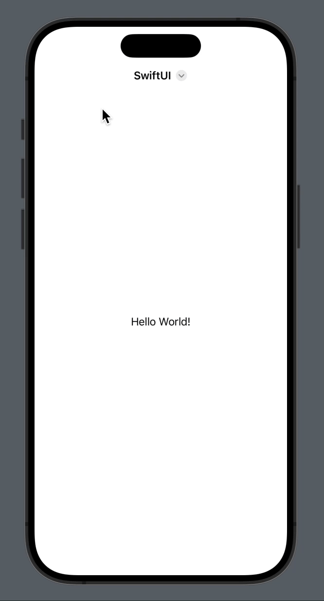

```swift
struct ContentView: View {
    @State private var title = "SwiftUI"
    
    var body: some View {
        NavigationStack {
            Text("Hello World!")
                .navigationTitle($title)
                .navigationBarTitleDisplayMode(.inline)
        }
    }
}
```

### Day46：项目九第四部分

#### 用navigation替代iExpense中的sheet

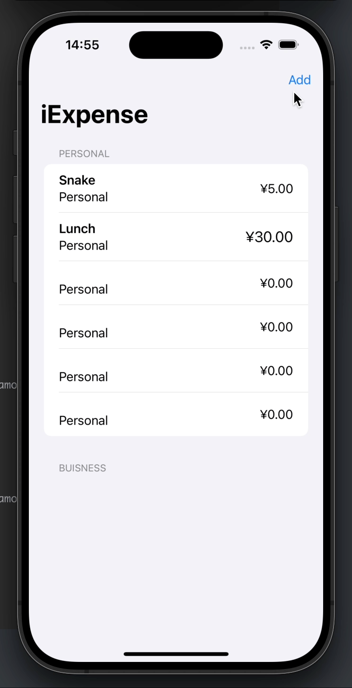

```swift
    //ContentView.swift
    var body: some View {
        NavigationStack {
            List {
                TypeView(sectionTitle: "Personal", expenses: expenses.personalItems, deleteUsingType: deletePersonalItems)
                
                TypeView(sectionTitle: "Buisness", expenses: expenses.buisnessItems, deleteUsingType: deleteBuisnessItems)
            }
            .navigationTitle("iExpense")
            .toolbar {
                NavigationLink("Add") {
                    AddView(expense: expenses)
                }
            }
        }
    }
		//AddView.swift
    var body: some View {
        List {
            TextField("Name", text: $name)
            
            Picker("Type", selection: $type) {
                ForEach(types, id: \.self) {
                    Text("\($0)")
                }
            }
            
            TextField("Amount", value: $amount, format: .currency(code: currency))
                .keyboardType(.decimalPad)
        }
        .navigationTitle("Add a new Enpense")
        .navigationBarTitleDisplayMode(.inline)
        .toolbar {
            ToolbarItem(placement: .confirmationAction) {
                Button("Save") {
                    expense.items.append(ExpenseItem(name: name, type: type, amount: amount))
                    dismiss()
                }
            }
            ToolbarItem(placement: .cancellationAction) {
                Button("Cancel") {
                    expense.items.append(ExpenseItem(name: name, type: type, amount: amount))
                    dismiss()
                }
            }
        }
        .navigationBarBackButtonHidden()
    }
```

#### 用navigation替代MoonShoot中的navigation label(此点笔记不做记录，具体看视频)

所用技术参考Day43中的.navigationDestination

### Day48：纽约Nextdoor 2018演讲

了解Swift在2018年的发展历程，具体详细看视频。

### Day49：项目十第一部分

使用iTunes API，从iTunes上获取Taylor Swift的专辑信息。

#### 构建用于接收返回值的数据结构：

```swift
struct Response: Codable {
    var results: [Result]
}

struct Result: Codable {
    var trackId: Int
    var trackName: String
    var collectionName: String
}

struct ContentView: View {
    @State private var results = [Result]()
    
    var body: some View {
        List {
            ForEach(results, id: \.trackId) { result in
                VStack(alignment: .leading) {
                    Text(result.trackName)
                    
                    Text(result.collectionName)
                }
            }
        }
        .padding()
    }
}
```

#### 加入用于获取iTunes数据的异步任务：

```swift
struct Response: Codable {
    var results: [Result]
}

struct Result: Codable {
    var trackId: Int
    var trackName: String
    var collectionName: String
}

struct ContentView: View {
    @State private var results = [Result]()
    
    var body: some View {
        List(results, id: \.trackId) {result in
            VStack(alignment: .leading) {
                Text(result.trackName)
                Text(result.collectionName)
            }
        }
        .task {
            await loadData()//1.创建异步任务。异步：它允许程序在执行某些操作时，不必等待该操作完成就可以继续执行其他任务。
        }
    }
    
    func loadData() async {
        //2.调用iTunes API
        guard let url = URL(string: "https://itunes.apple.com/search?term=taylor+swift&entity=song") else {
            print("Invaild URL")
            return
        }
        
        //3.获取数据
        do {
            //用元祖获取需要的数据，这里用异步、可选，来应对网络不通畅、网络问题无法获取数据的意外情况。该行代码会自动抛错。
            let (data, _) = try await URLSession.shared.data(from: url)
            
            do {
                let decodedResponse = try JSONDecoder().decode(Response.self, from: data)
                results = decodedResponse.results
            } catch {
                print("Decoding error \(error)")//强烈推荐使用do catch 而不是if try，多亏了catch我才能知道详细的错误原因！！！
            }
            
        } catch {
            print("Invaild Data")
        }
    }
}
```

#### 异步加载图像：

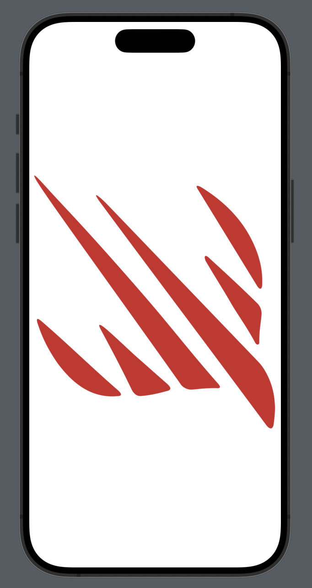

```swift
struct ContentView: View {
    var body: some View {
        AsyncImage(url: URL(string: "https://hws.dev/img/logo.png"), scale: 3)//以3x分辨率加载该远程图像
    }
}
```

#### 自定义异步加载图像的大小：

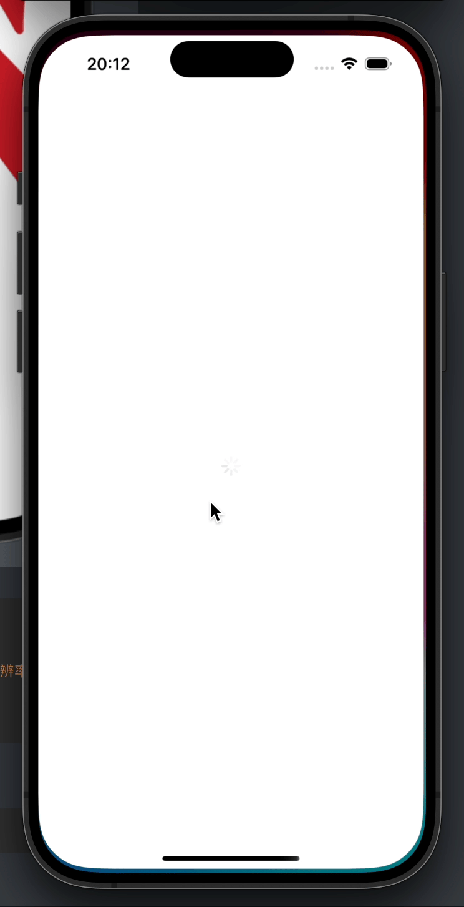

```swift
struct ContentView: View {
    var body: some View {
        AsyncImage(url: URL(string: "https://hws.dev/img/logo.png")) { image in
            image
                .resizable()
                .scaledToFit()
        } placeholder: {
            ProgressView()//旋转加载圈
        }
        .frame(width: 200, height: 200)//自定义大小
            
    }
}
```

#### 能报错的异步加载图像：

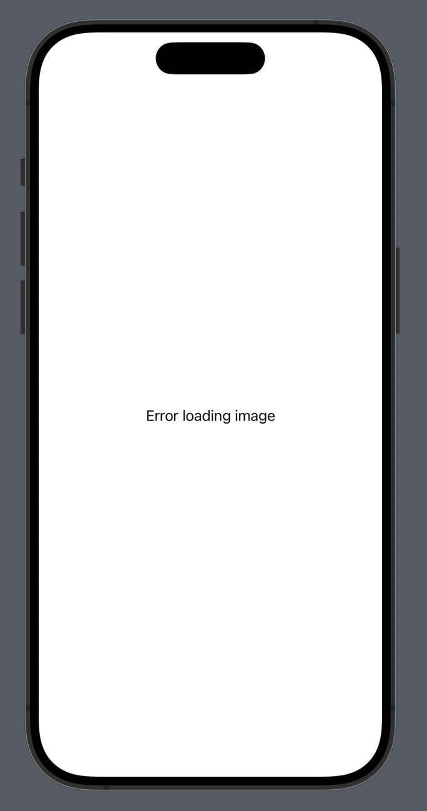

```swift
struct ContentView: View {
    var body: some View {
        AsyncImage(url: URL(string: "https://hws.dev/img/logo")) { phase in
            if let image = phase.image {
                image
                    .resizable()
                    .scaledToFit()
            } else if phase.error != nil {
                Text("Error loading image")
            } else {
                ProgressView()
            }
        }
        .frame(width: 200, height: 200)//自定义大小
    }
}
```

#### 不满足条件时禁用按钮

简单写法

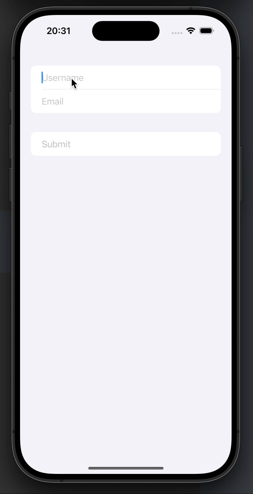

```swift
struct ContentView: View {
    @State private var username = ""
    @State private var email = ""
    
    var body: some View {
        List {
            Section {
                TextField("Username", text: $username)
                TextField("Email", text: $email)
            }
            
            Button("Submit") {
                //actions
            }
            .disabled(username.isEmpty || email.isEmpty)//简短写法
        }
    }
}
```

详细写法

```swift
struct ContentView: View {
    @State private var username = ""
    @State private var email = ""
    
    var submitCondition: Bool {//详细写法
        username.count < 5 || email.count < 10
    }
    
    var body: some View {
        List {
            Section {
                TextField("Username", text: $username)
                TextField("Email", text: $email)
            }
            
            Button("Submit") {
                //actions
            }
            .disabled(submitCondition)
        }
    }
}
```

### Day50：项目十第二部分

#### @Observable类的decode、encode：

因为用@Observable包装类时，Swift会对类内属性做处理，导致encode、decode类时，传出的JSON数据不符合JSON规范。

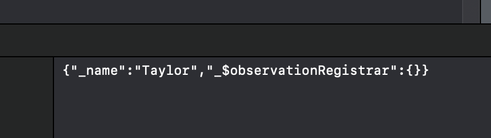

所以得用一个继承了CodingKey的特殊的枚举，指明属性内容。

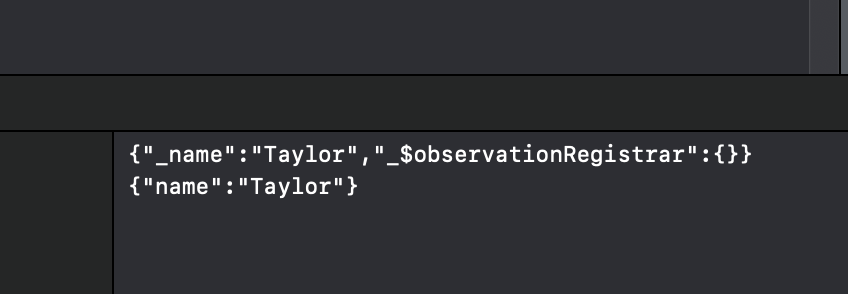

```swift
@Observable
class UserName: Codable {
    enum CodingKeys: String, CodingKey {
        case _name = "name"
    }
    
    var name = "Taylor"
}

struct ContentView: View {
    var body: some View {
        Button("Encode Taylor", action: encode)
    }
    
    func encode() {
        if let encodeData = try? JSONEncoder().encode(UserName()) {
            print(String(decoding: encodeData, as: UTF8.self))
        }
    }
}
```

#### 触觉反馈：

##### Swift内建的触觉反馈：

谨慎选择触觉反馈效果，考虑视障等用户。

```swift
struct ContentView: View {
    @State private var toggle = false
    
    var body: some View {
        Button("Toggle sensoryfeedback") {
            toggle.toggle()
        }
        .sensoryFeedback(.success, trigger: toggle)//Swift内建的震动类型
    }
}
```

##### 半自定义的触觉反馈：

```swift
.sensoryFeedback(.impact()flexibility: .soft, intensity: 1.0), trigger: toggle)//.impact()
```

##### 完全自定义的触觉反馈：

```swift
import CoreHaptics
import SwiftUI

struct ContentView: View {
    @State private var engine: CHHapticEngine?
    
    var body: some View {
        Button("Toggle sensoryfeedback", action: OEMHaptic)
            .onAppear(perform: initHapticEngine)//页面加载时就初始化HapticEngine
    }
    
    func checkHapticSupport() {
        //检查当前硬件设备是否支持Haptics。
        guard CHHapticEngine.capabilitiesForHardware().supportsHaptics else {
            print("The device not support hapticEngine.")
            return
        }
    }
    
    func initHapticEngine() {
        checkHapticSupport()
        do {
            engine = try CHHapticEngine()
            try engine?.start()
        } catch {
            print("Error loading HapticEngine, error: \(error.localizedDescription)")
        }
    }
    
    func OEMHaptic() {
        checkHapticSupport()
        
        var events = [CHHapticEvent]()
        //设置参数
        let intensity = CHHapticEventParameter(parameterID: .hapticIntensity, value: 1)
        let sharpness = CHHapticEventParameter(parameterID: .hapticSharpness, value: 1)
        //设置事件
        let event = CHHapticEvent(eventType: .hapticTransient, parameters: [intensity, sharpness], relativeTime: 0)
        
        events.append(event)
        
        do {
            let pattern = try CHHapticPattern(events: events, parameters: [])
            try engine?.makePlayer(with: pattern).start(atTime: 0)//触发触觉反馈
        } catch {
            print("Error: \(error.localizedDescription)")
        }
    }
}

#Preview {
    ContentView()
}
```

```swift
        //从弱到强的渐变震动
        for i in stride(from: 0, to: 1, by: 0.1) {
            let intensity = CHHapticEventParameter(parameterID: .hapticIntensity, value: Float(i))
            let sharpness = CHHapticEventParameter(parameterID: .hapticSharpness, value: Float(i))
            let event = CHHapticEvent(eventType: .hapticTransient, parameters: [intensity, sharpness], relativeTime: i)
            events.append(event)
        }
        
        //从强到弱的渐变震动
        for i in stride(from: 0, to: 1, by: 0.1) {
            let intensity = CHHapticEventParameter(parameterID: .hapticIntensity, value: Float(1 - i))
            let sharpness = CHHapticEventParameter(parameterID: .hapticSharpness, value: Float(1 - i))
            let event = CHHapticEvent(eventType: .hapticTransient, parameters: [intensity, sharpness], relativeTime: 1 + i)
            events.append(event)
        }
```

#### 构建App界面、结构体：

```swift
//ContentView.swift
struct ContentView: View {
    @State private var order = Order()
    
    var body: some View {
        NavigationStack {
            Form {
                Section {
                    Picker("Select your cake type:", selection: $order.type) {
                        ForEach(Order.types.indices, id: \.self) {
                            Text(Order.types[$0])
                        }
                    }
                    Stepper("Number of cakes: \(order.quantity)", value: $order.quantity, in: 0...20)
                }
                
                Section {
                    Toggle("Any special requests?", isOn: $order.specialRequestEnabled)
                    
                    if order.specialRequestEnabled {
                        Toggle("Add extra frosting", isOn: $order.extraFrosting)
                        Toggle("Add extra sprinkles", isOn: $order.addSprinkles)
                    }
                }
                
                Section {
                    NavigationLink("Delivery details") {
                        AddressView()
                    }
                }
            }
            .navigationTitle("Cupcake Corner🧁")
        }
    }
}

//AddressView.swift
struct AddressView: View {
    var order = Order()
    
    var body: some View {
        Text(/*@START_MENU_TOKEN@*/"Hello, World!"/*@END_MENU_TOKEN@*/)
    }
}

//Order.swift
import Foundation

@Observable
class Order {
    static let types = ["Vanilla", "Strawberry", "Chocolate", "Rainbow"]
    
    var type = 0
    var quantity = 3
    
    var specialRequestEnabled = false {
        didSet {//防止bug：关了特殊需求开关
            if specialRequestEnabled == false {
                extraFrosting = false
                addSprinkles = false
            }
        }
    }
    var extraFrosting = false
    var addSprinkles = false
}
```

### Day51：项目十第三部分

#### 多个页面使用同一份class数据：

使用@Observable和@Bindable双向绑定，能做到数据同步修改。

```swift
//Order.swift
@Observable
class Order {
...
}

//AddressView.swift
import SwiftUI

struct AddressView: View {
    @Bindable var order = Order()
    
    var body: some View {
        Form {
            Section {
                TextField("Name", text: $order.name)
                TextField("Street Address", text: $order.streetAddress)
                TextField("City", text: $order.city)
                TextField("Zip", text: $order.zip)
            }
            
            Section {
                NavigationLink("CheckOut") {
                    CheckOutView()
                }
            }
        }
    }
}

#Preview {
    AddressView(order: Order())
}
```

#### 增加表单筛选条件：

```swift
var hasInvalidValue: Bool {
    if name.isEmpty || streetAddress.isEmpty || city.isEmpty || zip.isEmpty {
        return true
    }

    return false
}
```

#### 设计成本计算属性

```swift
//  Order.swift
var cost: Decimal {
        //每个蛋糕成本两刀
        var cost = Decimal(quantity) * 2
        
        //不同品种的蛋糕成本也不一样
        cost += Decimal(type) / 2
        
        if extraFrosting {
            cost += Decimal(quantity)
        }
        
        if addSprinkles {
            cost += Decimal(quantity) / 2
        }
        
        return cost
    }
```

#### 构建CheckOut页面

```swift
//  CheckOutView.swift
import SwiftUI

struct CheckOutView: View {
    var order: Order
    
    var body: some View {
        ScrollView {
            VStack {
                AsyncImage(url: URL(string: "https://hws.dev/img/cupcakes@3x.jpg"), scale: 3) { image in
                    image
                        .resizable()
                        .scaledToFit()
                } placeholder: {
                    ProgressView()
                }
                .frame(height: 233)
                
                Text("Your total cost is \(order.cost, format: .currency(code: "USD"))")
                    .font(.title)
                
                Button("Place order") {
                    
                }
                .padding()
            }
        }
      	.navigationTitle("Checkout")
        .navigationBarTitleDisplayMode(.inline)
      	.scrollBounceBehavior(.basedOnSize)//Swift自动检测当前页面尺寸是否需要滑动
    }
}

#Preview {
    CheckOutView(order: Order())
}
```

#### 实现网络收发数据

```swift
struct CheckOutView: View {
    var order: Order
    @State private var CheckoutMessage = ""
    @State private var isCheckoutMessageShown = false
    
    var body: some View {
        ScrollView {
            VStack {
								...
                Button("Place order") {
                    Task {//因为button只接受同步函数，所以这里要写成新建一个Task
                        await placeOrder()
                    }
                }
                .padding()
            }
        }
        ...
        .alert("", isPresented: $isCheckoutMessageShown) {
            Button("OK") {}
        } message: {
            Text(CheckoutMessage)
        }
    }
    
    func placeOrder() async {
        //1.将本地数据打包成json
        guard let encodeData = try? JSONEncoder().encode(order) else {
            print("Encode local data failed.")
            return
        }
        //2.创建http POST请求
        var urlReq = URLRequest(url: URL(string: "https://reqres.in/api/cupcakes")!)//https://reqres.in/api/cupcakes是一个专用于测试http请求的网址
        urlReq.httpMethod = "POST"
        urlReq.setValue("application/json", forHTTPHeaderField: "Content-Type")
        //3.发送该POST请求 并接受处理该请求返回数据
        do {
            let (data, _) = try await URLSession.shared.upload(for: urlReq, from: encodeData)
            let decodeData = try JSONDecoder().decode(Order.self, from: data)
            CheckoutMessage = "Thank you! Your order is on its way!"
            isCheckoutMessageShown = true
            print(decodeData.quantity)
            print(Order.types[decodeData.type])
            if decodeData.specialRequestEnabled {
                print(decodeData.addSprinkles)
                print(decodeData.extraFrosting)
            }
        } catch {
            print("Checkout POST http failed: \(error.localizedDescription)")
            return
        }
    }
}
```

#### 使用断点+lldb查看数据信息

##### 新增断点

直接点击

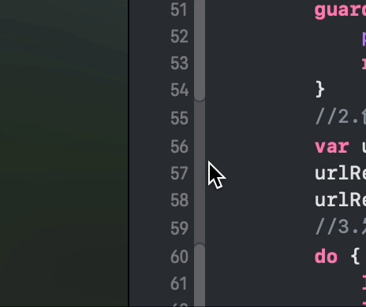

#### 取消断点

按住拖移到一边

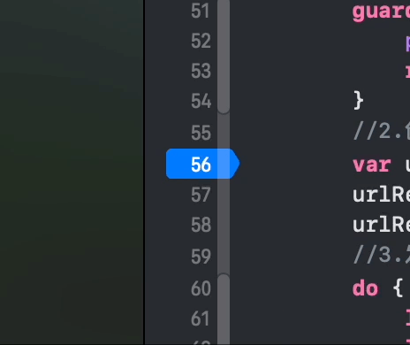

#### 使用lldb打印Order数据

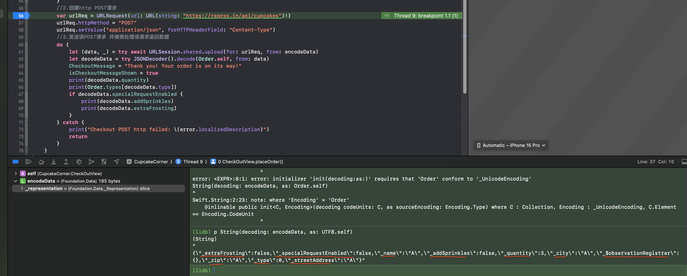

改进Order数据内的数据名称

```swift
//  Order.swift
enum CodingKeys: String, CodingKey {
        case _type = "type"
        case _quantity = "quantity"
        case _specialRequestEnabled = "specialRequestEnabled"
        case _extraFrosting = "extraFrosting"
        case _addSprinkles = "addSprinkles"
        case _name = "name"
        case _streetAddress = "streetAddress"
        case _city = "city"
        case _zip = "zip"
    }
```

### Day52：项目十第四部分

#### 完善空输入检查：

```swift
extension String {
    var isReallyEmpty: Bool {
        self.trimmingCharacters(in: .whitespacesAndNewlines).isEmpty
    }
}
```

#### 完善报错弹窗：

#### 将用户订单地址信息持久化保存：

```swift
//  Order.swift
@Observable
class Order: Codable {
 	 enum CodingKeys: String, CodingKey {
        case _type = "type"
        case _quantity = "quantity"
        case _specialRequestEnabled = "specialRequestEnabled"
        case _extraFrosting = "extraFrosting"
        case _addSprinkles = "addSprinkles"
        case _name = "name"
        case _streetAddress = "streetAddress"
        case _city = "city"
        case _zip = "zip"
    }
    ...
    var name: String {
        didSet {//这里用属性观察器而不用get/set的原因是，get/set会影响@Observable做CodingKeys
            UserDefaults.standard.set(name, forKey: "name")
        }
    }
    
    var streetAddress: String {
        didSet {
            UserDefaults.standard.set(streetAddress, forKey: "streetAddress")
        }
    }
    
    var city: String {
        didSet {
            UserDefaults.standard.set(city, forKey: "city")
        }
    }
    
    var zip: String {
        didSet {
            UserDefaults.standard.set(zip, forKey: "zip")
        }
    }
    ...
    init() {
        name = UserDefaults.standard.string(forKey: "name") ?? ""
        streetAddress = UserDefaults.standard.string(forKey: "streetAddress") ?? ""
        city = UserDefaults.standard.string(forKey: "city") ?? ""
        zip = UserDefaults.standard.string(forKey: "zip") ?? ""
    }
}

```

### Day53：项目十一第一部分

#### 用@Binding绑定同页面其他视图内的变量

Tip：同页面其他视图的变量用@Binding，其他页面的变量用@Bindable


```swift
struct ButtonView: View {
    let title: String
    @Binding var isPressing: Bool
    
    var onColor = [Color.green, Color.blue]
    var offColor = [Color(white: 0.6), Color(white: 0.4)]
    
    var body: some View {
        Button(title) {
            isPressing.toggle()
        }
        .padding()
        .background(LinearGradient(colors: isPressing ? onColor : offColor, startPoint: .leading, endPoint: .trailing))
        .foregroundStyle(.white)
        .clipShape(.capsule)
        .shadow(radius: isPressing ? 0 : 5)
    }
}

struct ContentView: View {
    @State private var isPressing = false
    
    var body: some View {
        ButtonView(title: "Remember me", isPressing: $isPressing)
        Text(isPressing ? "On" : "Off")
    }
}
```

#### 使用AppStorage保存长文本：

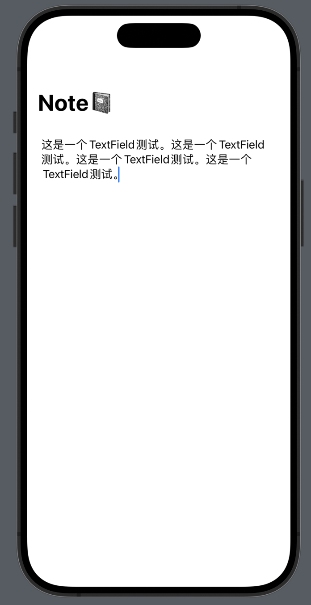

```swift
//长文本方式1：TextField
struct ContentView: View {
    @State private var isPressing = false
    @AppStorage("text") private var texts = ""
    
    var body: some View {
        NavigationStack {
            VStack {
                TextField("", text: $texts, axis: .vertical)//垂直方向增大文本输入框的TextField
                    .textFieldStyle(.roundedBorder)
                    .padding()
                ButtonView(title: "Remember me", isPressing: $isPressing)
                Text(isPressing ? "On" : "Off")
            }
        }
    }
}

//长文本方式2:Text
struct ContentView: View {
    @AppStorage("text") private var texts = ""
    
    var body: some View {
        NavigationStack {
            VStack {
                TextEditor(text: $texts)
                    .padding()
            }
            .navigationTitle("Note📓")
        }
    }
}
```

